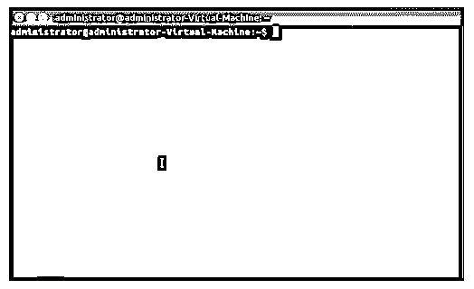

# Linux 操作员

> 原文：<https://www.educba.com/linux-operators/>

## Linux 操作系统简介

用于开发目的的最广泛使用和推荐的[计算机操作系统](https://www.educba.com/types-of-computer-operating-system/)之一“Linux”带有广泛的执行命令。这些命令是在终端上执行的单行指令。这些命令种类繁多，各有不同的特定用途。这些命令在 Linux CLI(命令行界面)上执行。在这个话题中，我们[将学习 Linux](https://www.educba.com/what-is-linux/) 操作符。

<small>网页开发、编程语言、软件测试&其他</small>

如果您不熟悉 Linux CLI，不知道这些操作符或如何使用它们，只需打开终端并运行“help”命令，它将列出 Linux Shell 的内置命令和语法。

其中一个功能强大的操作符是' && '(双&符号)，它是一种链式命令，使用时，在成功执行第一个命令后，执行第二个内联命令。

**例:**“apt-get update&”T3【apt-get Upgrade】，在成功执行更新命令后，执行升级命令。

让我们深入无限的 Linux 操作者的世界。首先，像任何编程语言一样，Linux 有一个基本的操作符范围。

以下是运算符的基本分类:

*   **算术运算符:**用于数学运算的执行。
*   **关系运算符:**简单定义两个操作数之间的关系。
*   **布尔运算符:**也称为逻辑运算符，这些用于执行逻辑运算。
*   **按位运算符:**、&、|、<、>、>”，用于简单的按位运算。
*   **文件测试操作符:**处理文件的属性。

### Linux 操作员列表

这些是运营商的几个类别。除此之外，Linux 还提供了广泛的命令。这些操作符基本上是在 Bourne Shell 上执行的。Bourne Shell 是 UNIX 的原始命令执行程序，由 Stephen Bourne 在美国电话电报公司开发，因此得名。现在，让我们通过示例来深入了解这些运算符。对于进一步的例子，我们将假设两个变量 X 和 Y，值为 5 和 10。

#### 1.算术运算符

基本上，这些运算符用于简单的数学计算，如加法和乘法。

我们有如下 7 个算术运算符:

*   **加法(+):** 简单地将两个给定变量的值相加。《出埃及记》X + Y 的结果是 15。
*   **减法(-):** 用一个变量减去另一个变量的值。《出埃及记》y–X 将得到 5。
*   **除法(/):** 将两个变量相除。《出埃及记》X / Y 会给我们 0.5。
*   **乘法(*):** 将两个变量相乘。《出埃及记》X * Y 的结果是 50。
*   **递增运算符(++):** 简单地给值加 1。递增运算符有两种工作方式，一种是作为前缀，另一种是作为后缀，根据运算符的位置，结果可能会有所不同。
*   **For Prefix:** 变量 Y++前有运算符，会返回递增前的值，例如。Y++ = 5
*   **对于后缀:**运算符前有变量，++Y，它将返回递增的值，Ex。++Y = 6。
*   **减量运算符(–):**类似于增量，除了这个删除单个值。有两种工作方式。
*   **For Prefix:** 首先给出 Y 的值，然后进行递减运算，例如。y-将得到 5。
*   **对于后缀:**最初将值减 1，然后给出结果，例如。–Y 将返回 4。

以上是广泛使用的[算术运算符](https://www.educba.com/arithmetic-operators-in-javascript/)，现在我们从第二个运算符列表开始，即关系运算符。

#### 2.关系运算符

简单地返回“真或假”，这取决于变量之间的关系，并且受 Bourne Shell 支持。

下面是总共 6 种类型的关系运算符:

*   **等于(==):** 比较两个变量，如果相等则返回 true，否则返回 false。《出埃及记》X == Y 将导致 false。
*   **不等于(！=):** 类似于等于，只是如果值不相同，它返回 true，否则返回 false。《出埃及记》x！= Y 将返回 true。
*   **小于(< ):** 如果左边的值小于右边的值，则返回 true 否则返回 false。《出埃及记》X < Y 将返回 true。
*   **大于(> ):** 如果左边的值大于右边的值，则返回 true，否则返回 false。《出埃及记》X > Y 将返回 false。
*   **小于或等于(< =):** 如果左边的值小于或等于右边的值，则为 true。
*   **大于或等于(> =):** 如果左边的值大于或等于右边的值，则为 true。

既然我们已经理解了关系运算符和算术运算符，让我们来学习布尔运算符和按位运算符。

#### 3.布尔运算符

Bourne Shell 完全支持布尔运算符，结合使用可以获得更好的搜索结果。AND、OR 和 NOT 是布尔运算符，使用这些运算符的结果可以节省时间。

*   **和:**缩小搜索范围。《出埃及记》测试分数和最终分数。
*   **或:**扩大搜索范围。《出埃及记》免费课程或低于 499 卢比
*   **NOT:** 排除关键字。《出埃及记》最新增加的不超过 499 卢比

#### 4.按位运算符

有点类似于逻辑操作符，除了位操作符工作在二进制数据表示的底层。这里，两个变量(右边和左边的值)必须是整数。

下面是 6 个按位运算符。

*   **与(& ):** 两位之间的比较。如果两位都是 1，则返回 1，否则返回 0。
*   **OR (|):** 比较两个位，如果两个位互补则返回 1，否则返回 0。
*   **XOR (^):** EXCLUSIVE-OR，类似于上面的运算符，它比较两个位，如果任一位为 1，则返回 1。否则，如果两位都是 0 或 1，它给出 0。
*   **恭维(~):**
*   **左移(< < ):** 简单地将位向右移动，0 被分配给最左边的位。
*   **右移(> > ):** 跟右移一样但是方向相反。它将位向左移动，并将 0 分配给最右边的位。

[位运算符用于](https://www.educba.com/bitwise-operators-in-javascript/)改变单个位。文件测试操作符与检查文件属性或权限(如读、写和执行)的操作符一样简单。这些运算符与 IF 子句一起使用。

**需要注意的是:**您可能遇到过在终端上输入密码时看不到密码的情况。明确地说，这不是一个问题，而是一个很好的安全点。当你输入密码时，密码是保密的，但 Linux 会保存每一次点击。

### 结论

在本文中，我们讨论了最广泛使用的基本 Linux 操作符。从算术到按位运算符，并附有简要说明和示例。这些只是可用命令的一小部分，Linux 有大量的操作命令，你可以根据需要学习和使用这些命令。使用和利用这些命令的力量将使操作 Linux 操作系统变得更加容易。

### 推荐文章

这是一个 Linux 操作员指南。这里我们讨论基本上在 Bourne Shell 上执行的 Linux 操作符列表。你也可以看看下面这篇文章。

1.  [Linux 系统日志](https://www.educba.com/linux-system-logging/)
2.  [Linux 文件系统](https://www.educba.com/linux-file-system/)
3.  [Linux 中的 Shells 类型](https://www.educba.com/types-of-shells-in-linux/)
4.  [Linux 发行版](https://www.educba.com/linux-distributions/)

