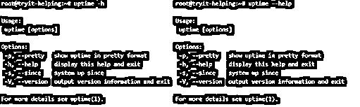

# Linux 正常运行时间

> 原文：<https://www.educba.com/linux-uptime/>

## Linux 正常运行时间介绍

正常运行时间被定义为一个命令，该命令返回系统已经运行了多长时间以及统计数据，如当前时间、用户的活动会话数以及系统的平均负载。不仅如此，加载时间也以 1 分钟、5 分钟和 15 分钟的节奏进行跟踪，正常运行时间命令有助于整理所有这些并作为一个整体呈现！该命令是系统管理员使用最广泛的命令之一。uptime 命令的结果来自 Linux 系统中的不同位置，然后以人类可读的格式聚集在一起，并且有许多选项可用于它的各种实用程序。

**语法**

<small>网页开发、编程语言、软件测试&其他</small>

在 Linux 中，可用于正常运行时间的选项非常有限，在这一节中，我们将详细讨论所有这些选项，通过查看语法来减少时间，在本文的后面，深入研究 Linux 中正常运行时间命令的工作方式。

**1。显示所有关于正常运行时间的信息而不格式化**

**语法**

`uptime`

**2。以漂亮的格式显示正常运行时间的统计数据**

**语法**

`-p`

**或**

`--pretty`

**3。显示正常运行时间的帮助文档**

**语法**

`-h`

**或**

`--help`

**4。显示自时间**起

**语法**

`-s`

**或**

`--since`

**5。列出输出版本**的信息

**语法**

`-V`

**或**

`--version`

### Uptime 命令在 Linux 中是如何工作的？

正常运行时间的描述，当出现在控制台中时，描述了以下信息的单行显示。首先，它是描述当前命令运行时间的当前时间。这是为了理解，也许从接下来的正常运行时间反算，来理解系统第一次运行的时间。既然我们已经提到了从正常运行时间反算的系统的开始，这个正常运行时间表示系统已经运行了多长时间。下一条信息是当前有多少用户登录。最后，以 1 分钟、5 分钟和 15 分钟的节奏，提到系统的平均负载。

现在，有了上面所有的描述，在我们跳到任何关于 Linux 工作的后续描述之前，我们需要知道 2 件主要的事情。第一个问题是我们所说的系统平均负载是什么意思，第二个问题是正常运行时间从哪里获得所有这些统计数据？回答第一个问题，系统平均负载是处于可运行或不可中断状态的进程的数量；可运行状态是进程正在使用 CPU 或等待使用 CPU 的状态，而不可中断状态是进程等待一些 I/O 访问(如磁盘)的状态。为了回答下一个问题，uptime 命令从两组不同的位置收集信息，/var/run/utmp 列出了当前登录系统的用户，另一个位置是/proc/uptime，列出了进程信息。

类似地，上一段中提到的位置处于机器可读的状态，这就是为什么需要类似命令的正常运行时间，以便于解释和转换为人类可读的格式。如果您需要交叉检查 uptime 是否向控制台提供了准确的输出，可以在/proc/uptime 位置使用 awk 或 sed 命令，并获得想要的结果。正常运行时间的结果也可以通过 w 命令轻松访问，该信息显示在命令输出的第一行。

现在是我们解码 uptime 命令显示的信息的时候了。当使用 uptime 命令时，它会得到以下行作为输出:

09:27:19 运行 91 天 27 分钟，9 个用户，平均负载:0.28、0.27、0.27

这里，第一个突出显示部分提到了运行 uptime 命令的时间。下一个突出显示部分提到了系统运行的天数和分钟数。下面突出显示的是登录的用户数量，在本例中是 9。最后，以百分比形式显示过去 1、5 和 15 分钟的逗号分隔的 CPU 负载。它的工作方式是所有信息驻留在不同的位置，而 uptime 命令试图将它们协调起来，并以人类可读的格式呈现出来。如果有人需要了解正常运行时间的替代品，他或她可以参考 Linux 中的 top 命令作为实用程序。另一个与正常运行时间类似的概念是 tuptime 实用程序，它列出了 Linux 服务器的历史正常运行时间及其统计数据！

### 例子

下面举几个例子

#### 示例#1

显示正常运行时间的所有信息，不带格式

**语法**

`uptime`

**输出:**

在此选项中，我们看到在 1 分钟时，CPU 负载为 3%(表示为一个分数)，在 5 分钟时，CPU 负载为 9%，在第 15 分钟间隔内，CPU 负载为 8%，系统运行 1 分钟。

#### 实施例 2

以漂亮的格式显示正常运行时间的统计数据

**语法**

`uptime -p`

**或**

`uptime --pretty`

**输出:**

#### 例号 <u>3</u>

显示正常运行时间的帮助文档

**语法**

`uptime -h`

**或**

`uptime --help`

**输出:**

#### 实施例 4

显示自时间起

**语法**

`uptime -s`

**或**

`uptime --since`

**输出:**

#### 实施例 5

列出输出版本的信息

**语法**

`uptime -V`

**或**

`uptime --version`

**输出:**

### 结论

有了一组例子和对正常运行时间工作方式的解释，现在使用 uptime 命令带来的实用程序就容易多了。现在，读者可以开始尝试 uptime，而不仅仅是停留在这里，还可以使用 sed 和 awk 命令的广泛实用程序来引入 uptime command 的相同功能。这样做不仅更令人满意，而且反过来，还可以帮助您检查 uptime 命令是否确实给出了正确的结果！

### 推荐文章

这是 Linux 正常运行时间的指南。在这里，我们讨论了 Uptime 命令在 Linux 中是如何工作的，并给出了示例和输出。您也可以看看以下文章，了解更多信息–

1.  [Linux 大小](https://www.educba.com/linux-size/)
2.  [Linux 加入](https://www.educba.com/linux-join/)
3.  [Linux 容器](https://www.educba.com/linux-container/)
4.  [Linux 大页面](https://www.educba.com/linux-hugepages/)

