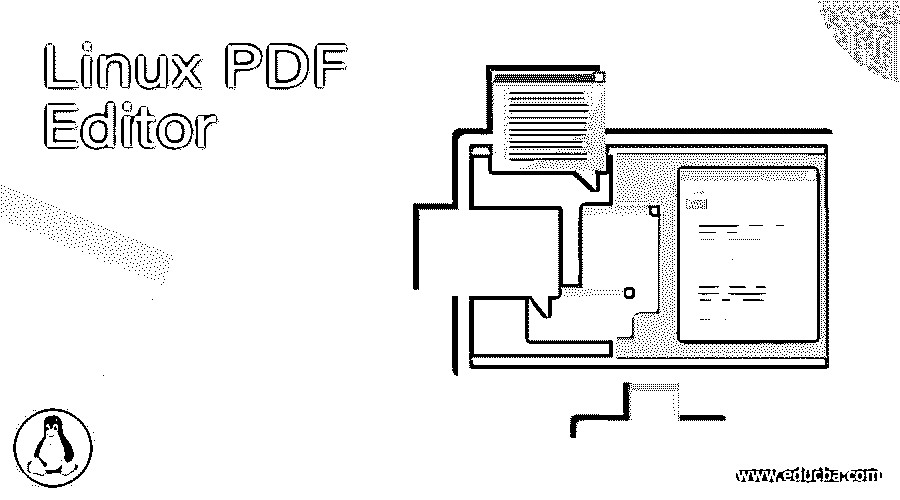

# Linux PDF 编辑器

> 原文：<https://www.educba.com/linux-pdf-editor/>

## Linux PDF 编辑器简介

在 Linux 操作系统中，我们有许多环境中可用的 pdf 编辑器。pdf 代表可移植文档格式。它是文本数据和图像数据的组合。1993 年，Adobe 开发了 pdf 格式。在开发这种原型时，他们希望开发一个独立于任何应用软件、任何操作系统和任何硬件的平台。Linux 环境中有不同类型的 pdf 编辑器，如 LibreOffice Draw、S Master PDF Editor、PDF Mix Tool、PDFsam、cribus、Okular、Qoppa PDF Studio、PDFArranger、PDF Chain、PDF Slicer 等。

**语法:**

<small>网页开发、编程语言、软件测试&其他</small>

因此，pdf 编辑器没有特定的语法。一般来说，我们使用 UI 中的 pdf 编辑器，因此我们不需要使用特定的语法。

### Linux PDF 编辑器是如何工作的？

在 Linux 环境中使用 pdf 编辑器时。我们需要选择任何一个 pdf 编辑器。从操作的角度来看，工作的方法是相同的，但当 pdf 编辑器将发生变化。这也将改变 pdf 编辑器的功能。根据需要，我们可以选择 pdf 编辑器。我们需要选择 pdf 文件，并在 pdf 编辑器环境中打开它。一旦文件可用，我们需要编辑/ pdf 编辑器工具。使用帮助编辑工具，我们可以在文本方面进行更改，如编辑文本、添加新文本或更新文本。同样，我们可以调整大小，添加，替换图像等。一旦我们这边做了所有必要的改变。我们可以将文件保存到任何其他位置。

### Linux PDF 编辑器

让我们讨论不同的 Linux PDF 编辑器。

#### 1\. Okular

在 Linux 环境中，我们有许多 pdf 编辑器工具，okular 就是其中之一。它也被称为绘图工具，因为它也提供绘图功能。它对不同的活动也很有用，如在 pdf 文件中添加一些文本，更新或删除一些文本，处理内嵌注释，处理图章，突出显示包含部分的数据，支持手绘线条。在 okular 编辑器中，我们获得了最好的注释功能。

*   操作系统:它也支持 Linux、Windows 和 Mac 平台。
*   **许可条款:**无需许可。它是一个开源工具，可以免费使用。

#### 2\. Scribus

Scribus 编辑器的工作机制与其他 pdf 编辑器不同。在 Scribus 编辑器中，我们可以启用 PDF 文档中的动画；创建互动模式等。

该编辑器通常用于传单、文档设计和设计图像等。此外，Scribus 允许列表和添加控件，为自己的用户创建新的 PDF。

*   操作系统:它支持多种操作系统，如 Linux、Windows 和 Mac 平台。
*   **许可条款:**无需许可。它是一个免费的编辑器。我们没有必要在 Scribus 编辑器上花钱。

#### 3.Foxit 阅读器

Foxit 阅读器属于 pdf 编辑器类别。这是基于云技术。对于任何 PDF 文档的阅读，它使用的是云通信。当使用 Foxit reader 时，它在加密、授权或撤销访问、签名机制方面为 PDF 文档提供了更多的安全性。

*   操作系统:它也支持 Linux、Windows 和 Mac 平台。
*   **许可条款:**软件免费安装，但部分企业特性需要付费。

#### 4.瘸子

GIMP 编辑器在 PDF 编辑和图像处理(GNU)方面提供了广泛的功能。我们没有在 Linux 环境中单独安装 GIMP 编辑器。它只提供操作系统安装。

与其他 PDF 编辑器相比，GIMP 编辑器并不简单。它涉及编辑 PDF 文档时的一些活动。为了编辑任何 PDF 文档，我们需要在 GIMP 编辑器中重新编译 PDF 文档，它将启用层。相同的图层将有助于编辑和导出。GIMP 编辑器的另一个缺点是，我们不能处理多页的 PDF 文档。同时，我们只需要在一个页面上工作。

*   **操作系统:**一般会支持多种操作系统。
*   **许可条款:**无需许可。它是一个免费的编辑器。我们不需要在 GIMP 编辑器上花钱。

#### 5.PDF 工作室

PDF studio 为理想的 PDF 编辑器提供了完整的解决方案。它将授予所有的 PDF 编辑功能方面的选定版本，如标准或专业版。在标准版中，我们可以创建新的 PDF 文档或文件、应用水印、附加页面、删除页面、PDF 表单和保护文档。在专业版中，我们将获得额外的功能来减少文件或文档的大小，轻松操作 PDF 文件，编辑文本，OCR 功能，帮助创建或启用文本搜索 PDF 文档(就小图像而言)。

*   **操作系统:**一般会支持多种操作系统。
*   许可条款:PDF studio 不是自由软件。根据要求，我们需要选择版本。标准版的成本是 89 美元，专业版是 129 美元。在专业版中，我们将获得 PDF studio 的所有功能。

### 结论

我们已经看到了“Linux PDF 编辑器”的完整概念，以及正确的解释、操作系统支持和许可条款。pdf 编辑器工具或软件用于对 PDF 文档或文件进行不同的操作。根据需要，我们可以选择 PDF 编辑器版本，如标准版、专业版或免费版。根据所选的版本，PDF 编辑器功能也将发生变化。

### 推荐文章

这是一个 Linux PDF 编辑器指南。这里我们讨论一下简介，不同的 Linux PDF 编辑器，以及 Linux PDF 编辑器是如何工作的？您也可以看看以下文章，了解更多信息–

1.  [Linux Ping](https://www.educba.com/linux-ping/)
2.  [Linux LVM](https://www.educba.com/linux-lvm/)
3.  [Linux Diff 命令](https://www.educba.com/linux-diff-command/)
4.  [Linux 大小](https://www.educba.com/linux-size/)

