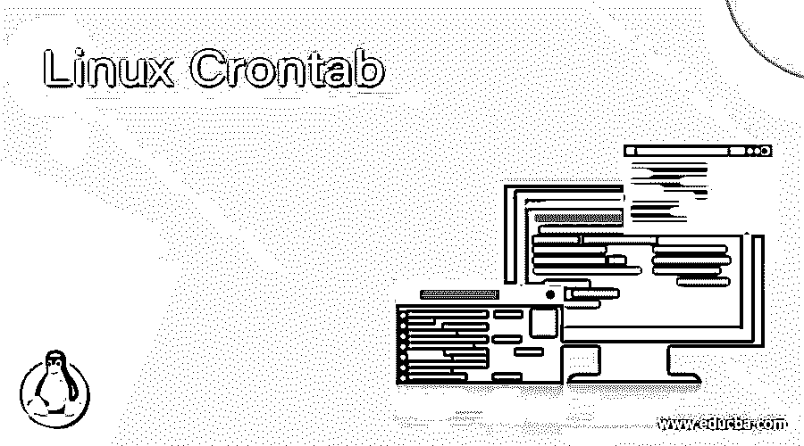
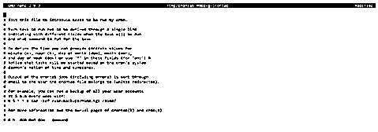
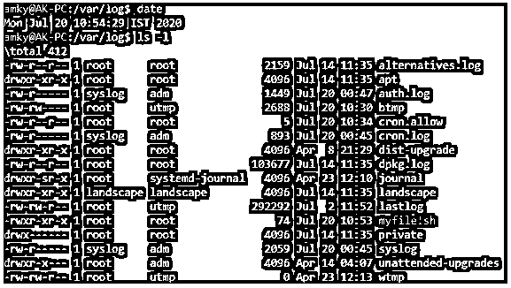
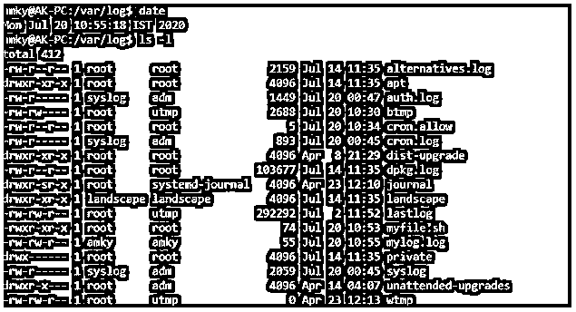

# Linux Crontab

> 原文：<https://www.educba.com/linux-crontab/>

## Linux Crontab 简介

Crontab 只不过是一个带有守护进程的表，cron 利用它在基于 Linux 的操作系统中调度任务。现在你一定在想什么幼稚的定义，我们连 cron 是什么都不知道！因此，我们将 cron 定义为一个软件工具，或者换句话说，允许用户调度基于时间的调度程序，以固定的时间间隔执行重复任务的系统进程。这些时间间隔可以是一天中的某个特定时间，甚至可以是一个有固定时间间隔的常规时间表。Crontab 代表“cron 表”,它本质上是从 cron 获取任务执行的帮助。在系统维护或系统管理需要自动化的情况下，这个实用程序非常方便。

### **语法**

在我们深入了解 crontab 将有助于什么场景，或者 crontab 的工作原理是什么之前，了解 crontab 背后的语法是非常重要的，以便在浏览任何进一步的细节时，我们可以记住语法，这将提高我们的视觉可解释性。

<small>网页开发、编程语言、软件测试&其他</small>

#### crontab 上的操作语法

`crontab [-u user] [-l | -r | -e] [-i] [-s]`

在这种语法中，可以使用任何一个选项或选项的组合。-u 帮助 crontab 专门查找该用户的 crontab。-l 选项有助于显示当前的 crontab 文件以供编辑。-r 选项有助于删除当前存在的 crontab。-e 有助于编辑 crontab 文件 post，下一个语法用于输入命令。-i 与-r 非常相似，唯一的区别是该选项在删除当前 crontab 文件之前会给出提示。-s 代表 SELinux，它是安全性增强的 Linux，不在本文讨论范围之内！

#### 命令输入的语法

`[MINUTE] [HOUR] [DAY OF MONTH] [MONTH] [DAY OF WEEK] COMMAND`

在上面的语法中，crontab 由以下参数组成，需要传递这些参数才能在所需的计划时间运行 cron 调度程序。这里的字段包括:[COMMAND]是您需要在计划的时间执行的命令，该计划由以下参数提供:[MINUTE]是一天中您希望命令运行的分钟[HOUR]是一天中命令需要运行的小时，[DAY OF MONTH]是一个月中的某一天，在 cast 中，命令只需要在一个月中的某一天运行， 当需要仅在特定月份运行命令时，使用[MONTH ][ DAY OF WEEK]表示命令需要在一周中的哪几天运行，在这里，这些天从星期一的 1 点开始，到星期日的 7 点结束。

还有一点需要记住的是，如果有任何选项对于 cron 调度程序的用例来说不是必需的，那么该字段将被替换为“”,这实际上意味着该命令将在提到“”的所有特性上运行。例如，如果[MONTH]被称为*，那么该命令将在所有月份运行！现在有一个小问题，想想如果所有的字段都是*，那意味着什么。试着思考这个问题，直到我们在下一节的例子中看到答案！

### Crontab 在 Linux 中是如何工作的？

在这里，我们将深入了解 crontab 在 Linux 中是如何工作的。Crontabs 存在于本地(例如/var/spool)或其子目录中(例如/var/spool/cron/crontabs)。尽管它们存在于这些位置中的任何一个，但是应该避免直接编辑它们，而应该借助命令 crontab 来实现该实用程序。

至此，我们将了解在您期望从 crontab 操作中获得期望的输出之前，需要哪些基本组件。在第一个命令中，条目必须出现在 crontab 中。这些只是 5 个字段，表示命令需要在一天中的什么时间执行，以及是否需要执行。用户可以通过使用命令 crontab -e 首先进入编辑模式来编辑 crontab。一旦输入时间，crontab 就完全可以在一天中的给定时间执行。

cron 守护进程帮助进行检查，以便指定的命令可以在该实例上运行。这个守护进程每分钟检查一次 crontab。这就是为什么这个 crontab 有详细到分钟，而不是秒。该检查每分钟执行一次，相应的命令运行，crontab 中提到的这些命令的字段与该时刻相匹配。

应该非常小心类似“丢失小时”或夏令时“向前跳跃”的情况，在这种情况下，命令甚至可能不会运行一次，另一方面，如果时间不止一次出现，如秋季夏令时，命令甚至可能会运行两次。

另一个例子是，还可以使用连字符在一天中的多个时间运行 cron 作业。例如，如果有人想在一天中的第 8 小时和第 9 小时运行 cron 作业，那么可以使用 8-9 来完成这个需求。

运行 cron 作业所需的另一件非常重要的事情是允许作业运行的配置。要允许或禁止用户运行 cron 作业，可以相应地修改 cron.allow 或 cron.deny 以使其生效。

### Linux Crontab 的例子

现在是时候看看 crontab 中的一些例子了，这将使我们对这个实用程序有一个全面的了解。

#### 示例# 1–编辑 Crontab

**代码:**

`crontab -e`

**输出:**

#### 示例 2–每 1 分钟在命令行中运行一次 Echo

**代码:**

`* * * * *myfile.sh >> /var/log/mylog.log 2>&1`

**输出:**

在上午 10:54，我们没有看到任何日志作为 mylog.log

在上午 10:55，我们看到生成了 mylog.log:

mylog.log 中的日志

这和我们在琐事中举的例子是一样的。在 myfile.sh 中，我们打印日期，然后是文本“我们正在从 EduCBA 学习 Crontab”。输出说明了一切！

### 结论

在本文中，我们已经广泛地研究了 crontab 带来的所有特性，并且决定在这些特性的基础上构建一个实用程序。至于这个小问题的答案，当所有的字段都是*时，那么这个命令将会每分钟运行一次，一天、一月、一年等等，直到它被删除！

### 推荐文章

这是 Linux Crontab 的指南。这里我们已经分别讨论了简要概述、调度技巧、输出存储。您也可以看看以下文章，了解更多信息–

1.  [Linux 面试问题](https://www.educba.com/linux-interview-questions/)
2.  [Linux 职业生涯](https://www.educba.com/careers-in-linux/)
3.  [Linux 应用程序](https://www.educba.com/linux-apps/)
4.  [Linux vs Windows 10](https://www.educba.com/linux-vs-windows-10/)

