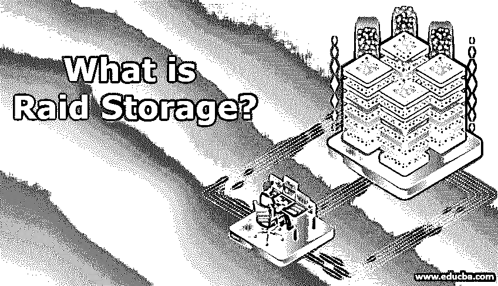

# 什么是 Raid 存储？

> 原文：<https://www.educba.com/what-is-raid-storage/>

## Raid 存储简介

Raid 是一种存储数据的虚拟化技术，因为它结合了不同位置的不同物理驱动器并存储数据。这些物理驱动器组合成一个逻辑单元，以提高存储性能。Raid 级别以从 0 开始的数字命名，并且不连续。Raid 的主要目标是始终可用于数据存储，以及复制数据用于恢复。在奇偶校验的帮助下，raid 被保护免于出错，并且这对于不同的级别是不同的

### 什么是 Raid 存储？

磁盘驱动器成为最早出现的技术，一直持续到过去十年，并且在 80 年代初和 90 年代末成为数据的重中之重。然而，由于每种技术都会在某个时间点过时，数据操作速度和安全性成为其衰落的主要原因，一种被称为 RAID 的新技术取而代之。这项技术致力于提高数据存储性能和可靠性。RAID 存储系统由多个协同工作的驱动器组成。RAID 存储技术在硬件和/或软件的帮助下，将可用的多个驱动器视为单个连续的驱动器。RAID 存储的一个重要特性是其在多个 RAID 级别中的可用性，这些级别都有特定的用途。

<small>网页开发、编程语言、软件测试&其他</small>

*   **RAID 0:** 它为所有的读写操作提供了方便更好的性能，这种技术易于操作。
*   **RAID 1:** 配置在磁盘镜像和双工上，这意味着相同的数据写入两个磁盘，形成镜像。如果一个磁盘出现故障，操作不会中止，因为第二个磁盘会继续工作。
*   **RAID 2:** RAID 2 和 RAID 5 相似，磁盘条带化是在比特级执行的，并对汉明码进行编码以防止错误。
*   **RAID 3:** 是具有专用奇偶校验磁盘的字节级条带化。
*   **RAID 4:** 具有良好的随机读取和顺序数据访问性能。它具有带奇偶校验磁盘的块级条带化。
*   **RAID 5:** 它的卓越性能和容错能力非常棒。它用于文件服务器、备份和 web 服务器。事务的读取速度很快，而写入速度相对较慢(由于奇偶校验较低)
*   **RAID 6:** 它是一个独立的数据磁盘，具有双重奇偶校验功能。它可靠、快速，并为容错处理提供完全的容错能力。它具有与 RAID 5 类似的块模式，但具有不同的块奇偶校验功能。
*   **RAID 10:** 由 1 和 0 两个 RAID 组合而成。它执行类似 RAID 1 的镜像功能，并作为 RAID 0 进行条带化。它具有良好的读写性能，可以在性能和可用性方面用于数据库存储。

有 3 种类型的 RAID 阵列:

*   **RAID 1:** 更侧重于镜像。
*   **RAID 1:** 主要处理纠错。
*   **RAID 0:** 仅限于数据分条。

### Raid 存储是如何工作的？

RAID 存储致力于提高性能，它将数据分成小块，并将其放入多个位置的多个磁盘中。它以平衡的方式做到这一点，这样 I/O 操作就不会受到干扰。它对 OS(操作系统)来说就像一个完整的硬盘。现在，RAID 技术将磁盘镜像成多个条带。数据作为其原始文件的镜像存储在多个位置。相关磁盘的这些条带是按顺序交叉存取和寻址的。这是一种快速存储和检索数据的有效方法，但以容错为代价，这意味着如果在任何时候一个磁盘不工作并出现故障，那么我保存在所有磁盘中的数据都会丢失。使用 RAID 存储技术时，数据备份解决方案是必不可少的。

### Raid 存储的优势

与单个硬盘驱动器相比，RAID 为用户带来了更多好处，包括快速数据检索和读/写。下面我们列出了使用 RAID 的一些重要优势:

*   大容量存储无疑是 RAID 相对于传统存储的一个明显优势，它为用户提供了比单个驱动器更多的存储容量。通过插入额外的硬盘，可以轻松增加 RAID 存储。
*   在普通硬盘的情况下，操作系统运行时间不会受到这种程度的影响。考虑一种情况，当正常系统中的硬盘发生故障时，操作系统将停止工作，但与 RAID 存储相比，类似的情况得到了更好的处理，并增加了 OD 的运行时间。
*   奇偶校验是 RAID 存储中的一项新功能，它使用户能够检查任何潜在的系统崩溃，如果是这样，它会向您发出警告。它给用户时间来理解问题并解决它。
*   快速是我们在简介部分简要介绍过的东西；这样做是因为它将每个文件的镜像存储到两个或多个位置。
*   数据可用性和性能得到了更大程度的增强，因为文件存储在多个位置，读/写任务是即时执行的。

### 结论

到目前为止，我们正在以多种方式消耗更多的数据，在过去十年中，应用程序和文件大小都有了相当大的增长。我们无法通过早期的技术(即硬盘驱动器)来满足这种需求，而是需要 RAID 存储来实现更快的数据处理。我们已经提出了所有可能的细节，我们的读者想知道的 RAID。

### 推荐文章

这是什么是 Raid 存储的指南？.在这里，我们讨论什么是 Raid 存储，它是如何工作的，以及它的优势和不同类型。您也可以浏览我们推荐的其他文章，了解更多信息——

1.  [Linux 中 Raid 是什么？](https://www.educba.com/what-is-raid-in-linux/)
2.  [什么是 Raid 5？](https://www.educba.com/what-is-raid-5/)
3.  [RAID 0 与 RAID 1 的对比](https://www.educba.com/raid-0-vs-raid-1/)
4.  [Raid 5 与 Raid 6 的对比](https://www.educba.com/raid-5-vs-raid-6/)

