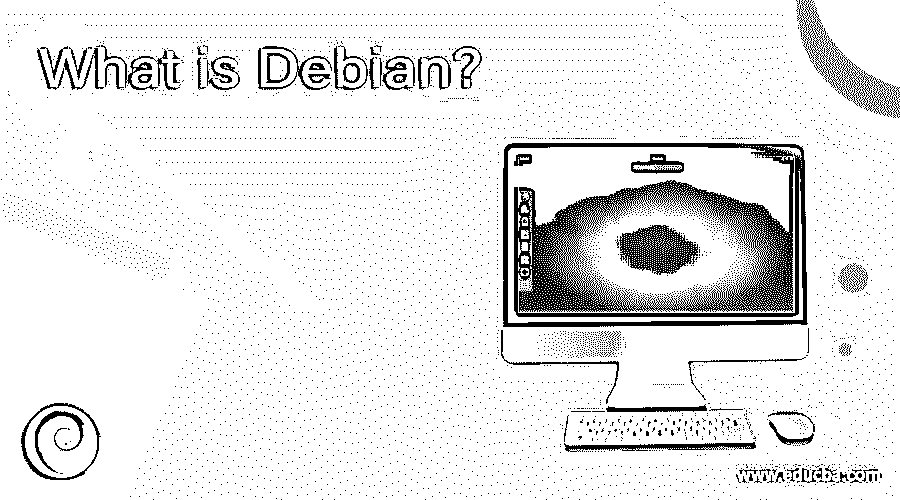

# Debian 是什么？

> 原文：<https://www.educba.com/what-is-debian/>

## Debian 简介

这篇文章将会谈到 Debian 操作系统，并且会给你一个基本的概念，告诉你为什么以及如何学习它是一项重要的技术。这是一个由一群人创造的免费操作系统；他们有一个共同的目标，那就是创建一个自由的操作系统。操作系统是让你的计算机运行的重要工具。操作系统只不过是一组基本程序。然后是内核，这是一个操作系统最基本的程序；它让你启动其他程序，并做所有其他基本要求的事情。

### Debian 使用的内核

*   Linux 内核: Linux 是由 Linus Torvalds 开发的一个软件片段，现在得到了全世界大量程序员的支持和使用。
*   **FreeBSD 内核:** FreeBSD 是一个 OS；它有自己的内核和其他所需的软件。

尽管如此，为 Hurd 提供其他内核支持的工作仍在继续。Hurd 是在一个微内核(例如 Mach)上持续运行的服务器的集合，以执行各种精彩内容。Hurd 是由 GNU venture 提供的免费程序。完成工作框架的一大部分基本设备来自 GNU venture 从今以后，名字:GNU/Linux、GNU/kFreeBSD 和 GNU/Hurd。这些仪器都是免费的。

<small>网页开发、编程语言、软件测试&其他</small>

显然，个人需要的是应用程序编程:使他们能够做他们需要做的事情的项目已经完成，从修改记录到维持业务到玩娱乐到编写更多的程序。它附带了超过 51000 个软件包(预编译的程序，打包在一个令人愉快的配置中，以便在您的机器上简单建立)、一个软件包管理器(APT)和不同的实用程序，这些实用程序可以像引入一个单独的应用程序一样有效地管理大量 PC 上的大量软件包。每一点都是免费的。它的钻头就像一座塔。底部是内核。最重要的是所有的基本工具。接下来是你在电脑上运行的所有软件。在塔的顶端是 Debian——仔细地组织和安装所有的东西，所以它能一起工作。

### 了解 Debian

Debian 是一个杰出的、不受限制的 PC 工作框架，它利用了 Linux 内核和来自 GNU venture 的其他程序段。它可以从网上下载，或者花一点钱，从光盘上下载。作为开源编程，Debian 是由 500 多名贡献的软件工程师创建的，他们共同构建了 Debian 项目。每隔一段时间就会有新的病人出院。通过邮件列表的成员身份可以访问管理进度。

Debian 支持超过 3950 个免费下载的应用程序。虽然一些广泛使用的应用程序，如微软 Word 和 Excel，被排除在外，Corel 的 WordPerfect 和比较工作区应用程序是可以访问的。这是主要的免费编程任务之一，由伊恩·默多克于 1993 年发起。它的发音是 deb-EE-uhn，因为它来自伊恩·默多克和他的另一半黛布拉的名字。

### Debian 支持硬件

Debian 将继续在几乎所有的个人电脑上运行，包括最成熟的型号。在很大程度上，Debian 的每一个新成员都会支持更多的 PC 型号。对于一个总的纲要，现在支持的，见稳定排放的文件。

有几个组织因为不公布他们设备的细节而使支持变得麻烦。这意味着你很可能不会在 GNU/Linux 上使用他们的设备。一些组织为 s an 提供非驱动程序，但这是一个问题，因为该组织以后可能会退出业务或停止对您的设备的支持。这是规定，你只能从制造商那里购买装备，这些制造商为他们的物品提供免费的驱动程序。

### 谁使用 Debian？

虽然没有精确的测量数据(因为它不期望客户注册)，但是有确凿的证据表明 Debian 被各种各样的协会使用，无论是大的还是小的，就像大量的人一样。

#### 使用 Debian 的理由

*   它是 100%基于志愿者的，不是由任何企业经营的
*   它是 100%开源的
*   各种 CPU 架构都支持它
*   许多 CPU 架构都支持它:Google 利用 Debian 的调整版本来运行它的服务器，许多不同的组织也使用它来运行他们的服务器。
*   大量最流行的 Linux 发行版都源自 Debian
*   它拥有最大数量的已安装软件包。

因此，最后，使用 Debian 的动机是，它是 100%基于志愿者的，不是由任何公司运行的，它是 100%开源的，它由许多 CPU 模型支持，它是这个星球上最好的工作框架之一，大量最主流的 Linux 发行版都来自 Debian，使用 Debian 将迫使你创造批判性思维能力。

### 这项技术将如何帮助你的职业发展？

由于这种操作系统可以免费获得，并且全球有成千上万的程序员在使用它，这表明这项技术有着光明的前景。许多像 Google 这样的公司都在使用 Debian 来运行他们的服务器。这项技术不会消亡，并将永远提供一个良好的职业机会。

### 结论

Debian 是最著名的 Linux 发行版中的佼佼者，包括 Ubuntu 和 Knoppix 在内的许多不同版本都是从 Debian 代码库中获得的。从 2018 年开始，DistroWatch 记录了 141 个动态 Debian 子公司。这个项目为下属提供了最佳实践的规则，并敦促下属将他们的工作整合到 Debian 中。

尽管有这些内部的改进，人们可以合理地期待新的基于 Debian 的拨款变得可见；同样数量的文书继续使这项工作变得更加简单。新的特定子项目也将开始，以便将 Debian 的范围扩大到新的天际线。

### 推荐文章

这是一个什么是 Debian 的指南？.在这里，我们讨论 Debian 使用的内核，支持硬件，以及这项技术将如何帮助你的职业发展？.您也可以阅读以下文章，了解更多信息——

1.  [什么是 C++中的模板类？](https://www.educba.com/what-is-template-class-in-c-plus-plus/)
2.  [Ubuntu 替代品](https://www.educba.com/ubuntu-alternatives/)
3.  [如何安装 Debian](https://www.educba.com/install-debian/)
4.  什么是 JSF？

