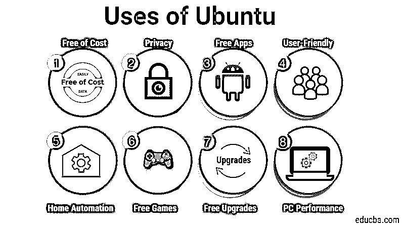

# Ubuntu 的使用

> 原文：<https://www.educba.com/uses-of-ubuntu/>

## Ubuntu 简介

Ubuntu 是一个开源的免费 Linux 发行版。它是一个云计算操作系统，支持开放堆栈。Ubuntu 是由 canonical 社区开发的，可以免费获得。此外，Canonical 有限公司负责 Ubuntu 的资金。

基本上 Ubuntu 是半年发布一次。每个版本都有九个月的免费支持，每两年发布一次的长期支持(LTS)。Ubuntu 的第一次发布是在 2004 年 10 月。最新发布的是 18.10，也叫，宇宙乌贼。

<small>网页开发、编程语言、软件测试&其他</small>

Ubuntu 的三个版本是桌面版、服务器版和核心版。

Ubuntu 的名字是以这位非洲哲学家的名字命名的，意思是“对他人的仁慈”。Ubuntu 的架构是[基于 Debian](https://www.educba.com/what-is-debian/) 和 Linux server。

### Ubuntu 的使用

以下是 Ubuntu 的 12 大应用:

#### 1.免费

下载和安装 Ubuntu 是免费的，安装它只需要时间。你可以从网上下载或者创建一个 ISO 引导盘，然后环境就可以启动了。在 Ubuntu 的帮助下，人们可以恢复旧的、未使用的或任何低性能的计算机系统，而无需任何投资。还有，故障排除不要一分钱。人们可以在 Linux 环境的帮助下做到这一点。

它还包括自己的办公套件，名为 LibreOffice。这阻止了我们的口袋，不让我们购买昂贵的许可套件，如 MS Office 等。

#### 2.隐私

与 Windows 相比， [Ubuntu 在隐私和安全方面提供了更好的选择](https://www.educba.com/install-ubuntu/)。使用 Ubuntu 的最大好处是，我们可以获得所需的隐私和额外的安全性，而无需任何第三方解决方案。使用这种分布可以将黑客攻击和各种其他攻击的风险降至最低。

#### 3.使用硬盘分区

Linux live CD 和 Gparted 支持将硬盘划分为多个分区。当您的系统是双重或三重启动时，此功能也适用。否则，分区有助于迁移到固态硬盘或更宽敞的硬盘。除此之外，在 Ubuntu 中清除数据也很容易。

#### 4.免费应用

Ubuntu 提供了许多免费的应用程序来探索充满机遇、点心和快乐的世界。以下列出了几个应用程序供参考:

*   **Spotify** :免费用于流媒体歌曲。还允许创建播放列表和喜爱歌曲的专辑。0
*   **Skype** :用于即时通讯、高质量视频和语音通话。
*   **VLC** :单一媒体播放器，兼容多种媒体文件格式。
*   **Firefox** :比 Chrome 效率更好、重量轻 30%的快速浏览器。
*   **Slack** :团队协作软件，让一个地方轻松顺利地完成工作。
*   Atom:现代的文本编辑器，具有处理所有类型文档格式的特性。
*   Pycharm :一个吸引人的编程 IDE，包括 Python 编码的所有重要工具，以及令人兴奋的应用内特性。
*   **Telegram** :一款移动同步桌面应用，可实现更快、更安全的信息传递。

#### 5.方便用户的

Ubuntu 和 [Windows 操作系统](https://www.educba.com/windows-operators/)一样简单。关于 Ubuntu 有一个众所周知的神话，那就是 Ubuntu 只为开发者和编码者开发。但事实是，Ubuntu 是一个漂亮的桌面操作系统，任何普通电脑用户都可以使用。

#### 6.易接近

Ubuntu 的另一大特点是易用性。用户可以很容易地使用 PHP 的各种 CMS，比如 Laravel，Magneto，WordPress 等等。除了 PHP，Ruby，Java，Python 可以很容易的在 Ubuntu 中实现。用户在访问 Ubuntu 时体验到一个漂亮的桌面设计，使用起来非常简单高效。

#### 7.家庭自动化

一知半解的 Linux 和一台小型机[如 Raspberry Pi](https://www.educba.com/uses-of-raspberry-pi/) ，都是为了制造小型家庭自动化小工具。一次点击或按下或按住就能让你家的各种设备和系统自动运行，无需人工干预。

#### 8.向防病毒说再见

感染病毒或[恶意软件的风险最小](https://www.educba.com/what-is-malware/)，这降低了防病毒软件的成本。反病毒也是计算机系统运行缓慢的一个原因，并严重影响性能。此外，这可能会导致系统无法有效运行。除了这个问题，反病毒也在我们的系统中占据了很大的空间。但是有了 Ubuntu，所有这些风险和问题都可以以一种负担得起的方式被忽略。

#### 9.向盗版软件说再见

如前所述，它是免费的，这也包括许多嵌入系统的免费软件。然而，一些基于 windows 的程序需要替代选项，如虚拟机，因为它会在基于 Linux 的服务器中产生兼容性问题。访问官方软件，不仅提供了安全性和防止错误，而且还节省了购买盗版软件的费用。

#### 10.免费游戏

通常称为 WINE 的兼容层是用于在基于 Linux 的操作系统上运行基于 windows 的游戏和应用程序的最流行的程序。发行版中的许多游戏都是开源的，因此不需要任何额外的成本来安装在我们的系统中。

#### 11.电脑性能

系统的性能取决于使用的类型。例如，如果系统用于编码、设计、测试问题或用于商业目的，或者仅仅是简单地使用计算机系统，则推荐使用。这背后的一些原因是，Ubuntu 比 Windows 启动更快，感染更少，提供各种免费的 ide。否则，如果考虑游戏目的，Windows 和 MAC 比 Ubuntu 要领先很多。

#### 12.免费升级

Ubuntu 提供的所有升级都是免费的。它们每六个月发布一次。升级是自动安装的，但只有在用户许可并且用户知道安装的情况下。安装时，用户不需要担心丢失数据或重做数据。分配本身能够很好地处理系统。

### 结论

Ubuntu 是一个开源的桌面操作系统，可以免费下载和安装，没有任何麻烦。Ubuntu 附带了各种各样的特性，这使得它比其他发行版更有竞争力。Ubuntu 功能的多样性使它对开发者和普通用户都很有用。

### 推荐文章

这是 Ubuntu 的使用指南。这里我们举例说明了 Ubuntu 的不同用法。您也可以浏览我们推荐的其他文章，了解更多信息——

1.  [Splunk 的用途](https://www.educba.com/uses-of-splunk/)
2.  [SQL 的使用](https://www.educba.com/uses-of-sql/)
3.  [c#的用途](https://www.educba.com/uses-of-c-sharp/)
4.  WordPress 的使用

