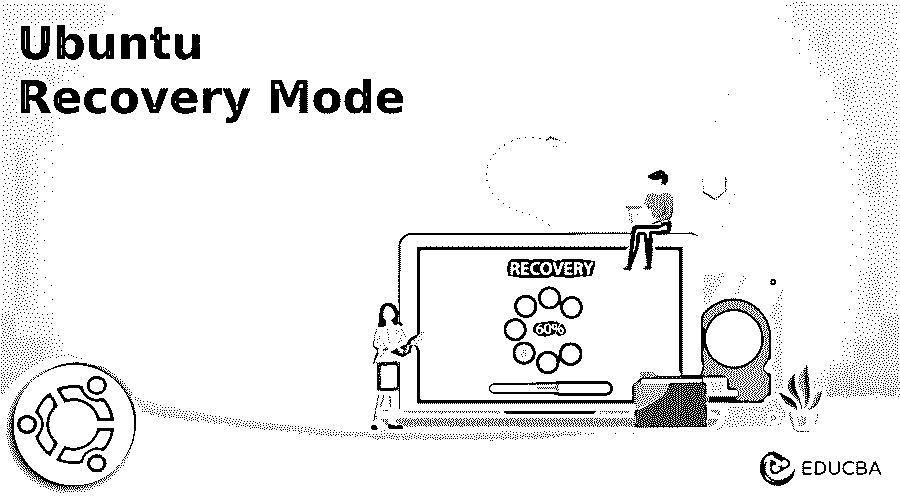
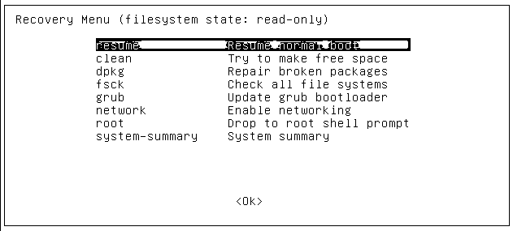
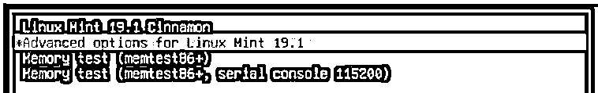
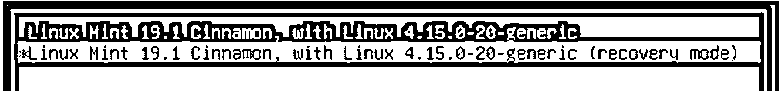
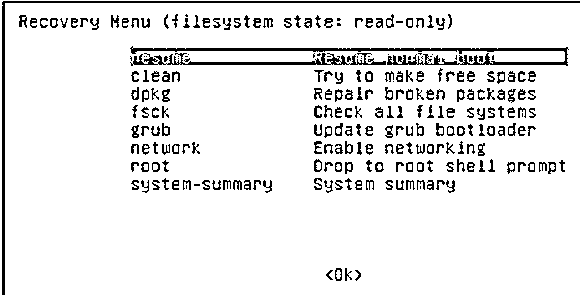

# Ubuntu 恢复模式

> 原文：<https://www.educba.com/ubuntu-recovery-mode/>




## Ubuntu 恢复模式简介

基本上，Ubuntu 向用户提供不同类型的功能，其中恢复模式是 Ubuntu 提供的功能之一。有时我们的系统由于任何原因无法启动，这时我们可以使用恢复模式来启动我们的系统。通过使用恢复模式，我们可以加载我们需要的所有基本服务，并且还可以打开命令行模式。

### 关键要点

*   通过使用恢复模式选项，我们可以构建一个低接触系统。
*   恢复模式还支持物联网设备，该设备可通过不同选项进行扩展。
*   它避免了手动修复系统，这意味着我们可以采取远程访问来解决问题。
*   恢复模式有助于我们将快照保存到恢复系统中。

### 什么是 Ubuntu 恢复模式？

Ubuntu 伴随着恢复模式。有了这个选项，客户可以进入一个失败系统的命令行，修复一个错误配置的文档，测试系统内存不工作的可能性，等等。尽管恢复模式是存在的，但是很多 Ubuntu Linux 客户端对它的工作方式以及如何管理它还是陌生的。换句话说，我们可以说，每个小工具调制恢复模式亮点，有能力执行各种任务。这些活动包括清理垃圾信息、更新设施、信息重建、备份或小工具重置。

<small>网页开发、编程语言、软件测试&其他</small>

同样，在 Linux 传播中，我们还强调了恢复模式的开放性。它允许客户端重新启动系统，并以另一种方式获得它。在系统中，我们可能需要恢复模式。可能会有许多潜在的结果，即当系统回拨时，它忽略了在任何情况下启动，或者另一方面，如果您发现任何错误，这意味着您的系统需要恢复。同样，你也可以修复损坏的记录，并测试一下记忆是否正常。

### 如何使用 Ubuntu 恢复模式？

让我们看看如何在 ubuntu 中使用恢复模式，如下所示:

1.首先，我们需要启动电脑。

2.之后需要等待 BIOS/UEFI 完成加载(在加载这个 BIOS 设置的同时，可以看到我们电脑系统的 logo)。在这里，我们可以按任意键快速启动。

3.对于 BIOS 设置，我们需要按住 shift 键，直到弹出菜单。现在按 escape 键进入菜单。

4.现在选择菜单高级选项行。

5.之后，我们需要单击第二行的恢复模式选项。

6.在这一步，我们需要点击我们机器的返回按钮，之后我们的机器将被处理。

7.一段时间后，我们得到一个带有不同选项的菜单，这里我们需要选择 Drop to root shell prompt 选项。

8.默认的根分区是以只读方式挂载的，因此我们需要读/写权限。借助下面的命令，我们可以读/写如下。

**代码:**

```
mount –o remount, rw/
```

9.如果我们有任何其他点的分隔符，那么我们需要使用下面的命令如下。

**代码:**

```
mount –all
ubuntu recovery mode Menu
```

下面我们来看看 ubuntu 中的恢复菜单。

进入启动后，我们得到如下截图所示的恢复菜单。




通过使用恢复模式，我们可以将引导系统转换为恢复模式，在上面的恢复菜单中，我们可以根据我们的要求看到不同的选项，我们可以选择选项。

*   **恢复:**在这个选项的帮助下，我们可以结束恢复模式，引导系统重新启动。
*   **清理:**通过使用这个选项，我们可以清理系统中的空间，有时我们的系统空间变满了，我们就可以使用它了。
*   **dpkg:** 有时我们试图安装软件包，但是一个软件包没有安装或者我们可以说它失败了，系统不能正常工作，所以这时我们可以使用 dpkg 命令来解决这个安装问题。
*   如果我们想要配置图形驱动程序，或者有时我们的硬盘损坏了，我们可以使用 fsck。
*   grub: 如果我们想升级 grub 引导加载程序，那么在这个命令的帮助下，我们可以自动更新 grub。
*   **网络:**我们可以根据自己的需要启用网络。
*   **root:** 由于某些错误，我们无法打开引导菜单，此时我们可以使用 root 进行输入，这样可以允许系统打开写入模式并解决错误。

### Ubuntu 恢复模式引导

在得到我们系统的徽标后，我们需要在得到如图所示的新屏幕后快速按下 shift 或 escape 键。




在上面的截图中，我们可以看到一个高级选项，所以选择并按 enter。之后，我们得到一个新的窗口，如图所示。




现在我们把 GRUB 放入新的菜单中，我们称之为恢复菜单，如下图所示。




### Ubuntu Recover 无法访问

有时我们无法进入恢复模式，所以那时我们需要使用 ubuntu 安装盘或 USB。因此，首先我们需要将系统引导到 USB 驱动器，并选择 repair GRUB 选项，我们可以通过使用命令行终端或 GUI 来完成。

在修复 GRUB 引导加载程序之后，你应该可以选择再次重启你的电脑。GRUB2 引导加载程序将显示并引导 Ubuntu，通常使用我们已经看到的恢复模式。

### 常见问题解答

下面是提到的常见问题:

#### Q1。我们为什么要使用恢复模式？

**答:**恢复模式帮助我们在任何故障或由于某种原因系统崩溃后恢复我们的系统，我们还可以恢复丢失的数据。

#### Q2。如何在 Ubuntu 中启动恢复模式？

**回答:**首先我们需要重启计算机，在获得徽标后，我们需要快速按下 shift 或 escape 键，因此我们获得 GRUB 菜单，并按下引导过程的 return 选项。

#### Q3。救援模式和恢复模式类似吗？

**答:**基本上，rescue 用于安装指定的服务，它只对单用户模式有用，但另一方面，恢复模式能够执行帮助我们恢复系统的所有服务。

### 结论

在这篇文章中，我们看到了什么是 Ubuntu 恢复模式，以及我们也看到了一些基本的配置 Ubuntu 恢复模式的关键思想。我们还看到了 Ubuntu 恢复模式的用途和功能，以及如何使用它们。

### 推荐文章

这是一个 Ubuntu 恢复模式的指南。这里我们讨论一下入门，以及如何使用 Ubuntu 恢复模式。Ubuntu recover 无法访问和常见问题。您也可以看看以下文章，了解更多信息–

1.  [Ubuntu 版本](https://www.educba.com/ubuntu-version/)
2.  [Ubuntu 命令](https://www.educba.com/ubuntu-commands/)
3.  [如何安装 Ubuntu](https://www.educba.com/install-ubuntu/)
4.  [如何安装 Ubuntu 服务器](https://www.educba.com/install-ubuntu-server/)


