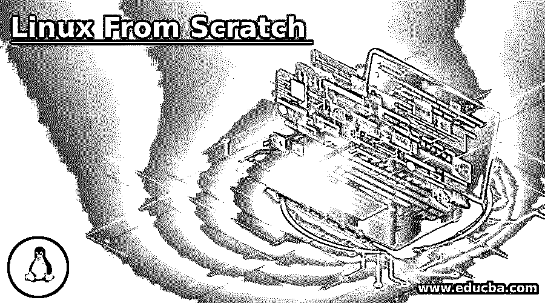

# 从零开始的 Linux

> 原文：<https://www.educba.com/linux-from-scratch/>

## 从零开始介绍 Linux

从零开始 Linux 的概念是在 Linux 中安装，它将通过手动构建 Linux 系统的所有组件来安装一个成熟的 Linux 系统。正如我们完全可以理解的那样，从零开始制作 Linux 是一个比在系统中实际安装 Linux 发行版长得多的过程，但是这带来了安装 Linux 可能需要的定制。灵活、紧凑和安全的系统将按照用户的要求，不存在任何额外的组件，并且还将使用户或开发者能够了解 Linux 系统的内部工作方式。至此，在本文中，我们将看到安装的过程以及该组件在开发环境中的一般工作方式。

### 要求和程序

在这里，我们将讨论从头构建自己的 Linux 所必需的需求。在《Linux 从零开始》一书中提到了所有软件的列表，包括提到的最小版本，这样 Linux 版本就不会有问题。

<small>网页开发、编程语言、软件测试&其他</small>

该列表如下:

| **软件** | **版本** |
| 尝试 | Three point two |
| Binutils | Two point two five |
| 野牛 | Two point seven |
| Bzip2 | 1.0.4 |
| 科里蒂尔斯 | Six point nine |
| 困难 | 2.8.1 |
| Findutils | 4.2.31 |
| 呆子 | 4.0.1 |
| （同 groundcontrolcenter）地面控制中心 | Six point two |
| Glibc | Two point one one |
| 可做文件内的字符串查找 | 2.5.1a |
| Gzip | 1.3.12 |
| Linux 内核 | Three point two |

现在，一旦满足了需求，就要遵循以下步骤。

在这里，我们还将看到完成构建所需的任何特定语法。

*   在当前的操作系统或虚拟机器或虚拟机中，创建一个分区，然后设置正确的文件格式。基本目录，如 bin 文件夹、需要安装二进制文件的位置、用户相关数据所在的 usr 文件夹等。被创造出来并准备好。
*   GitHub 或任何私有存储库上提供的压缩源代码可以下载为. tar.gz 或。焦油文件。
*   在下载 tar 文件时，需要记住通过散列检查来检查压缩文件中的任何篡改，从而验证 tarball 的完整性。
*   压缩文件被提取出来，用于获取所需进程或命令的源代码。
*   运行 make 命令(语法:make check)对源代码执行检查。发布(语法:make install)为构建和安装所需的进程而运行，并将二进制文件存储在 bin 文件夹中。
*   对于需要在 Linux 系统中安装的任何其他命令或进程，重复步骤 2 到 5。

### 从零开始 Linux 在 Linux 中是如何工作的？

在 Linux 中，从零开始，毫无疑问是理解 LFS 引导脚本的工作原理。这些引导脚本是作为步骤 5 的一部分安装的。LFS 启动脚本是一组脚本，安装这些脚本是为了执行一些基本但重要的任务。这些 SysV 类型的脚本执行各种任务，如在引导期间执行文件系统完整性检查、加载键映射、设置网络以及在关机时暂停进程。这些虽然看起来是最基本的任务，但是对于 Linux 系统的平稳运行同样重要。

在我们看到工作之前，有必要了解作为 LFS 引导脚本的一部分安装的不同脚本集。

下面给出了一些基本但也是最重要的脚本。

*   **checkfs:** 在挂载文件系统之前，查找文件系统中的任何问题。
*   **cleanfs:** 删除任何不需要在重启之间保留的文件。
*   **暂停:**帮助暂停系统。
*   **网络:**帮助设置网络接口。
*   **localnet:** 确保用于环回的主机名和本地设备设置正确。
*   **重启:**帮助重启系统。
*   **暂停:**帮助暂停系统。

上面的列表并不详尽，读者应该注意这一点。

现在我们对什么是引导脚本有了一个简单的概念，让我们知道这些引导脚本是如何工作的？Linux 的引导工具是一种特殊的工具，称为 SysVinit，运行概念是基于运行级的。这里有 7 个运行级别，其中每个级别对应于一个状态，也指操作系统启动时需要执行的操作。

运行级别如下。

*   **0:** 停止电脑。
*   **1:** 只允许单个用户。
*   **2:** 允许多用户，但不联网。
*   **3:** 允许多个用户联网。
*   **4:** 任何定制选项的占位符。
*   **5:** 同样是一个占位符，但最有可能用于使用 GUI 登录。
*   **6:** 重新启动电脑。

使用 init 命令可以很容易地根据用例的要求修改运行级别。在/etc/rc.d 位置有许多像 rc？.哪里？表示一个人正在寻找的运行级别。这还包括 rcsysinit.d，它包含符号链接，这些符号链接的命名有助于确定目录中脚本运行的顺序。命名法中的数字越小，文件执行得越早，实际的脚本存储在/etc/rc.d/init.d 文件夹中。符号链接指向存储在这里的脚本，这些脚本按照开发人员的要求完成全部工作。

这就是定制开始的地方，用户可以通过选择引导过程的工作方式来选择 Linux 系统所需的生活方式。毕竟，这是一个人自己的系统，在这个系统中，一个人可以发挥所有的创造力，为生活带来一些东西。

### 结论

在这篇文章中，虽然没有例子，但尽管如此，文章的重点是一个名为 Linux 从零开始(LFS)的项目，以及如何建立定制的 Linux 系统，可以满足自己的需求，并没有任何不必要的组件在 Linux 系统开发。有超越 LFS 的，例如，BLFS(从无到有超越 Linux)，ALFS(从无到有自动化 Linux)等。这超出了本文的范围，但却是我们的读者的首选读物。

### 推荐文章

这是一本从零开始的 Linux 指南。在这里，我们讨论介绍，要求和程序，如何从零开始在 linux 中工作？您也可以看看以下文章，了解更多信息–

1.  [Linux tracepath](https://www.educba.com/linux-tracepath/)
2.  [Linux 挂载命令](https://www.educba.com/linux-mount-command/)
3.  [Linux comm](https://www.educba.com/linux-comm/)
4.  [Linux 正则表达式](https://www.educba.com/linux-regular-expression/)

