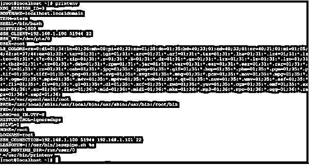
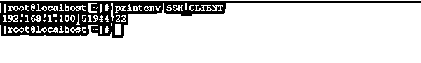
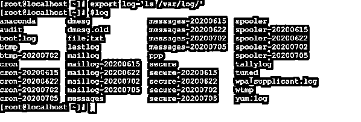
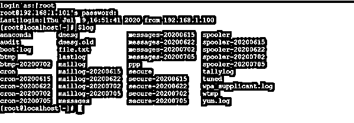
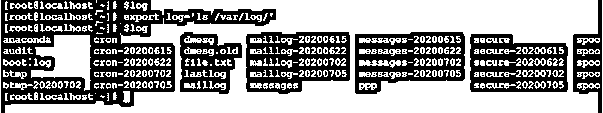

# Linux 环境变量

> 原文：<https://www.educba.com/linux-environment-variables/>

## Linux 环境变量简介

在 Linux 生态系统中，环境变量可以设置为全局变量或局部变量，用于执行 shell、bash 或任何应用程序级作业。换句话说，我们可以说 Linux 或 UNIX 环境变量只不过是一个名称，而同一个名称包含一些值或路径。

环境变量向最终用户提供功能，应用程序作业将如何在 Linux 环境中运行，以及系统的自定义行为。有不同的方式，我们可以分类的环境变量，即全局和局部变量，或环境和外壳变量。

<small>网页开发、编程语言、软件测试&其他</small>

### 环境变量的语法

下面是 Linux 环境变量的语法:

**1。设置环境变量**

`SET VARIABLE METHOD [ ENVIRONMENT NAME ] [ PATH ]`

*   **设置变量方法:**我们可以使用不同的环境方法来设置环境变量。它将接受两个不同的参数，如环境名和路径。相应地输入，它将导出环境变量。
*   **环境名称:**我们可以提供与环境变量兼容的不同环境名称。
*   **PATH:** 我们可以将路径或命令传递给环境变量。

#### 2.调用环境变量

`echo $[ ENVIRONMENT NAME ]`

*   **echo:** 我们需要使用 echo 命令来调用或检查具体的环境变量。
*   **环境名:**我们需要在 echo 命令中传递带有“$”符号的环境变量名。

### Linux 环境变量命令是如何工作的？

环境变量是系统级可用的变量。相同的变量对于 shell 或应用程序级别的作业也很有用。有不同的方式；我们可以在 Linux 环境中使用 env、printenv、set、unset、export 等环境变量。

*   **env:**env 命令允许最终用户在自定义环境中运行程序或作业。运行作业时，不会影响或修改当前环境。当使用不带参数的 env 命令时，它将打印系统中可用变量选项的列表。
*   **set:**set 命令对于在 Linux 机器上设置环境变量很有用。当使用不带任何参数的 set 命令时，它将打印系统中可用变量选项、shell 变量和 shell 函数的列表。
*   **unset:**unset 命令有助于删除 shell 和环境变量。
*   **printenv:**printenv 命令用于打印系统的所有环境变量。
*   **导出:**导出命令有助于设置环境变量。但是变量是临时的，如果会话将注销或关闭，那么变量的作用域将消失。

**Note:** The environment variables are very important for third-party software or application jobs. With the help of the same variables, the software will execute the jobs.

### 实现 Linux 环境变量命令的示例

下面是提到的例子:

#### 示例# 1–变量显示命令

在 Linux 环境中，我们有打印所有系统环境变量的功能。变量的范围是全局的。

**代码:**

`printenv`

**解释:**我们在下面的截图中使用了“printenv”命令。它将打印系统的所有默认环境变量。我们没有对它使用任何选项。我们可以在任何应用程序或 shell 作业中使用相同的变量。

**输出:**

#### 示例 2–调用特定变量

根据需求，我们可以从系统中可用的环境变量中选择特定的环境变量。

**代码:**

`printenv SSH_CLIENT`

**说明:**根据上面的命令，我们使用了特定的环境变量，即“SSH_CLIENT”。它将只显示与“SSH_CLIENT”环境变量相关联的值。

**输出:**

#### 示例 3–设置环境变量

通过不同的方式，我们可以定义自己的或用户的环境变量。

**注意:**变量的范围将只针对登录会话，除非并且直到用户环境变量将被硬编码在“环境”文件中。

**代码:**

`export log='ls /var/log/'
$log`

**说明:**根据下面的截图 1 (a)，没有“log”变量的作用域。在“导出”命令的帮助下，我们正在创建环境变量，即“日志”。一旦“日志”变量将导出。我们可以使用“log”变量(参见截图 1 (b))。

**输出:**

#### 示例 4–更新“环境”文件

在 Linux 环境中，我们有硬编码用户定义环境变量的功能。一旦它被硬编码，那么用户定义的变量的范围将是全局的。

**代码:**

`vim /etc/environment
cat /etc/environment`

**说明:**根据上面的命令，我们正在编辑“/etc/environment”文件。当我们定义用户时，定义环境变量。那么变量的范围将仅限于登录会话。保持变量作用域的全局。我们需要在“/etc/environment”文件中输入变量，并编辑变量及其路径，如“log='ls /var/log/'”

**输出:**

#### 示例 5–删除变量

在 Linux 生态系统中，我们能够删除环境变量。我们也可以删除默认的系统变量，以及用户定义的变量。

**代码:**

`unset log
$log`

**说明:**根据下面的截图 3 (a)，我们已经通过“export”命令设置了环境变量“log”。我们能够使用相同的“log”变量。但是现在，我们需要从 Linux 环境中删除同一个“log”环境变量。我们可以使用“unset”命令删除环境变量。一旦我们触发了上面的命令。变量的作用域将消失，在环境中不再可用(参见截图 3 (b))。

**输出:**

### 结论

我们已经看到了“Linux 环境变量命令”的完整概念，以及正确的示例、解释和具有不同输出的命令。环境变量对于导出路径或在 Linux 环境中设置特定值非常重要。它将为第三方软件或应用程序导入，以访问 Linux 环境并执行其作业。

### 推荐文章

这是一个 Linux 环境变量的指南。这里我们讨论一个介绍 Linux 环境变量，语法，它是如何工作的例子。您也可以浏览我们的其他相关文章，了解更多信息——

1.  [Linux 重命名命令](https://www.educba.com/linux-rename-command/)
2.  [Linux Inode](https://www.educba.com/linux-inode/)
3.  [Linux 别名命令](https://www.educba.com/linux-alias-command/)
4.  [Linux 正则表达式](https://www.educba.com/linux-regular-expression/)

