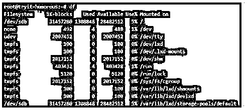
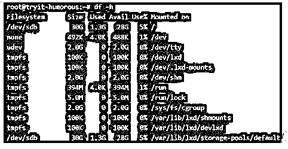
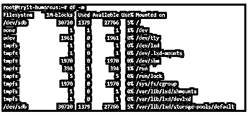
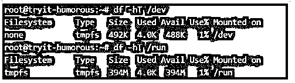
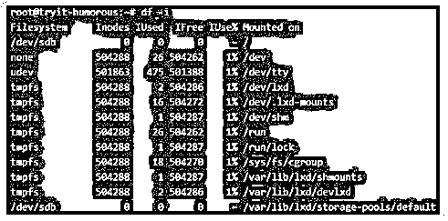
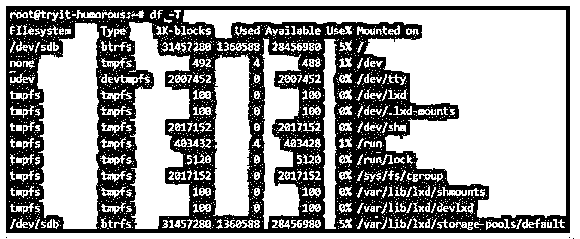
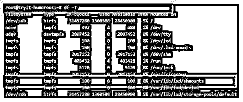
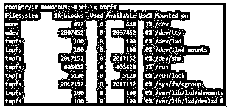
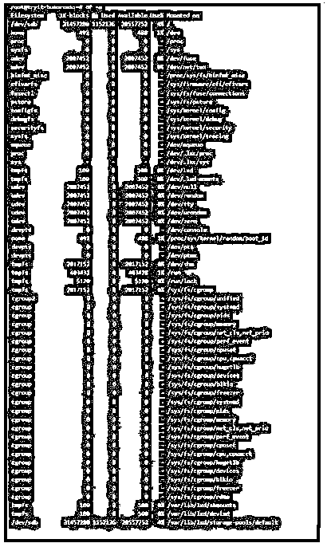
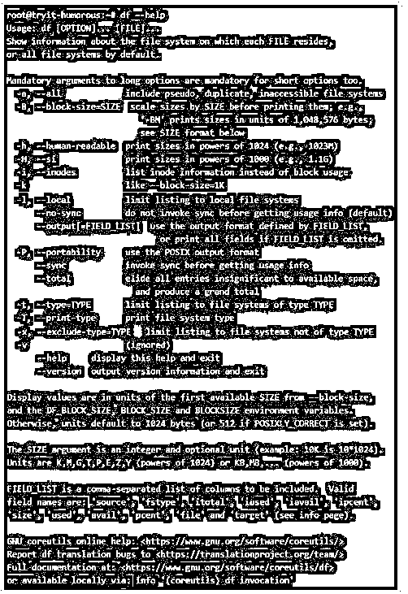

# Linux 磁盘空间

> 原文：<https://www.educba.com/linux-disk-space/>

## Linux 磁盘空间介绍

下面的文章提供了 Linux 磁盘空间的概要。磁盘空间被定义为帮助用户利用系统磁盘剩余空间的工具。在该实用程序本身中，有许多允许用户执行特定任务的子实用程序。这种任务的几个例子是管理磁盘空间、检查磁盘空间、释放磁盘空间等。在本文中，我们将深入研究在磁盘空间大背景下单独执行的每个任务。我们需要确保在系统上执行这种磁盘空间操作的用户需要具有适当的读取权限，没有这种权限，甚至无法测试命令。

### Linux 磁盘空间的语法

在 Linux 中，Linux 磁盘空间实用程序有很多选项，为了遵守文章大小的限制，我们需要列出其中的几个，但是要确保我们在这里讨论的选项能够满足当今世界使用的大多数实用程序的需求。

<small>网页开发、编程语言、软件测试&其他</small>

在这里，我们将首先查看语法，在本文的后续部分，我们将查看磁盘空间实用程序的工作原理。

1.检查磁盘空间使用情况。

**语法:**

`df`

2.显示磁盘空间的可读格式。

**语法:**

`df -h`

如果用户希望获得以 MB 为单位的磁盘空间，上面的选项-h 可以替换为-m，或者如果用户希望获得以 KB 为单位的磁盘空间，可以替换为-k。

3.显示关于特定装载位置的信息。

**语法:**

`df -hT <mount location>`

4.显示文件系统的信息节点。

**语法:**

`df -i`

5.显示文件系统的类型。

**语法:**

`df -T`

6.仅列出某些文件系统类型。

**语法:**

`df -t <type of file system>`

7.排除特定文件系统后的列表。

**语法:**

`df -x <type of file system>`

8.即使可用字段为 0，也显示完整的磁盘使用情况。

**语法:**

`df -a`

9.显示命令的帮助部分。

**语法:**

`df --help`

### Linux 磁盘空间是如何工作的？

在我们讨论 Linux 磁盘空间之前，让我们熟悉一些关于空间的关键符号。1024 GB = 1TB 是众所周知的事实。现在，当您购买一个 1 TB 的驱动器并安装它时，系统将报告它为 977 GB。好的。剩下的 23 GB 去哪了？事实上，它没有去任何地方，你也不应该觉得你被骗了。差异在于磁盘制造商使用真正的公制度量，即 1000 而不是 1024。

所以从数学上来说，

**1 TB = (1000 /1024) *1000 GB = 976.5 ~ 977 GB**

现在来看下一个指针，关于文件如何存储在磁盘中。文件中的内容存储在磁盘的数据块中。现在，出现的问题是，如果一个特定的块包含文件中的内容，命令如何知道要检索什么。为此，inode 的用途就开始发挥作用了。inode 类似于文件指针，当前指向磁盘空间中的特定位置或块。

现在，inode 携带了块的一些信息，并使用这些信息，或者换句话说，通过使用剩余的文件指针；系统找到未被消耗的指针组，然后合计未使用的空间，以显示空闲空间！还必须注意，磁盘有一些保留空间，称为保留块数，这是内核为特权用户的进程保留的空间，不是每个人都可以访问，因此，磁盘可能显示为 100%满，即使在大小和已用空间之间的比较中可能有一些空间。

### Linux 磁盘空间示例

下面给出了针对特定实用程序的不同磁盘空间命令的具体示例:

#### 示例#1

检查磁盘空间使用情况。

**语法:**

`df`

**输出:**

<u>

</u> 

在这里，我们看到所有的属性都是以一种粗略的形式提到的，这种形式不太容易让人读懂。不同的文件系统安装在不同的位置，如显示中所述。还可以获得不同文件系统的使用率，并据此制定必要的策略来优化磁盘空间。

#### 实施例 2

显示磁盘空间的可读格式。

**语法:**

`df -h`

**输出:**

以 GB 为单位的格式:

以 KB 为单位的格式:

`df -k`

**输出:**

以 MB 为单位的格式:

`df -m`

**输出:**

#### 实施例 3

显示关于特定装载位置的信息。

**语法:**

`df -hT /dev
df -hT /run`

**输出:**

<u>

</u> 

#### 实施例 4

显示文件系统的信息节点。

**语法:**

`df -i`

**输出:**

<u>

</u> 

#### 实施例 5

显示文件系统的类型。

**语法:**

`df -T`

**输出:**

<u>

</u> 

#### 实施例 6

仅列出某些文件系统类型。

**语法:**

`df -T
df -t btrfs`

**输出:**

显示文件系统的所有文件类型:

仅显示 btrfs 的文件系统:

在第一个快照中，当执行第二个命令时，只显示高亮显示的快照。

#### 实施例 7

排除特定文件系统后的列表。

**语法:**

`df -x btrfs`

**输出**

显示文件系统的所有文件类型:

Display of file system excluding btrfs:

第一批快照中突出显示的内容将被删除。

#### 实施例 8

即使可用字段为 0，也显示完整的磁盘使用情况。

**语法:**

`df -a`

**输出:**

<u>

</u> 

#### 实施例 9

显示命令的帮助部分。

**语法:**

`df --help`

**输出:**

<u>

</u> 

在这个例子中，我们看到他们中的大多数人在执行命令时很少使用所有其他可见的选项。

### 结论

通过一组例子和对磁盘空间工作方式的解释，我们可以对 df 命令的效用有所了解。另一件要提到的事情是，还有另一个命令 du，它或多或少地执行与 df 类似的任务，留给读者去尝试和试验，以便人们可以很容易地欣赏 Linux 带来的广阔空间！最后但同样重要的是，我们建议读者自己尝试每个命令，以理解并熟悉命令的工作方式。

### 推荐文章

这是一个 Linux 磁盘空间指南。这里我们讨论引言；Linux 磁盘空间是如何工作的？和示例。您也可以看看以下文章，了解更多信息–

1.  [Linux Xargs](https://www.educba.com/linux-xargs/)
2.  [Linux LVM](https://www.educba.com/linux-lvm/)
3.  [Linux 大小](https://www.educba.com/linux-size/)
4.  [Linux Kill 信号](https://www.educba.com/linux-kill-signals/)

