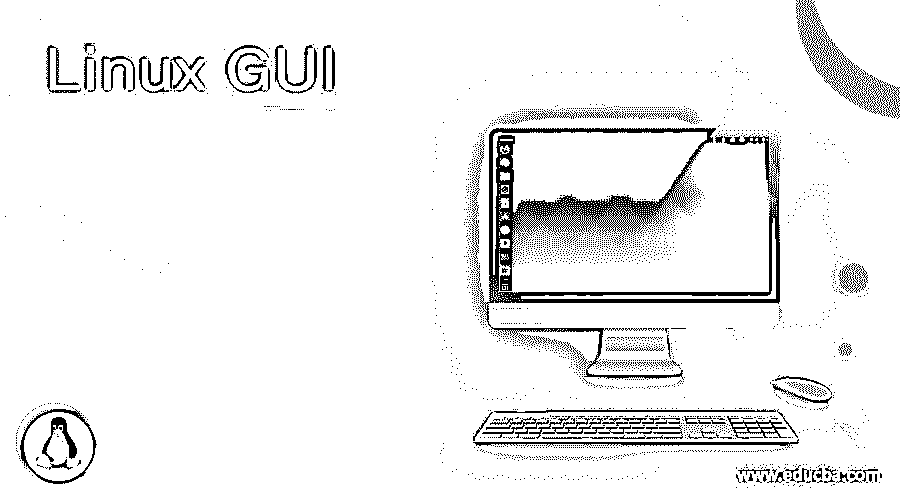

# Linux GUI

> 原文：<https://www.educba.com/linux-gui/>

## Linux GUI 简介

Linux GUI(图形用户界面)被定义为支持用户界面的实用程序或功能，允许用户与系统交互，并从窗口、图标、图形等获得帮助。，并响应鼠标和键盘的操作。当我们谈论 Linux 时，我们总是认为内核是 Linux 系统的心脏，它保持系统运行，就像心脏保持身体运行一样。另一方面，我们在人体中看到的也是外表，而这正是 GUI 赋予 Linux 的。GUI 是操作系统的脸面！

### Linux 图形用户界面的使用

正如我们在定义中所讨论的，GUI 是一个允许用户与系统交流的界面。GUI 的工作非常简单。在界面中，动作被作为输入，然后以需要执行的命令的形式传输到系统，然后执行任务。比如鼠标从 A 点移动到 B 点，传感器跟踪鼠标的移动，然后翻译成机器理解的语言，动作瞬间执行。

<small>网页开发、编程语言、软件测试&其他</small>

对于不同层的组件，这在本文中是完全不同的部分， [GUI 允许](https://www.educba.com/what-is-gui/)系统将它们连接起来，允许用户根据方便和需求来执行任务。技术和设备的结合是构建一个平台的必要条件，该平台为用户提供与系统交互的选项。一些 GUI 组件可能只是一个 CLI 命令，在用户需要时执行！

### Linux GUI 的组件

尽管有许多桌面环境，但下面列出的一些组件有助于 GUI 的完整性。虽然这个列表并不详尽，但是它将提供 Linux 中所需组件的概念以及原因:

*   窗口管理器:这是构建 Linux 桌面环境的第一个组件，它提供了应用程序需要如何呈现给用户的选项。它们大致分为以下三类:
    *   **合成**:这是最广泛使用的一种，不同的窗玻璃出现在彼此的顶部，但并排拍摄，使其赏心悦目。这包含了两个世界的优点，堆叠和平铺。
    *   堆叠(Stacking):这是一种有点过时的方式，窗格完全堆叠在彼此之上。
    *   **平铺**:在这种分类中，窗格并排放置，没有重叠。
*   **面板:**在 Linux 中，屏幕上可能有多个面板，包含菜单、快速启动项、最小化的应用程序或通知区域等项目。
*   **菜单:**Linux 中的菜单就像一个包含各种类别的列表，用户可以根据需要灵活地选择选项。该组件还提供了搜索应用程序的功能！
*   **系统托盘:**该组件通常附在面板上，让用户能够访问音频、网络、电源等关键设置。
*   **图标:**Linux 中的图标是为了方便用户即时访问应用。它可以被认为是执行应用程序的可视化表示。
*   这个组件提供了在桌面上显示有用信息的工具。一些例子是时钟、天气等。
*   启动器:这是特定于像 Unity & GNOME 这样的环境的，在那里一个可定制的快速启动项目列表被提供给用户以便于访问。
*   仪表盘:这也是某些环境特有的，比如 Unity & GNOME，它提供了一个 dash 类型的界面来方便用户交互。
*   **文件管理器:**顾名思义，该组件通过提供移动、编辑、重命名、复制等实用工具来帮助用户管理文件。
*   终端模拟器:对于那些喜欢在 Linux GUI 的命令行中工作的人来说，这个组件会很有意思。
*   **文本编辑器:**该组件允许用户创建文本文件和一个实用程序，以便在需要时编辑配置文件。
*   **显示管理器**:该组件是允许用户登录系统的屏幕。
*   **配置工具:**这个组件主要是做美观上的改变，即。使用中的桌面环境的外观和感觉。

### 例子

下面列出了 Linux 操作系统中的一些示例，没有按优先顺序排列:

*   GNOME 外壳
*   一致
*   交配
*   KDE Plasma
*   XFCE 你好
*   启迪
*   糖
*   肉桂色

### 优势

在数字化的黄金时期，我们看到了很多关于服务的共享，包括资源和专门的硬件。这使得 GUI 在这个时代不辜负用户的期望变得更加有趣。在本节中，我们将探讨所有能够满足用户期望的优势:

1.  界面功能使计算机上的操作更加直观，因此在现实生活中更容易学习和使用。例如，我们发现将文件从一个位置拖到另一个位置比编写命令然后执行它更容易。
2.  直觉带来了反馈的力量，而使用 GUI，用户几乎可以立即获得所执行操作的反馈。再举一个例子，当一个文件被删除时，该文件消失并且立即可见，而不是编写一个命令来查找该文件是否被删除。
3.  GUI 的下一个优点是它充分利用了现代操作系统的多任务处理能力。这反过来又导致了高生产率以及计算机使用的灵活性。
4.  不仅 GUI 本身的优势足够，而且 GUI 本身也为其他应用程序的构建铺平了道路，新的行业也因此而形成，这提高了便利性。
5.  最后但并非最不重要的一点是，使用 GUI 可能不需要大量的培训和先验知识，如果使用命令行界面，即使是新手也可以使用它来执行复杂的任务。

### 结论

本文介绍了构成有效 GUI 的不同包，以及与 Linux 中 GUI 相对应的一些优点。这个特性或实用程序的主要目的是减轻在命令行上工作的复杂性，并为用户快速使用 Linux 铺平道路，而不必投入大量时间学习命令行并让 Linux 或他们的开发人员来处理它们！

### 推荐文章

这是一个 Linux 图形用户界面指南。在这里，我们将讨论构成有效 GUI 的不同包，以及与 Linux 中 GUI 相对应的一些优点。您也可以阅读以下文章，了解更多信息——

1.  [Linux Untar](https://www.educba.com/linux-untar/)
2.  [Linux Kill 信号](https://www.educba.com/linux-kill-signals/)
3.  [Linux 观察命令](https://www.educba.com/linux-watch-command/)
4.  [Linux Xargs](https://www.educba.com/linux-xargs/)

