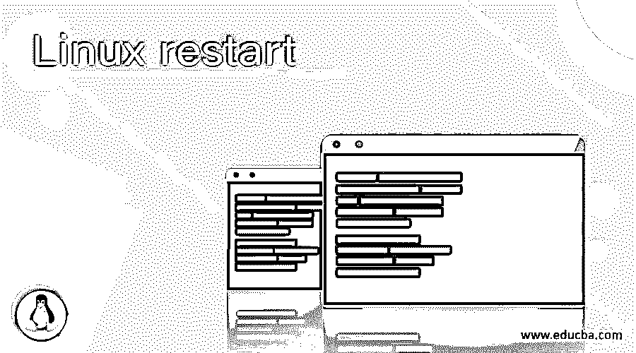
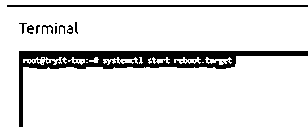
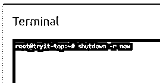
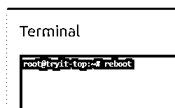

# Linux 重启

> 原文：<https://www.educba.com/linux-restart/>

## Linux 重启简介

Linux 重启被定义为使用户能够重启或重启 Linux 系统的命令。当系统需要发布一些重要的更新(如网络或驱动程序)时，这个实用程序是必不可少的。重新启动的原因是确保所有支持应用程序都已关闭，以便在整个系统和服务器中统一产生适当的效果。这个术语是关于系统重启的，但是它也负责系统中运行的进程的重启。在本文中，我们将介绍一些重启 Linux 系统和运行在 Linux 中的进程的方法。

### 句法

在 Linux 中，有许多选项可用于 Linux 重启实用程序，在本文中，我们将介绍所有选项，还将提到我们拥有的每个选项的实用程序以及它们最适合的场景。但在此之前，让我们先看看命令行命令的语法，然后再讨论执行任务的不同方式。

<small>网页开发、编程语言、软件测试&其他</small>

#### 重启 Linux 系统

1.使用 systemctl 命令

**语法**

`sudo systemctl start reboot.target`

2.使用关机命令

**语法**

`sudo shutdown -r now`

3.使用重新启动命令

**语法**

`sudo reboot`

4.使用 init 命令

**语法**

`sudo telinit 6`

#### 重启 Linux 进程

1.使用 systemctl 命令

**语法**

`sudo systemctl restart <process name>`

2.使用服务命令

**语法**

`sudo service httpd restart`

### 如何用各种方法重启 Linux？

在这一节中，我们将看看重启 Linux 的不同方法。首先，我们将讨论用于重启 Linux 的方法。对于我们所有的读者来说，知道重启和重启之间的细微差别是很有趣的。这两个词之间有很大的区别，因此，如果你想交替使用这两个词，理解这一点非常重要。单词 reboot 可以分解成两个子单词，即 re 和 boot。现在，重启背后的意图是修复正在发生的问题，如果系统再次启动，该问题可以得到解决，而重启在幕后没有任何意图，尽管过程保持不变。因此，对于本文中的任何目的，从进程的角度来看，我们都将重新引导和重新启动视为相同。

现在来谈谈重启系统的方法。在第一种情况下，我们可以使用 Linux UI，它可能会根据所安装的发行版而有所不同。在这里，我们需要转到应用程序菜单，从那里需要选择电源按钮的选项。同样，可能存在多个选项，其中之一是重新引导或重启系统。点击该按钮将自动关闭系统并再次重启。第二种选择是按下物理按钮。按下系统中的按钮将会显示一个关闭或重启的选项。选择重新启动选项以继续该选项。有时，用户可能在终端上操作，而不是在 GUI 上操作，因此会发现使用 CLI 方式更有效，因此接下来的几个选项正好显示了这些。第三个选项是运行 systemctl 命令。

进程的重启或启动由 init 系统负责，Linux 中的系统就是 init 系统。使用 systemctl 命令将允许系统接受复位信号并相应地采取行动。第四个选项是运行 shutdown 命令。有各种各样的选项可用，其中之一是-r 选项，它将结束给 OS 的重新启动系统的信号。第五个选项是运行 reboot 命令。这个命令只不过是实现重启功能的前一个命令的快捷方式。第六步也是最后一步是使用 telinit 命令，该命令为重启保留一个数字，一旦调用该选项或数字，即 6，信号就会自动发送到操作系统。

现在来看重新开始这一进程的另一部分。第一个选项是使用 systemctl 命令。这里我们可以看到重启系统和重启进程之间的细微差别，这在语法中有解释。第二种选择是使用 service 命令；年表与 systemctl 命令略有不同，用于遗留系统。令我们惊讶的是，这个命令在最新的发行版中仍然有效。

虽然在本文中我们已经讨论了 Linux 操作系统中可能的大多数方法，但这并不意味着我们已经讨论了所有的方法。其中一些还包括硬重启或重启。硬重启是不负责任地重启系统，因为这些方法有可能损坏系统。

### Linux 重启示例

下面举几个例子

#### 示例#1

重新启动 Linux 系统:

使用 systemctl 命令

**语法**

`systemctl start reboot.target`

**输出:**

#### 实施例 2

使用关机命令

**语法**

`shutdown -r now`

**输出:**

#### 实施例 3

使用重新启动命令

**语法**

`sudo reboot`

**输出:**

#### 实施例 4

使用 init 命令

**语法**

`sudo telinit 6`

**输出:**

#### 实施例 5

重新启动 Linux 进程:

使用 systemctl 命令

**语法**

`sudo systemctl restart httpd`

**输出:**

在这个场景中，我们没有输出，但是这个命令会让您重新启动名为 httpd 的进程，然后返回到 bash 提示符。代替 httpd，您可以输入您想要的任何其他进程！

#### 实施例 6

使用服务命令

**语法**

`sudo service httpd restart`

**输出:**

### 结论

通过所讨论的一组示例和对重启工作方式的解释，我们可以对每种方法所拥有的效用有所了解。现在，读者有责任尝试我们在本文中讨论的所有方法，并每天不断尝试以了解更多信息。最后，总结一下，我们想说的是，当系统重启时，人们应该负责任地行动。

### 推荐文章

这是一个 Linux 重启指南。在这里，我们讨论如何使用各种方法和示例以及输出来重启 Linux。您也可以阅读以下文章，了解更多信息——

1.  [Linux Ping](https://www.educba.com/linux-ping/)
2.  [Linux 大小](https://www.educba.com/linux-size/)
3.  [Linux Kill 信号](https://www.educba.com/linux-kill-signals/)
4.  [Linux 容器](https://www.educba.com/linux-container/)

