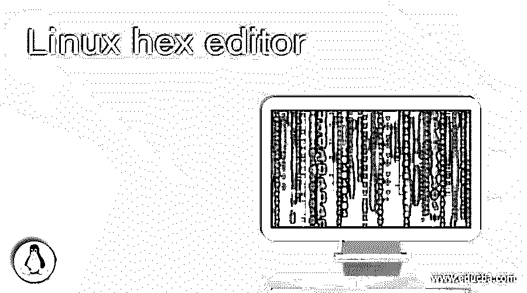
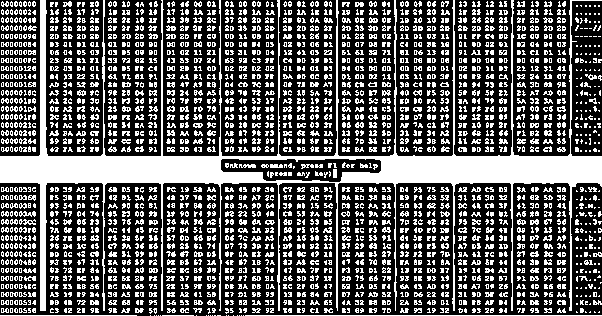
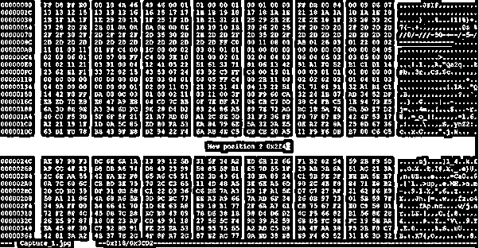
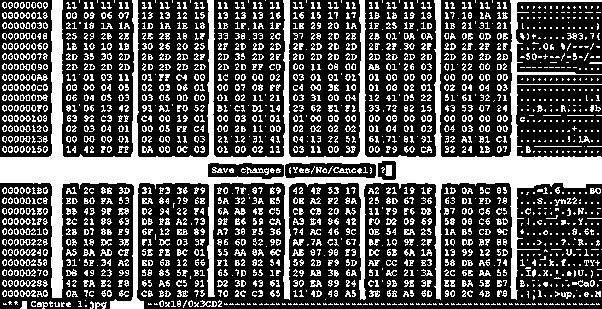

# Linux 十六进制编辑器

> 原文：<https://www.educba.com/linux-hex-editor/>

## Linux 十六进制编辑器简介

在 Linux 操作系统中，我们有各种各样的数据。数据可以是不同的格式，如文本数据、二进制数据等。通常，我们根据需求使用不同类型的文本编辑器。十六进制编辑器对二进制文件很有用。它将有助于编辑、评估和检查二进制文件。对于十六进制编辑器，我们可以编辑单个字节的数据。十六进制编辑器主要由系统管理员、程序员、开发人员等使用。十六进制编辑器实用程序由 Pixel 编写，即 Pascal Rigaux。(通讯 ID: pixel@rigaux.org)。在这个主题中，我们将学习 Linux 十六进制编辑器。

**Linux 十六进制编辑器的语法**

<small>网页开发、编程语言、软件测试&其他</small>

`hexedit [ -s | --sector ] [ -m | --maximize ] [-h | --help ] [ filename ]`

*   **hexedit:** 我们可以在语法或命令中使用“hexedit”关键字。它将采用不同的参数，如扇区信息、最大化值、hexedit 帮助选项和文件名。根据所提供的参数，这将有助于编辑二进制文件。
*   **扇区:**我们可以向“hexedit”命令提供扇区信息。
*   **Help:** 根据需要，我们可以使用 Help 关键字来获取 hexedit 命令的基本信息。
*   **Filename:** 在使用 hexedit 时，我们需要提供文件的文件名或路径(在命令的末尾)。

### Linux 十六进制编辑器如何工作？

Linux 是一个支持多用户的操作系统。它将支持多个服务器或应用程序。在运行这些服务器或应用程序时，它们会生成大量的服务器或应用程序级和用户级数据。在 Linux 中，我们有编辑或管理不同数据的功能，如 ASCII 格式、二进制格式等。十六进制编辑器有助于编辑二进制文件。在编辑二进制文件时，我们需要为十六进制编辑器命令提供不同的选项，如扇区、最大化、帮助、文件名。

以下是与十六进制编辑器命令兼容的快捷选项列表。

| **服务请求编号** | **选项** | **描述** |
| One | 向右箭头、向左箭头、向下箭头、向上箭头 | 这将有助于在编辑器窗口中移动光标。 |
| Two | Ctrl+F, Ctrl+B, Ctrl+N, Ctrl+P | 类似于键盘箭头键，它将有助于在编辑器窗口中移动光标。 |
| Three | Esc+向右箭头，Esc+向左箭头，Esc+向下箭头，Esc+向上箭头 | 类似于键盘箭头键，它将有助于在编辑器窗口中移动 n 次。 |
| Four | Esc+F，Esc+B，Esc+N，Esc+P | 这将有助于移动 n 次光标编辑窗口。 |
| Five | 主页，Ctrl+A | 这将有助于转到文件行的开头。 |
| Six | 结束，Ctrl+E | 转到文件的行尾会有所帮助 |
| Seven | 向上翻页，Esc+V，F5 | (在文件中)向上一页会有帮助。 |
| Eight | 向下翻页，Ctrl+V，F6 | (在文件中)往下一页会有帮助。 |
| Nine |  | 转到文件的开头会有所帮助。 |
| Ten | Ctrl+Z 组合键 | 如果你想暂停 hexedit，那么我们需要使用这个选项。 |
| Eleven | Ctrl+U, Ctrl+_, Ctrl+/ | 这将有助于撤消所有操作。 |
| Twelve | Tab, Ctrl+T | 这将有助于 ASCII 和十六进制之间的切换。 |
| Thirteen | /，Ctrl+S | 这将有助于以 ASCII 或十六进制向前搜索。 |
| Fourteen | Ctrl+R | 这将有助于向后搜索。 |
| Fifteen | Ctrl+G, F4 | 这将有助于定位到文件中的某个位置。 |
| Sixteen | 返回 | 它将转到文件中的扇区。 |
| Seventeen | Esc+L | 这将有助于从光标的当前位置开始打印页面。 |
| Eighteen | F2, Ctrl+W | 这将有助于保存我们对输入文件所做的修改。 |
| Nineteen | Ctrl+向右箭头，Ctrl+向左箭头，Ctrl+向下箭头，Ctrl+向上箭头 | 这将有助于在编辑器窗口中移动 n 次。 |
| Twenty | Esc+>，Esc+结束 | 这将有助于转到文件的结尾。 |

### 实现 Linux 十六进制编辑器的例子

下面举几个例子:

#### 1.Linux 十六进制编辑器:读取二进制文件

在 Linux 环境中，我们不能用普通的文本编辑器读取二进制文件。如果我们训练用普通的文本编辑器打开二进制文件，我们将得到#或*值模式。它将无法理解它。为了读取二进制文件，我们需要一个特定的文本编辑器来理解文件中可用的二进制模式。

**命令:**

`hexedit Capture_1.jpg`

**说明:**

按照上面的命令，我们在“/root/data”位置有一个二进制文件。这是二进制文件。我们使用 hexedit 命令来读取“Capture_1.jpg”文件。

**输出:**

#### 2.Linux 十六进制编辑器:移动到新位置

在十六进制编辑器中，我们可以将光标或控件从当前位置移动到新位置。

**命令:**

`hexedit Capture_1.jpg`

(按回车键并添加新的药剂值)

**说明:**

按照上面的命令，我们已经在十六进制编辑器中打开了该文件。当前位置是“00000070”，我们需要移动到“0x2f4”位置。为此，我们需要按回车键并输入下一个位置的十六进制值。

**输出:**

#### 3.Linux 十六进制编辑器:编辑二进制文件

在 Linux 中，我们有编辑二进制文件的功能。一旦文件将被编辑，我们需要按“Y/YES”来保存更改或按“N/NO”来保存撤消的更改。

注意:在编辑二进制文件时，确保我们对二进制和十六进制模式格式有适当的了解。

**命令:**

`hexedit Capture_1.jpg`

(按“Y”保存更改，或按“N”不更改编辑)

**说明:**

根据下面的截图，我们正在编辑“Capture_1.jpg”文件。我们在“00000000”位置进行了更改，并保存了二进制文件，然后按“y”键(是)。

**输出:**

### 结论

我们已经看到了“Linux 十六进制编辑器”的完整概念，以及正确的示例、解释和带有不同输出的命令。根据需要，我们可以使用十六进制编辑器来编辑二进制文件。在编辑二进制文件之前，请理解二进制和十六进制模式。

### 推荐文章

这是 Linux 十六进制编辑器的指南。在这里，我们讨论了 Linux Hex Editor 的工作原理和例子，以及命令和输出。您也可以阅读以下文章，了解更多信息——

1.  [Linux 模拟器](https://www.educba.com/linux-emulator/)
2.  [Linux nslookup](https://www.educba.com/linux-nslookup/)
3.  [Linux 分割命令](https://www.educba.com/linux-split-command/)
4.  [Linux 容器](https://www.educba.com/linux-container/)

