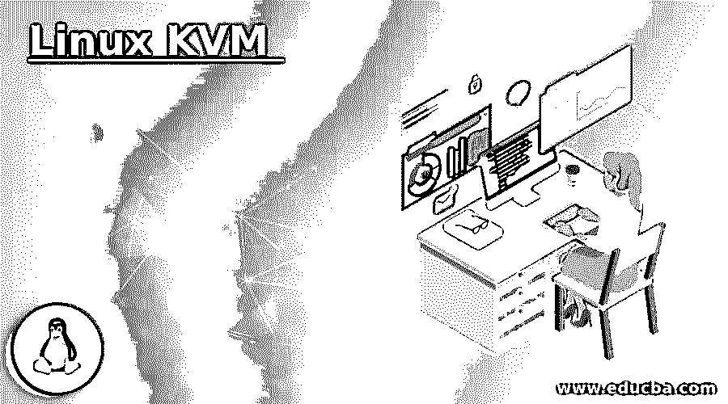

# Linux KVM 产品

> 原文：<https://www.educba.com/linux-kvm/>

## Linux KVM 简介

KVM 被定义为一个开源解决方案，用于在 x86 硬件上实现 Linux 的完全虚拟化(最初为 x86 构建，但后来也移植到 S/390、PowerPC、IA-64 和 ARM ),它由虚拟化的扩展组成。KVM 是基于内核的虚拟机的缩写。该虚拟化设置包含一个名为 kvm.ko 的可加载内核模块和一个特定于处理器 kvm-intel.ko 或 kvm-amd.ko 的模块。特定于处理器的模块之间的选择完全基于机器运行的处理器硬件类型，可以是 intel 或 amd。此外，可加载内核模块为核心虚拟化提供了基础设施。

### Linux KVM 是如何工作的？

*   在深入研究之前，必须意识到这样一个事实，即即使有多个虚拟机运行映像，每个虚拟机也需要有自己的一组虚拟专用硬件，如网卡、磁盘、图形适配器、CPU 等等。
*   现在回到 KVM 的工作点，Linux 被转换成了第一类管理程序。现在来看看 KVM 的工作，我们会遇到很多新的单词或术语。+987poi 在这里，我们将仔细解释每一个术语。虚拟机管理程序就像一个监控工具，它创建虚拟机并监控它们。使用虚拟机管理程序允许一台计算机通过监控和跟踪内存、处理等资源共享来运行多个虚拟机。现在，一旦 Linux 被转换成管理程序，所有的系统级组件，即。内存管理器、输入输出堆栈、进程调度器、网络堆栈、设备驱动程序等。，因为它是 Linux 内核的一部分。
*   发布每个虚拟机都是通过常规的 Linux 进程实现的，其中 Linux 调度程序安排实现，确保所有虚拟硬件，如网卡、图形适配器等。，都很到位。虚拟机管理程序可以被认为是存在于虚拟化系统和真实硬件之间的一层。隔离的操作系统将底层的硬件平台视为属于它的平台，因为管理程序创建了一种假象。随着时间的推移，KVM 也在发展。现在，通过使用带有主机操作系统内核的模块，CPU 扩展被用于虚拟化。此外，最近，KVM 对一些输入输出驱动器使用半虚拟化，这提高了某些用例的系统性能。

### 如何使用 Linux KVM？

在了解如何在系统中安装 Linux KVM 或运行 KVM 之前，必须了解处理器的虚拟化能力，或者换句话说，了解处理器是否能够实际支持硬件虚拟化。

<small>网页开发、编程语言、软件测试&其他</small>

要检查这一点，必须运行以下命令:

`LC_ALL=C lscpu | grep Virtualization`

或者

`grep -E --color=auto 'vmx|svm|0xc0f' /proc/cpuinfo`

如果运行这些命令后没有得到任何结果，那么可以肯定的是硬件不支持虚拟化。在这种情况下，我们必须首先通过升级或对处理器进行较小的改动来准备处理器，以便虚拟化成为可能。如果系统没有为虚拟化做好准备，用户将无法使用 KVM。

另一件需要记住的事情是，你需要运行 2007 年以后发布的 Linux 版本。选中这两个复选框后，主机内核模块和特定于处理器的模块将被加载，虚拟化之后，守护程序 libvirtd 将重新启动，从而完成 KVM 的安装和部署。

一旦到了那里，我们就可以很容易地使用 KVM 来启动一个使用 GNOME 或 GNOME Classic 的虚拟机。

### Linux KVM 的优缺点

下面给出了 Linux KVM 的优点和缺点:

#### 优势:

*   由于 KVM 系统源于 Linux，所以它是一个相当成熟的系统。
*   KVM 内置于大多数 Linux 发行版中。
*   KVM 是开源的，因此可以免费使用。
*   KVM 确保性能和稳定性。
*   它是由著名组织开发的，因此值得信赖。
*   Libvirt 使管理自动化。

#### 缺点:

*   KVM 仅适用于 Linux 发行版。
*   主机需要足够强大，能够承担多个虚拟机的负载。
*   使用 KVM 有一个附加的学习曲线。
*   由于硬件是集中的，因此在系统故障的情况下丢失数据的风险会成倍增加。

### Linux KVM 的特性

KVM 有许多可用的特性，主要有 8 种不同的类型，这使它成为企业最喜爱的虚拟机管理程序的明显选择。

#### 1.安全性

KVM 结合使用安全性增强的 Linux (SELinux)和安全虚拟化(sVirt)来增强 VM 的安全性和隔离性。围绕虚拟机建立安全边界，并标记任何手动标记错误。

#### 2.储存；储备

KVM 也支持 Linux 支持的任何存储，因为它只属于 Linux 的一部分！KVM 使用多路径 I/O 来消除冗余，从而提高存储能力。

#### 3.硬件支持

KVM 提供了多种支持 Linux 的硬件，由于硬件供应商是内核开发的主要贡献者，因此它可以快速适应 Linux 内核。

#### 4.内存管理

KVM 继承了 Linux 的内存管理特性，使得它在更新方面更加及时。非统一内存访问和内核同页合并是 KVM 的一些特性，是市场上最新的特性。

#### 5.实时迁移

KVM 作为一种解决方案，能够执行实时迁移，这在当前非常重要，因为系统停机时间越短，系统就越有效。

#### 6.性能和可扩展性

借助 Linux 的继承能力，KVM 可以轻松地进行扩展，以满足客户机器请求或请求增加的需求负载。

#### 7.计划和资源控制

Linux 调度程序允许对 KVM 的资源分配进行细粒度的控制，使得控制和调度资源变得非常容易，实现了实时扩展。

#### 8.更低的延迟和更高的优先级

Linux 的实时扩展能力使基于虚拟机的应用程序以更低的延迟运行，从而遵循更好的优先级。甚至一个需要长时间计算的进程也被分解成小的组件，然后被相应地调度、运行和处理。

### 结论

在本文中，我们已经触及了 KVM 的重要方面。现在我们可以肯定的是，无论何时出现不灵活或不可伸缩的问题，KVM 都会在那时拯救开发人员。KVM 帽子上的另一个羽毛是保持来宾帐户精简的能力，允许他们只使用特定的工具。

### 推荐文章

这是一个 Linux KVM 的指南。这里我们讨论一下 Linux KVM 的入门、工作、使用方法？优点、缺点和特点。您也可以看看以下文章，了解更多信息–

1.  [Linux 日期](https://www.educba.com/linux-date/)
2.  [Linux 模拟器](https://www.educba.com/linux-emulator/)
3.  [Linux LVM](https://www.educba.com/linux-lvm/)
4.  [Linux 大小](https://www.educba.com/linux-size/)

