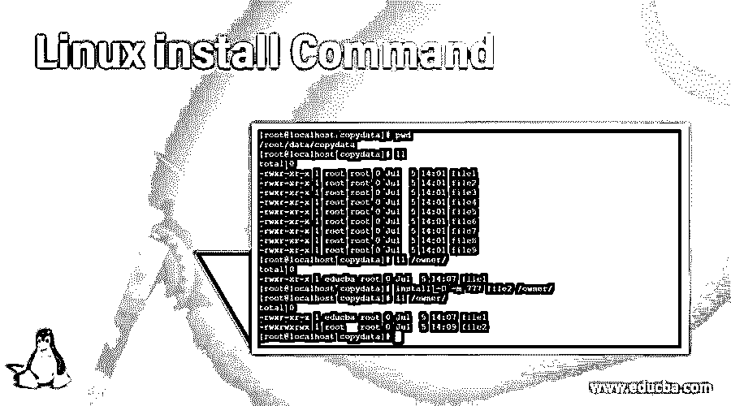
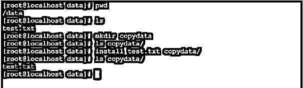
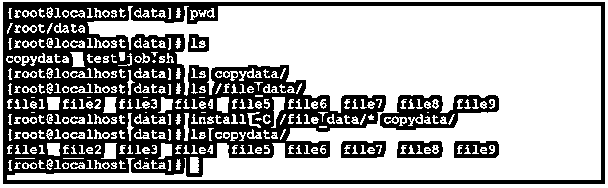
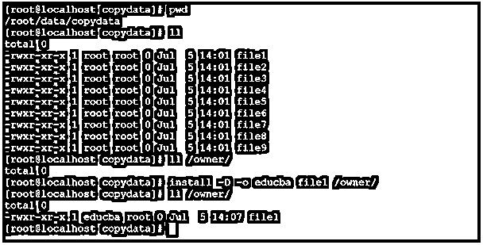
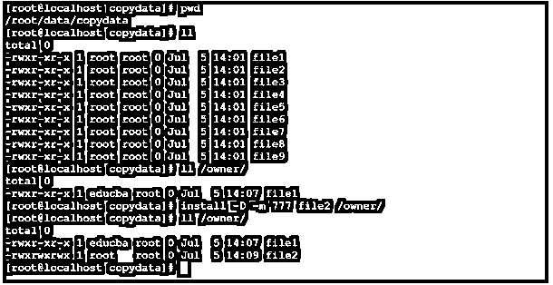
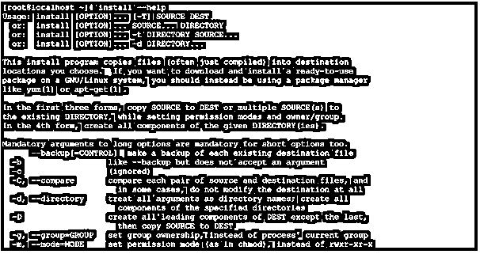
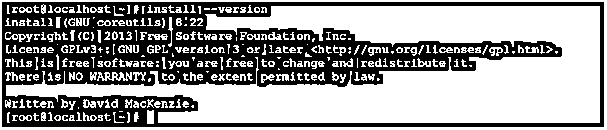

# Linux 安装命令

> 原文：<https://www.educba.com/linux-install-command/>

## Linux 安装简介

在 Linux 生态系统中，install 命令类似于 Linux cp 命令。根据用户要求，install 命令用于将数据复制到目标位置。安装命令可以使用不同的复制命令(作为 cp)、所有者改变或更新命令(chown)、许可改变或更新命令(chmod)、剥离命令等。

安装命令实用程序是由 David MacKenzie 编写的。

<small>网页开发、编程语言、软件测试&其他</small>

注意:install 命令不用于在上安装应用程序。对于软件包上的安装，我们需要使用不同的 Linux 实用程序，如 yum、rpm、apt-get 等。它受 Linux 发行版的约束。

### 安装命令的语法

`install [OPTION]... [-T] SOURCE DEST
install [OPTION]... SOURCE... DIRECTORY
install [OPTION]... -t DIRECTORY SOURCE...
install [OPTION]... -d DIRECTORY...`

*   **install:** 我们可以在语法或者命令中使用 install 关键字。它将接受选项、后缀值、路径等参数。install 命令将有助于复制数据、更改权限等。
*   **选项:**我们可以提供不同的标志作为与 ping 命令兼容的选项。
*   **目录:**在 install 命令中，我们可以使用后缀值来减少将时间值转换为秒值的计算次数。

**注意:**以上三个选项对于将数据从源位置复制到目的位置或者将数据从多个源位置复制到目的位置都很有用。它还包括设置权限和更改所有权任务。最后一个或第四个选项对于创建所提供目录的所有组件非常有用。

### Linux 安装命令是如何工作的？

在 Linux 中，有不同的方法将数据从源位置复制到目标位置。Install 是完成相同任务的实用程序之一。它不仅复制数据，而且改变所有权和改变权限。install 命令接受与 location 兼容的不同选项，并执行复制、所有者和权限更改任务。

下面是 install 命令的选项列表。

*   **–backup[= CONTROL]:**它将备份每个现有的目标文件
*   **–b:**它类似于–backup 选项，但不接受参数
*   **-c:** 该选项用于忽略
*   **-C:** 该选项用于–比较。它将比较每一对源文件和目标文件。
*   **-d:** 用于–目录。它会将所有参数视为目录名。
*   **-g:** 用于–GROUP = GROUP 选项。这将有助于设置组所有权。
*   **-m:** 用于–MODE = MODE 选项。这将有助于设置权限模式。
*   **-o:** 用于–OWNER = OWNER 选项。这将有助于设置所有权模式。
*   **-s”-strip ":**用于条形符号表。
*   **-S–SUFFIX = SUFFIX:**覆盖通常的备份后缀很有用。
*   **-t:** 将所有源数据或文件复制到目录中很有帮助。
*   **-T:** 它将把目的地视为一个普通文件。
*   **-v:** 根据目录创建，它将打印每个目录的名称 verbose。
*   **-P:** 有助于防止 SELinux 安全上下文。
*   **-Z:** 将目标文件的安全 SELinux 上下文设置为默认类型。

### 理解 Linux 安装命令的示例

下面是下面提到的例子:

#### 示例 1–安装命令

在 Linux 环境中，我们能够将文件从一个位置移动到另一个位置或目录。这是 install 命令的默认特性。

**命令**

`install test.txt copydata/
ls copydata/`

**解释**

按照上面的安装命令，我们将“test.txt”文件从数据位置复制到复制数据位置。

**输出:**

#### 示例 2–比较和复制

在 install 命令中，我们可以通过比较将数据从一个位置复制到另一个位置。

**Co**T2】mmand

`install -C /file_data/* copydata/
ls copydata/`

**解释**

我们正在使用比较功能执行复制操作。要使用 compare 执行复制操作，我们需要在 install 命令中使用“-C”选项。

**输出:**

#### 示例 3–改变所有权

在 Linux 环境中，我们可以使用 install 命令来更改文件的所有权。

**命令**

`install -D -o educba file1 /owner/
ll /owner/`

**解释**

按照上面的安装命令，我们在"-o "选项的帮助下执行所有权变更操作。我们正在将所有权从“root”用户更改为“educba”用户。

**输出:**

#### 示例 4–更改许可模式

在 install 命令中，我们拥有更改文件权限的功能。

**命令**

`install -D -m 777 file2 /owner/
ll /owner/`

**解释**

按照上面的安装命令，我们在"-m "选项的帮助下执行权限更改操作。我们正在将文件权限从 755 更改为 777。

**输出:**

#### 示例 4–帮助

我们有获得安装命令帮助的功能。要获得任何帮助，我们需要在安装命令中使用“help”关键字。

**命令**

`install --help`

**解释**

按照上面的命令，我们能够通过 install 命令获得基本的帮助。它将打印一般信息，如命令如何，命令做什么，等等。

**输出:**

#### 示例 5–版本

我们有在 Linux 环境中检查安装实用程序/命令版本的功能。

**命令**

`install --version`

**解释**

根据上面的版本命令，我们能够获得安装命令的版本信息。它用于检查安装命令的功能。大部分情况下建议使用新版本或最新版本。

**输出:**

### 结论

我们已经看到了“Linux Install Command”的完整概念，以及正确的示例、解释和带有不同输出的命令。install 命令用于复制、更改权限或所有者等。它不适用于在 Linux 环境中安装软件包。

### 推荐文章

这是一个 Linux 安装命令指南。这里我们讨论 Linux Install 命令是如何工作的，以及相应的命令和编程示例。您也可以看看以下文章，了解更多信息–

1.  [Linux mdadm](https://www.educba.com/linux-mdadm/)
2.  [Linux Inode](https://www.educba.com/linux-inode/)
3.  [Linux 正则表达式](https://www.educba.com/linux-regular-expression/)
4.  [Linux rm 命令](https://www.educba.com/linux-rm-command/)

