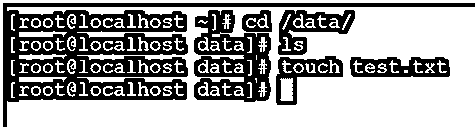
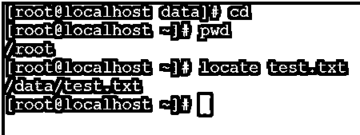
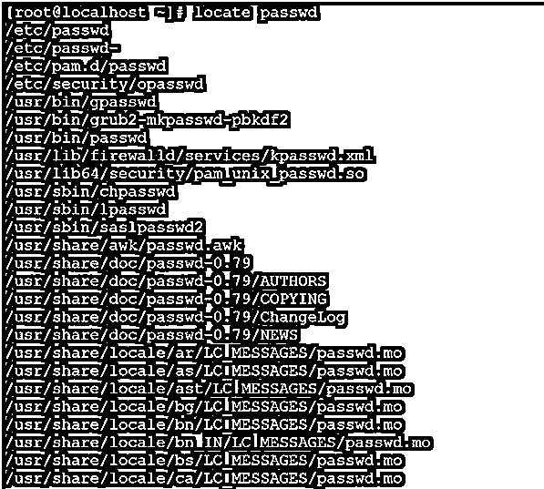
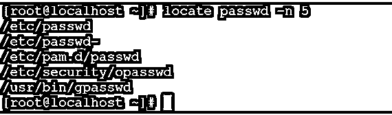
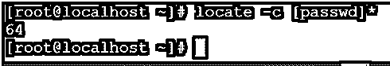
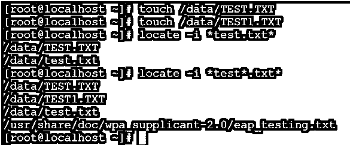
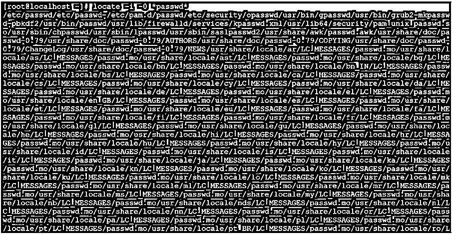
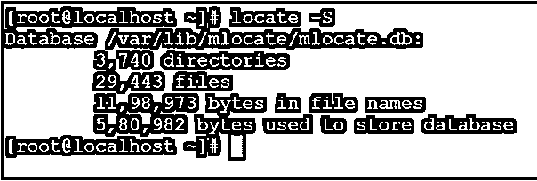

# Linux 定位命令

> 原文：<https://www.educba.com/linux-locate-command/>

## Linux 定位命令简介

在 Linux 生态系统中，locate 命令用于根据文件名查找或搜索文件。与查找命令相比，它的功能更强大，并能快速获得结果。

注意:与其他文件或目录搜索实用程序一样，locate 命令不会搜索整个文件系统来查找文件或文件位置。它将使用数据库来查找文件位置。Locate 命令实用程序是由 Miloslav Trmac 编写的。

<small>网页开发、编程语言、软件测试&其他</small>

**语法:**

`locate [OPTION]... PATTERN...`

*   **locate:** 我们可以在语法或者命令中使用 locate 关键字。它将两个参数作为选项和文件名或模式。提供在文件系统上搜索文件位置的最终结果。
*   **选项:**我们可以提供不同的标志作为与定位命令兼容的选项
*   **格式:**根据需要，我们可以将不同类型的模式或文件名传递给定位命令。

### Linux 定位命令是如何工作的？

如前所述，locate 命令用于根据文件名搜索或识别文件。基本上，定位命令是非常轻和更快的。因为系统中有后台进程，所以会在 Linux 系统中运行。该过程持续运行，找到一个新文件并将相关信息存储在数据库中。当任何客户端使用 locate 命令时，客户端请求将只在数据库中搜索文件名。它不会搜索完整的文件系统。因此，与其他搜索工具相比，locate 命令更好更快。

locate 命令将能够读取由 updatedb–8 准备的一个或多个数据库，并写入与至少一个模式匹配的文件名(按照标准输出)。如果没有提供–regex 值，模式可以包含成组字符。

默认情况下，在查找命令时，它不检查文件是否存在于数据库中，但它要求所有在 Linux 环境中可用的父目录都应该存在于数据库中。一旦最近的文件将在环境中生成或创建。定位实用程序永远不会报告更新相关数据库中的新文件信息。

### 实现 Linux 定位命令的例子

下面是 linux locate 命令的例子，给出如下:

#### 1.locate 命令

在 Linux 环境中使用 locate 命令是一种非常简单和常见的方法。它将打印文件位置，即文件在 Linux 操作系统中的位置。

**命令:**

`locate test.txt`

**说明:**在定位命令的帮助下，我们能够找到文件在系统上的位置。根据截图 1(a ),我们已经创建了一个样本文件，并在定位命令的帮助下定位文件位置。

**输出:**

`cd /data/
ls
touch test.txt`

`cd
pwd
locate test.txt`

#### 2.定位命令–限制搜索查询

我们能够在 locate 命令中限制搜索查询。为了获得有限的输出列表，我们需要在 locate 命令中使用“-n”选项。

**Co**T2】mmand:

`locate passwd -n 5`

**解释:**默认情况下，locate 命令会打印所有模式匹配文件的位置。按照上面的命令，我们能够打印初始匹配的 5 个位置。

**输出:**

`locate passwd`

`locate passwd -n 5`

#### 3.定位命令–打印匹配条目的编号

在 Locate 命令中，我们可以获得环境中匹配文件的数量或文件位置。要获得匹配计数的数量，我们需要在 locate 命令中使用“-c”选项。

**命令:**

`locate -c [passwd]*`

**说明:**

按照上面的定位命令，我们能够打印整数值上的位置路径(passwd ),即有 64 个位置将出现 passwd 模式。

**输出:**

`Locate -c passwd] *`

#### 4.定位命令–忽略大小写

在 Locate 命令中，我们能够打印所有大写和小写文件的位置。要打印所有不敏感文件的位置，我们需要在 locate 命令中使用"-i "选项。

**命令:**

`locate -i *test*.txt*`

**说明:**

默认情况下，locate 命令区分大小写。按照上面的命令，我们不区分大小写地搜索文件位置。

**输出:**

`touch /data/TEST.TXT
touch /data/TEST1.TXT
locate -i *test.txt*
locate -i *test.txt*`

#### 5.locate command–仅显示当前文件

为了避免删除文件信息，只需要获得当前文件。我们可以在 locate 命令中使用"-e "选项。

**命令:**

`locate -i -e *test.txt*`

**解释:**当任何物理文件将从文件系统中移除时，locate 命令仍会显示位置。为了避免这种情况并获得正确的数据，我们需要在命令中使用"-e "选项。

**输出:**

`rm /data/TEST*`

`locate -i -e *test.txt*`

#### 6.定位命令–打印输出，不带新行

在 Linux 环境中，我们可以以不同的方式使用 locate 命令。这里，我们能够在顺序管理器中打印定位命令输出，即不在新行中。

**命令:**

`locate -i -0 *passwd*`

**说明:**根据需要，我们可以在单行中打印定位命令输出，而不用从新行开始。

**输出:**

`locate –i -0 *passwd*`

#### 7.定位命令–查看定位数据库

在定位命令中，我们拥有查看定位数据库的功能。我们可以在 locate 命令中使用"-S "选项。

**命令:**

`locate -S`

**说明:**根据上面的命令，我们可以对定位数据库进行概述。

**输出:**

**定位-S**

#### 8.定位命令-数据库更新

在 Locate 命令中，新文件不会在文件创建的同时反映出来。我们可以使用下面的命令来更新定位数据库，并能够找到文件的位置。

**命令:**

`updatedb`

**解释:**为了获得正确的和更新的文件信息，我们需要运行上面的命令。它将更新 Linux 生态系统中所有新创建的文件。

**输出:**

`updatedb`

### 结论

我们已经看到了“Linux Locate Command”的完整概念，以及正确的示例、解释和带有不同输出的命令。定位命令在它自己的数据库上工作。因此，在 Linux 环境中查找文件位置会更快更快。

### 推荐文章

这是一个 Linux 定位命令指南。这里我们也讨论一下 linux 如何定位命令的介绍和工作原理？以及不同的示例及其代码实现。您也可以看看以下文章，了解更多信息–

1.  [Linux rm 命令](https://www.educba.com/linux-rm-command/)
2.  [Linux tac](https://www.educba.com/linux-tac/)
3.  [Linux More 命令](https://www.educba.com/linux-more-command/)
4.  [Linux 排序命令](https://www.educba.com/linux-sort-command/)

