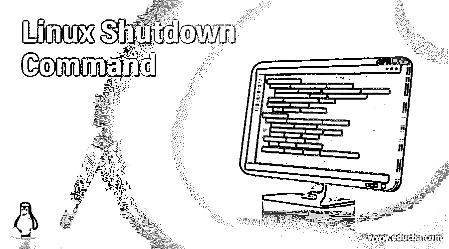

# Linux 关机命令

> 原文：<https://www.educba.com/linux-shutdown-command/>

## Linux 关机命令的定义

Linux 中的 shutdown 命令有助于以安全的方式关闭系统。当我们启动 shutdown 命令时，所有登录的用户和进程都会收到通知，系统将会关闭，因此不允许再登录系统。我们可以立即关闭系统，也可以按照 24 小时的时间表来关闭系统。需要注意的是，只有根用户有关闭系统的权限。

在本文中，我们将展示如何在 Linux 中使用 shutdown 命令，以及如何使用不同的选项来管理这个命令。为了更好地理解，我们用片段简要地解释了这些选项。

<small>网页开发、编程语言、软件测试&其他</small>

### Linux 关机命令的语法

`shutdown [options] [time] [message]`

这里，

*   **选项:**有几个用于关闭系统的选项，如暂停、重启或关机选项。
*   **时间:**时间指定关机应该在什么时间进行。
*   **消息:**消息选项指定关机启动时向所有用户广播的消息。

### Linux 中的 Shutdown 命令是如何工作的？

shutdown 命令中用于管理系统的选项很少。下面是选项及其说明。

*   **-r:** 一旦系统停机，它将允许请求重新启动系统。
*   **-h:** 一旦机器停机，它将允许请求机器停机或断电，然后由系统选择。
*   **-H:** 一旦机器被放下，它将允许请求停止机器。
*   **-P:** 一旦机器停机，将允许请求关闭机器电源。
*   **-c:** 取消正在运行的关机。使用此选项时，时间参数不与此选项一起提及，第一个参数是消息选项。
*   **-k:** 仅用于发送警告信息和禁用登录，不允许机器停机。

**Linux 中的关机命令:**

只有根用户有权关闭系统。关闭系统的基本格式如下所示:

`sudo shutdown`

### Linux 关机命令的示例

下面是几个例子，用截图展示了关机命令在 Linux 中是如何工作的。

#### 如何在指定时间关闭系统？

有两种不同的方法来处理时间参数。一种方法是以 hh:mm 格式指定绝对时间，另一种方法是使用+m，其中“m”是从现在开始的分钟数。

**举例:**

在这里，这个例子意味着系统将在早上 5 点关闭。

`sudo shutdown 05:00`

下面的例子意味着机器将在 20 分钟后关闭。

`sudo shutdown +20`

#### 如何立即关机？

有两种不同的方法来处理时间参数。一种方法是将 alias 指定为 now，另一种方法是提及+0，其中“0”是从现在开始的分钟数。

**举例:**

`sudo shutdown now
sudo shutdown +0`

#### 关机时如何发送自定义消息？

下面是从现在起 20 分钟后关闭系统的语法，然后登录的用户将收到消息“系统将在 20 分钟后关闭”

**举例:**

`sudo shutdown +20 "System Shutdown in 20 minutes"`

需要注意的是，当我们指定一个自定义消息来通知用户时，我们还必须在消息中提到时间参数。

#### 如何停止机器？

我们可以使用选项-H 来暂停系统。暂停系统意味着暂停所有 CPU 并关闭系统电源。我们还需要确保系统和主电源是断开的。

下面给出了暂停系统的语法。

**语法:**

`sudo shutdown -H`

#### 如何关闭系统电源？

默认情况下，这是可以手动完成的，但是我们也可以通过使用选项-P 来关闭系统并明确地关闭电源。下面给出了语法。

**语法:**

`sudo shutdown -P`

#### 如何重启机器？

有两种不同的方法来处理重新启动参数。一种方法是使用选项-r，另一种方法是用定制的消息提到时间参数。如下所示。

**举例:**

`sudo shutdown -r
sudo shutdown -r +10 "Rebooting the system in 10 minutes"`

#### 如何取消指定的关机？

无论何时，如果计划了任何关闭，并且我们想要取消该特定的计划时间，我们可以通过使用选项-c 来实现。

当我们取消关闭时，我们不能提及时间参数，但我们可以向所有登录的用户发送定制的消息。下面给出了它的语法。

**语法:**

`sudo shutdown -c`

在这里，消息在取消关闭之前被发送给所有用户。请注意，没有指定时间参数。

`sudo shutdown -c "Cancelling the shutdown now"`

### 结论

关机命令是 Linux 操作系统中最有用的命令之一。管理员通常使用此命令来管理系统。Linux 中的 shutdown 命令有助于以安全的方式关闭系统。当我们启动 shutdown 命令时，所有登录的用户和进程都会收到通知，系统将会关闭，因此不允许再登录系统。我们可以立即关闭系统，也可以按照 24 小时的时间表来关闭系统。需要注意的是，只有根用户有关闭系统的权限。

### 推荐文章

这是一个 Linux 关机命令指南。在这里，我们还讨论了关机命令的定义以及它在 Linux 中是如何工作的，并给出了不同的例子。您也可以看看以下文章，了解更多信息–

1.  [Linux 用户](https://www.educba.com/linux-users/)
2.  [Linux 挂载命令](https://www.educba.com/linux-mount-command/)
3.  [Linux mdad](https://www.educba.com/linux-mdadm/)
4.  [Linux 网络命令](https://www.educba.com/linux-network-command/)

