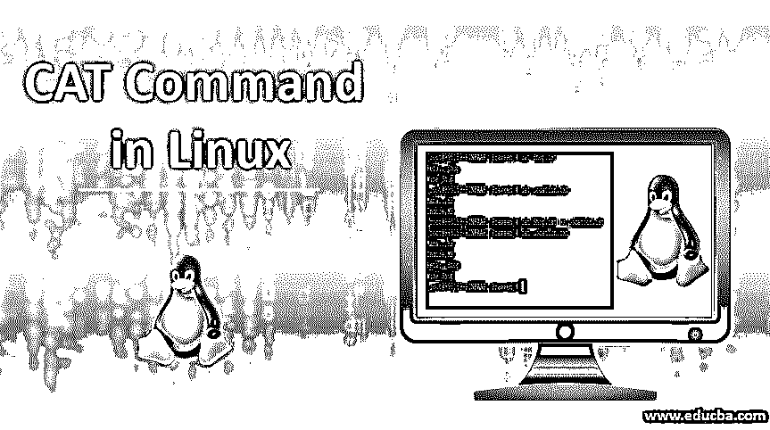
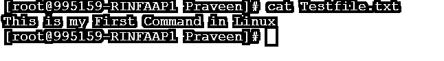
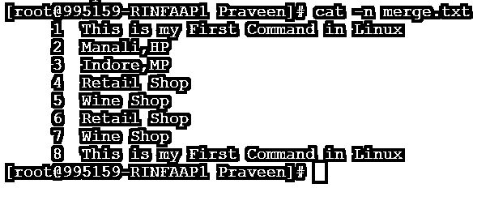
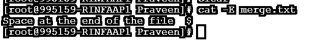
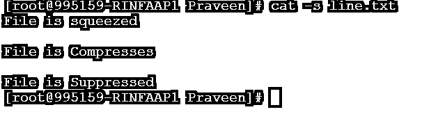
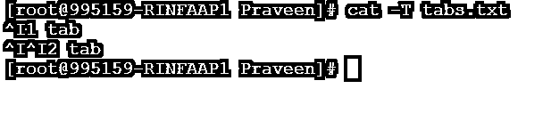
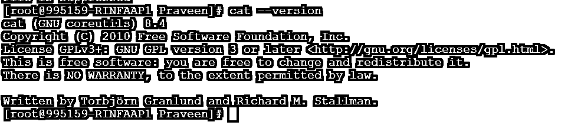

# Linux 中的 CAT 命令

> 原文：<https://www.educba.com/cat-command-in-linux/>




## Linux 中的 CAT 命令简介

cat 命令被称为“concatenate ”,它是 Unix/Linux & Apple Mac OS 操作系统中广泛使用的命令之一。这个命令有不同的应用，如创建单个/多个文件，查看文件的内容，连接文件，并将其输出重定向到终端或文件。cat 命令将文件内容显示在屏幕上。Cat 命令将标准输入连接到标准输出。当没有文件时，或者当有文件时，它读取标准输入？它执行与文本文件操作相关的三个主要角色:创建、显示和组合它们。

**语法:**

<small>网页开发、编程语言、软件测试&其他</small>

```
cat OPTIONS FILE_NAME
```

**选项:**

*   **A:** 用来显示文件的所有内容。
*   **b:** 该选项用于给出一个非空白/非空输出行的数字，并覆盖选项-n。
*   **e:** 几乎等于 option -vE。
*   它将显示文件的结尾。
*   **n:** 该选项将按升序给文件的每一行编号。
*   **s:** 该选项将抑制多个空输出行。
*   **t:** 这个选项类似于选项-vT。
*   **T:** 用于显示^I.等特殊制表符
*   **u:** 用来忽略事情。
*   **v:** 用于显示使用^和 m 符号的不可打印字符。
*   **help:** 该选项用于获取关于 cat 命令的详细信息。
*   **版本:**使用此选项我们可以了解 cat 命令的版本信息。

### 在 Linux 中实现 CAT 命令的例子

下面是提到的例子:

#### 示例#1

创建一个新文件。

使用 Cat 命令我们可以很容易地创建一个文件。让我们创建一个名为 Testfile.txt 的文件，写下内容“这是我在 Linux 中的第一个命令。

**代码:**

```
Cat > Testfile.txt
```

添加内容后，按 Cntrl + D 退出 shell，并将内容写入文件。

**输出:**


#### 实施例 2

如何显示文件的内容？

为了显示文件的内容，我们可以简单地使用 cat 命令并传递我们想要查看的文件的名称。文件的输出将被打印在标准输出上，并且可以在终端上查看。

**代码:**

```
cat Testfile.txt
```

**输出:**




如果一个文件的内容很长，那么所有的内容都将被写入终端。在这种情况下，发现或识别所有内容将是一项挑战。当搜索特定内容时，grep 将是一个很好的选择。

#### 实施例 3

将任何文件的内容写入新文件。

为了将文件内容写入新文件，将在 cat 命令中使用“shell 重定向”。在下面的例子中，假设文件 Testfile.txt 只有一行“这是我在 Linux 中的第一个命令”,并将它写入 File_1.txt。

**代码:**

```
cat Testfile.txt > File_1.txt
cat File_1.txt
```

**输出:**


**Note:** New File_1.txt is created and the content of Testfile.txt is copied to the File_1.txt.In case if the File_1.txt already exists then it will use the existing file at the path.

#### 实施例 4

将一个文件的内容追加到另一个文件**。**

如果我们需要将任何文件的内容附加到另一个文件，将使用 shell 重定向。例如，假设我们有两个文件 Shop.txt 和 Location.txt。

**代码:**

```
cat Shop.txt
Retail Shop
Wine Shop
```

Location.txt 文件也包含两行:

**代码:**

```
cat Location.txt
Manali,HP
Indore,MP
```

**现在我们将使用 shell 重定向(>>)来追加两个文件的内容:

**代码:**

```
cat Shop.txt >> Location.txt
```

**代码:**

```
cat Location.txt
```

**输出:**


#### 实施例 5

将多个文件合并成一个统一的文件。

为了将多个文件合并成一个文件，cat 命令将与 shell 重定向一起使用。下面提到的命令将把所有带有*的文件组合在一起。txt 扩展名的文件放入同一或不同目录中的一个文件中。

**Note:** * is a special character in Linux/Unix which means all.

**代码:**

```
cat *.txt > merge.txt
```

**代码:**

```
cat merge.txt
```

**输出:**


您可以记住从 Testfile.txt、File_1.txt、Shop.txt 和 Location.txt 组合的内容，因为它们都有。txt 扩展名。

#### 实施例 6

将行号添加到 Cat 输出中。

为了在 cat 命令的输出中添加行号，我们将使用-n 选项。它会在每行的开头加上数值。

**代码:**

```
cat -n merge.txt
```

**输出:**




你可以看到数字是按升序排列的。

#### 实施例 7

显示线的末端。

如果我们想知道文件中行的结束，那么我们将使用带有-E 选项的 cat 命令。它将在行尾追加一个“$”字符。该选项对于检查文件中何时有尾随空格很有用。例如，让我们使用相同的 merge.txt。

**代码:**

```
cat -E merge.txt
```

**输出 1:**


在上面的输出中，行尾没有空格。

现在让我们添加一些带空格的行，然后我们会看到在结束行和“$”之间有一个制表符。

**输出 2:**




#### 实施例 8

挤压或压缩空行。

为了压缩文件中的空行，我们可以使用带有-s 选项的 cat。它将挤压空行，然后抑制重复的空输出行。

假设我们有文件 line.txt，它包含以下数据:

*   文件被压缩
*   文件被压缩
*   文件被禁止
*   文件被压缩

**代码:**

```
cat -s line.txt
```

**输出:**




我们可以看到重复的记录已被删除。

#### 实施例 9

显示文件中的选项卡。

为了显示 tab，我们可以使用带有-T 选项的 cat。它将显示标签为^I.

文件 tabs.txt 包含:

*   1 个选项卡
*   2 选项卡

**代码:**

```
cat -T tabs.txt
```

**输出:**




#### 实施例#10

版本。

**命令:**

```
cat --version
```

**输出:**




### 推荐文章

这是一个 Linux 下的 CAT 命令指南。这里我们讨论语法和 10 个不同的例子，在 Linux 中用正确的代码和输出实现 cat 命令。您也可以浏览我们的其他相关文章，了解更多信息——

1.  [Linux 中的 Tar 命令](https://www.educba.com/tar-command-in-linux/)
2.  [Linux 中的 GCC 命令](https://www.educba.com/gcc-command-in-linux/)
3.  [Linux 中的 IP 命令](https://www.educba.com/ip-command-in-linux/)
4.  [Linux 中的 Chown 命令](https://www.educba.com/chown-command-in-linux/)


