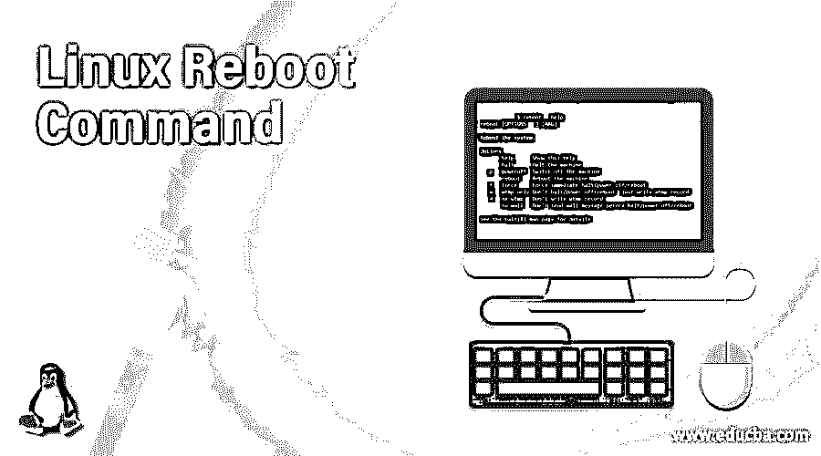
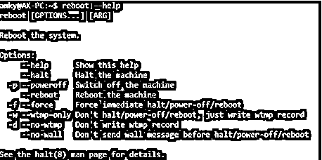

# Linux 重启命令

> 原文：<https://www.educba.com/linux-reboot-command/>

## Linux Reboot 命令简介

Linux 中的 Reboot 命令是一种从现有状态重启系统的方法。这听起来可能是陈词滥调，但这是一句广为人知的名言:重启可以解决主要问题。许多人也会感觉到它被引用的方式。现在，这只是一个报价，因为也有一个科学或可以说是基于软件的逻辑解释。重新启动后，系统帮助从活动存储器中清除故障软件，并在重新启动后，将软件作为干净副本加载到活动存储器中。不仅如此，在操作系统运行过程中，经常需要使用最新的配置更改和更新来刷新系统，这也是重新启动非常方便的地方！

### Linux 重新启动命令的语法

执行重启命令有多种方式。有些命令会包含关键字 reboot，有些可能不包含关键字。那些不包含关键字的命令的执行方式也与 reboot 命令的预期方式完全相同。

<small>网页开发、编程语言、软件测试&其他</small>

**语法#1**

`sudo reboot`

这种语法是最简单的，只要加入关键字就可以帮助完成所需的操作。在这种语法中，有多个选项，我们将在本课程的后面部分讨论。

**语法#2**

`sudo shutdown –r`

虽然这个命令描述了另一个关键字，但它确实满足了重新启动命令的要求。这里，shutdown 是 Linux 在执行这个命令时寻找的关键字。如果将-r 作为选项，它会发送一个信号，表明该命令应该执行 reboot，因为 reboot 需要关闭然后自己打开，不需要手动干预就可以启动。

**语法#3**

`init 6`

init 是一个关键字，意思是初始化，它用于初始化或启动系统上的进程。这个命令对于那些精通 Linux 并对 init 提供的选项有很好理解的人来说非常方便。这个命令调用运行级别 6，它是为重新启动 Linux 而保留的

### Linux 中的 Reboot 命令是如何工作的？

现在，我们已经对 reboot 命令的外观、语法有了一个大致的了解，理解 reboot 命令的使用情形、reboot 命令的工作方式以及 reboot 命令的许多可用选项就变得更加重要了。

作为一名管理员，我们总是想让我们的 Linux 系统保持最新，并且随着任何与网络或安全补丁相关的重大更新，重启 Linux 系统是不可避免的。在某些情况下，这些更新可以在服务器上进行，为了让这些更改在所有用户中得到反映，管理员需要重新启动 Linux 系统。

在正常的重启中，我们所做的是关闭操作系统，但是使用重启命令，我们所做的是允许固件取代系统来重启。人们往往会混淆重启和硬休息，但微妙的区别是硬休息只不过是强制关闭系统，而重启是一个正常的过程，包括受控关机！

以下是重启时需要遵循的几个步骤:

*   一个 HUP 信号被发送给所有使用 Linux 系统的用户，告诉他们可能发生的重启。简而言之，HUP 是一种通知信号，当相应的控制终端关闭时就会发出。
*   关闭所有服务时会遵循一个受控的流程，例如，依赖于其他流程关闭的任何流程都将优先关闭，以便在系统重新启动时不会出现技术故障。
*   如果某些会话由于某种原因没有关闭，将发送 TERM signal，如果在规定的时间内没有响应，将发送 KILL 命令。
*   现在，任何基于网络的文件系统都将被卸载，以便在卸载之前完成所有缓存的写操作。
*   接下来，访问网络文件系统的任何服务都将关闭，紧接着，允许完成对本地磁盘的任何写操作。
*   最后，所有这些都完成后，一个硬件信号被发送到内核，让它知道重新启动系统！

在下一节中，我们将查看不同的选项，以了解哪些步骤适合哪些选项。

#### 重新启动命令选项

在 Linux 中，reboot 命令有以下选项:

*   **–帮助:**这允许用户查看与重启命令相关的文档。该命令只打印重启和退出时可用的不同选项。

**代码:**

`reboot --help`

**输出:**

*   **-p 或–power off:**该选项将使系统仅断电，即断电
*   **-f 或–force:**该选项将强制执行所有需要的动作。在使用此选项的情况下，不会发生干净关闭。简而言之，除了最后一步，我们最后一节中的所有步骤都被跳过。
*   **-w 或–wtmp-only:**选择此选项时，仅记录 wtmp 关闭条目，而不记录任何暂停/关机/重启

为了实现计划的关机，我们需要借助命令 shutdown，语法如下:

`shutdown –r [TIME] [MESSAGE]`

**代码:**

`sudo shutdown -r 02:00`

**输出:**

**代码:**

`sudo shutdown -r +5`

**输出:**

**代码:**

`sudo shutdown -r 00:00 “Server has some new updates and hence will shutdown”`

**输出:**

这里，如果[时间]以 HH:MM 表示，则它将被视为 24 小时格式的一天中的时间，如果它是正式的+<integer>，则它被假定为系统在启动重新引导之前将等待的分钟数。</integer>

### 结论

在这篇文章中，我们通过一系列的例子介绍了 reboot 命令在现实生活中的用法，并研究了可供开发人员使用的不同选项。管理员使用这一功能时，系统的重启会非常顺利和及时，以便在系统关闭之前计划好所有必要的操作。

### 推荐文章

这是一个 Linux 重启命令的指南。这里我们还将讨论 linux reboot 命令的介绍和语法，以及它是如何工作的。您也可以看看以下文章，了解更多信息–

1.  [Linux 用户](https://www.educba.com/linux-users/)
2.  [Linux 网络命令](https://www.educba.com/linux-network-command/)
3.  [在 Linux 中设置 IP 地址](https://www.educba.com/set-ip-address-in-linux/)
4.  [Linux 排序命令](https://www.educba.com/linux-sort-command/)

