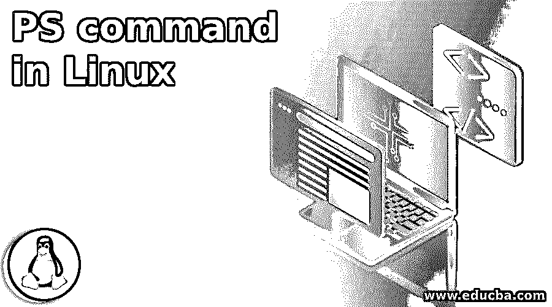
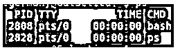
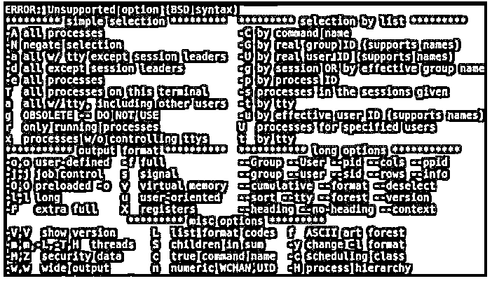
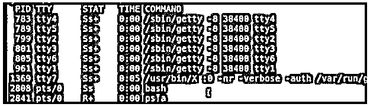
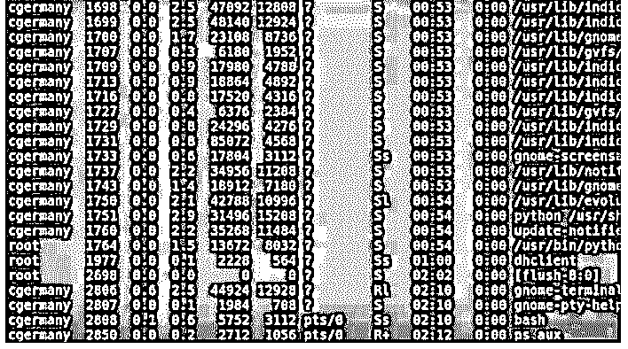

# Linux 中的 PS 命令

> 原文：<https://www.educba.com/ps-command-in-linux/>

## Linux 中 PS 命令介绍

Linux 进程控制可以使用命令 PS、kill、Bg、fg、jobs、nice、renice、grep 和 top 来实现。通过使用这些命令，任何后台守护程序都可以有效地管理我们的程序进程。PS 命令是列出正在运行的进程和守护程序的进程命令，它类似于 Windows 中的任务管理器。

**PS 命令的语法:**

<small>网页开发、编程语言、软件测试&其他</small>

`ps -[options]`

### PS 命令可用的选项

可用的通用 PS 选项:

|  | **选项** | **工作** |
| One | 英语字母表中第五个字母 | 选项它显示正在运行的守护进程。 |
| Two | 英语字母表中第六个字母 | 使用 F 选项，它显示带有完整选项的进程。 |
| Three | 英语字母表中第十二个字母 | 使用 L 选项，它将列出关于这些进程的更多信息。 |
| Four | 仰角指示器 | 我们将 e 和 F 结合在一起，显示所有 TTYS 上的所有进程和守护进程。 |
| Five | 一 | 会列出所有在终端上运行的进程。 |
| Six | 英语字母表的第 24 个字母 | x 将列出所有不在终端上运行的进程。 |
| Seven | 去吧 | 我们要结合一个 U 和 X，列出所有运行在终端上或终端外的进程，它会用类似于一个长列表的附加信息格式化结果。 |

### Linux 中 PS 命令的例子

下面是一些例子:

#### 示例#1

**代码:**

`ps`

**输出:**

**说明:**

*   在这里，我们得到一个基本的进程 ID 或 ped 你 TTY 它运行在，记住这里七，我们可以做所有的 F 1 到 F 6 的命令提示符在 alt f7 4x Windows 或贵由知道时间在这种情况下，该进程是在 CPU 和命令上运行，所以在这种情况下，它是 bourne-again shell。

#### 实施例 2

**代码:**

`ps **`

**输出:**

**说明:**

*   键入 PS，我们可能知道会弹出一个手册页，或者即使我们输入了像几个星号这样的错误语法，它也会给我们一个交换机和其他东西的列表。

#### 实施例 3

**代码:**

`ps a`

**输出:**

#### 

#### 实施例 4

**代码:**

`ps u`

**输出:**

#### 实施例 5

**代码:**

`ps aux|less`

**输出:**

#### 实施例 6

**代码:**

`ps -f`

**输出:**

**说明:**

*   我们可以用 F 选项做 PS，它只是给我们多一点信息。
*   同样，如果我们只是浏览第一部分，运行进程的用户 id，这是 pid，进程 ID，稍后当我们将它与 kill 命令结合使用时，我们需要知道任何进程的 pid，以便能够杀死它或将其发送到后台，有时这取决于您将如何处理 ppid 是父进程 ID，发生的事情在 Bourne shell 中，在本例中是 bourne-again shell。
*   每当您启动一个进程或程序时，它基本上会进入等待状态，并创建另一个 shell，该程序会返回并启动该程序，然后当它完成时，如您所知，该 shell 有自己的内置 kill 命令，它会杀死自己，然后返回到父进程或父进程 ID，然后权重函数完成，然后父进程 ID 会将光标或控制台返回。
*   快照有用户 ID 在这种情况下，进程 ID，父进程 ID ppid 下一个选项是 CPU 利用率在这种情况下，它可以忽略启动时正在使用的内容，TTY，时间是在这种情况下，您知道进程占用 CPU 的时间，这也是可以忽略的，然后是命令本身，所以现在只有 bourne-again shell 和 process 命令，不包括后台程序和在后台写入的内容。

#### 实施例 7

**代码:**

`ps -ef`

**输出:**

**说明:**

*   这里我们想显示所有的进程和守护进程，那么 F 就是进程，所以如果你在寻找一个特定的进程，这可能是一个有用的信息。

#### 实施例 8

**代码:**

`ps -l`

**输出:**

**说明:**

*   如果我们想列出更多的信息，我们可以做 PSL，这将给我更多的信息。
*   如果我们这样做，那么这里的第一列 F 代表一个标志，在这种情况下，如果是 4，那么这是根用户，在这种情况下，那么下一个是，这里的 S 是进程状态，有几种可能的状态，S 代表休眠，R 代表运行，Z 代表僵尸状态，在僵尸状态下，进程正在等待释放它的父进程，进程可能会停止，或者 它可能正在被另一个进程跟踪，或者该进程没有内容和内存，因此有几个不同的选项，再次显示 UID 1000 和运行该进程的用户组，PPID 是进程 ID C 仍然是 CPU 利用率 PR 是进程优先级，所以它现在在 UNIX 或 Linux 环境下运行的精确级别，您知道的优先级越低，优先级就越高，换句话说。
*   换句话说，优先级最高的是 0，最低的是 127，nice 值，如果是 0，那么它们都有默认的 nice 值，不管它们是在什么情况下启动的，但是如果是负 20，你知道数字越小，它获得更高优先级的机会就越大，我说的是机会，这不是保证的，但以时间片的方式，因为它与其他恶魔和进程共享 CPU 周期。
*   如果是好的，那么负 20 会有更高的优先级，另一方面，如果是正 19，那么它获得高优先级的机会会低得多，好的，所以优先级本身不同于实际的好的值，你知道它与优先级相关或者确实影响优先级，我们稍后会更详细地看一下，我们现在只是在讨论进程提交的基础，嗯。
*   让我们看下一个字段，地址是进程的内存地址，下一个字段是进程的内存大小，WCHAN 是进程再次休眠时等待的时间，TTY 到终端，时间是进程占用 CPU 的时间，命令是单独的命令进程。

### 推荐文章

这是一个 Linux 中 PS 命令的指南。我们已经看到了如何使用 PS 命令查看流程和 it 信息。在这里，我们讨论 PS 命令的简介、可用选项和示例。您也可以看看以下文章，了解更多信息–

1.  [Linux 中的 du 命令](https://www.educba.com/du-command-in-linux/)
2.  [Linux 路由命令](https://www.educba.com/linux-route-command/)
3.  [Linux 中的 SCP 命令](https://www.educba.com/scp-command-in-linux/)
4.  [Linux tee 命令](https://www.educba.com/linux-tee-command/)

