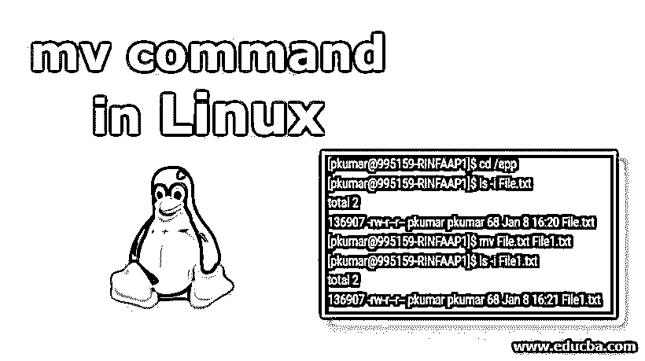
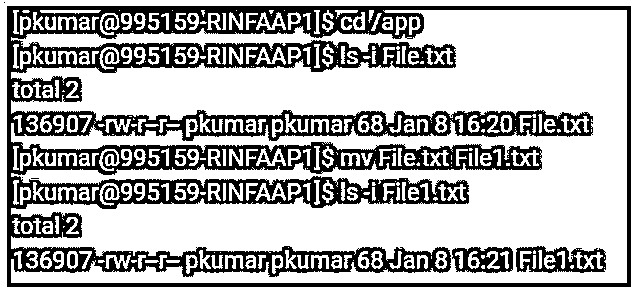
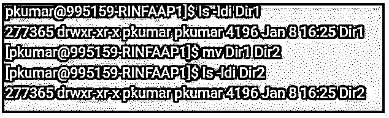
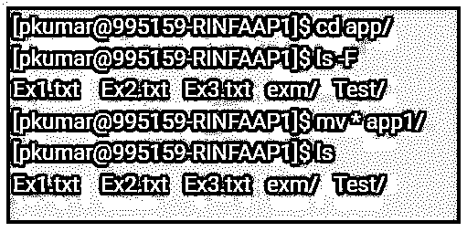
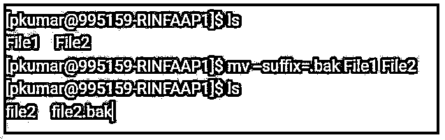
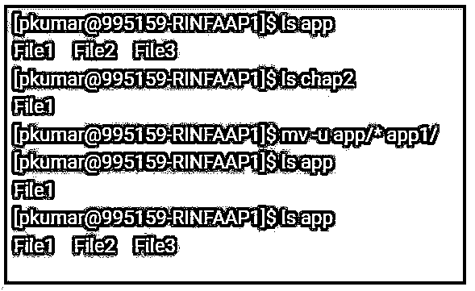

# Linux 中的 mv 命令

> 原文：<https://www.educba.com/mv-command-in-linux/>




## Linux 中 mv 命令介绍

mv 命令称为“Move”，这是一个命令行实用程序，用于将文件或目录从源移动到目标。它支持单个文件、多个文件和目录的移动。它与复制命令 (cp)非常相似，用于复制，而删除命令(rm)用于删除。唯一的区别是，移动命令具有重命名和移动文件的两种命令的功能。

**先决条件**

<small>网页开发、编程语言、软件测试&其他</small>

要运行移动命令(mv ),要移动文件或目录，我们必须拥有对源和目标的写权限，否则我们将收到权限被拒绝的错误。

### 句法

```
mv [OPTION] SRC DEST
```

其中，SRC 是源文件或目录，DEST 是目标文件或目录。

**各种因素的应用:**

*   源可以是单个或多个文件或目录，目标可以是单个文件或目录。
*   当多个文件或目录作为源传递时，目标需要是一个目录。在这种情况下，源文件将移动到目标目录。如果我们指定单个文件作为源，那么目的地目标是一个现有的目录，那么该文件将被移动到指定的目录。
*   当我们指定一个文件作为源文件和一个文件目标时，我们就是在重命名文件。
*   如果我们的源是一个目录，而目标不存在，那么源将被重命名为目标，或者如果目标存在，那么它将被移动到目标目录中。

### 选择

有多种选项可用于移动命令。

**1。mv -i:** 此选项表示“交互模式”，意味着在移动替换/覆盖已存在的同名文件之前，将提示用户确认。在这种情况下，我们必须输入“y”来确认或覆盖文件。

**2。mv -n:** 该选项用作 no-clobber，这意味着它将防止文件被覆盖。简单地说，我们可以重命名一个文件以匹配另一个文件，同时仍然保留已经存在的文件的内容。

**3。mv -v:** 这意味着以“详细模式”移动文件，意味着它将显示 mv 命令运行时发生的活动状态。

**4。mv -u:** 这个选项暗示为“更新模式”，意味着只有当源文件有任何新内容或者甚至目标文件丢失时，它才会更新目标文件丢失。

**5。mv *:** 这个选项会将多个文件移动到一个特定的/当前的目录。

**6。mv–suffix = suffix:**该选项用于在覆盖文件或目录之前对其进行备份。默认为“~”。

**7。mv–版本:**该选项检查 mv 命令的版本。

**8。mv -f，–force:**该选项将在没有任何提示的情况下移动文件或目录。如果我们需要覆盖多组权限为只读的文件，此选项将非常有用，如果您不指定此选项，则会为每个文件显示提示。

### Linux 中 mv 命令的例子

下面给出了 Linux 中 mv 命令的示例:

#### 示例 1–重命名文件。

当使用 mv 命令重命名文件时，即使将其移动到不同的文件名，inode 编号也保持不变。移动和更改文件系统时，Indone 编号会发生变化

**命令:**

```
mv File.txt File1.txt
```

**输出:**




**Note:** ls -i will display the inode number of a file.

#### 示例 2–重命名目录。

与重命名文件类似，我们也可以通过 mv 命令重命名目录。这里的索引节点号也与重命名文件中的相同。

ls -l 将显示目录中的文件和目录。要显示唯一的目录，请使用-d 选项。-i 选项，它将显示目录的索引节点号。

**命令:**

```
mv Dir1 Dir2
```

**输出:**




#### 示例# 3–提示终端确认覆盖。

mv 命令在覆盖时不会要求确认，但在相同位置时会默认。它将简单地覆盖它。为了避免任何问题，我们希望在覆盖目标文件之前得到 mv 命令的确认，所以我们需要"-i "选项，如下所示。然后，我们可以键入 Y 或 N 进行操作。

**命令:**

```
mv -i File.txt File1.txt
```

**输出:**


当目标文件权限不同于源文件权限时，mv -i 命令将显示以下确认信息。

**输出:**


#### 示例 4–将多个文件移动到特定目录。

我们可以用 MV 命令移动多个文件或目录。下面将展示如何使用 MV 命令移动目录的内容。

**命令:**

```
mv * app1/
```

**输出:**




#### 示例 5–覆盖前创建备份文件。

现在，当我们使用 mv-suffix 时，将会创建一个备份文件。现在，以前的文件将使用在-S of-suffix 选项中指定的新后缀进行移动。

**命令:**

```
mv --suffix=.bak File1 File2
```

**输出:**




**Note:** mv –suffix can be written as an alias which would backup the same as mv command automatically.

#### 示例 6–在不存在的目标路径中移动文件。

mv *将有助于将所有文件移动到新位置。mv -u 命令将有助于将文件或目录移动到新的位置，这些文件或目录不存在，也没有更新/更改。

下面的命令只会将文件 2 和文件 2 从应用程序移动到应用程序 1，因为文件 1 已经存在于应用程序 1 中，所以它会移动。

**命令:**

```
mv -u app/* app1/
```

**输出:**




### 推荐文章

这是 Linux 中 mv 命令的指南。这里我们讨论 Linux 中 mv 命令的基本概念、选项和示例。您也可以看看以下文章，了解更多信息–

1.  [Unix Shell 命令](https://www.educba.com/unix-shell-commands/)
2.  [Linux 中的 Shells 类型](https://www.educba.com/types-of-shells-in-linux/)
3.  [Ubuntu 命令](https://www.educba.com/ubuntu-commands/)
4.  [Linux 中的 rmdir 命令](https://www.educba.com/rmdir-command-in-linux/)


