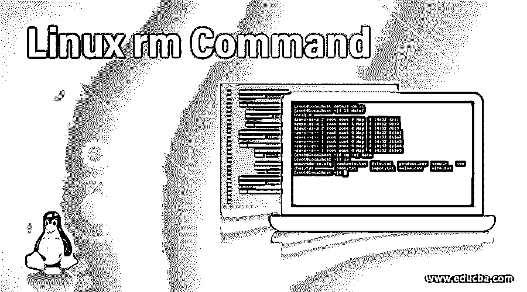
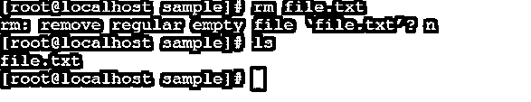
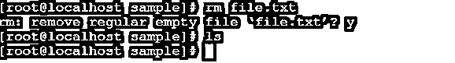
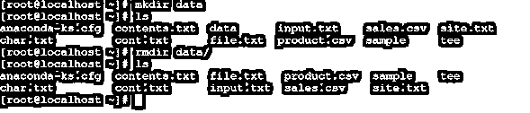
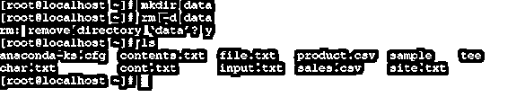
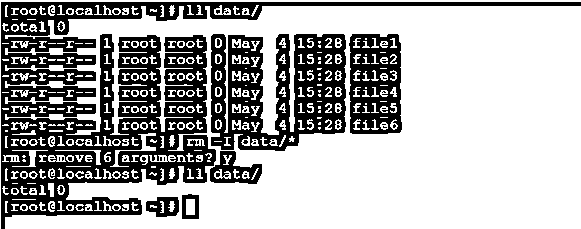
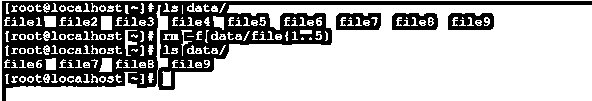
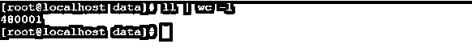

# Linux rm 命令

> 原文：<https://www.educba.com/linux-rm-command/>

## Linux rm 命令简介

在 Linux 操作系统中，rm 命令用于移除或删除文件或目录。同样，我们也可以使用“unlink”命令只删除单个文件。Linux rm 命令行实用程序是由 Paul Rubin、David MacKenzie、理查德·M·斯托曼和 Jim Meyering 编写的。

**Note:** By default, the rm command will not remove the directories.

**RM 命令的语法**

<small>网页开发、编程语言、软件测试&其他</small>

`rm [ OPTION ] FILE NAME | DIRECTORY NAME`

*   **rm:** 在命令|语法中使用 rm 关键字。它将这两组参数作为选项和文件/目录名，并根据文件/目录权限和给定的选项删除它。
*   **选项:**我们可以提供不同的标志作为 rm 命令的选项。
*   **文件:**输入文件或目录名。

### Linux Rm 命令是如何工作的？

顾名思义，rm 命令对于从 Linux 文件系统中移除或删除文件或目录非常有用。根据文件或目录权限，“rm”命令将删除文件。“rm”命令接受两个参数作为选项和文件/目录名，然后根据选项和文件权限删除文件/目录。

**Note:** If you are newer in the Linux environment, please run the “rm” command very carefully. It will be a bit difficult to recover the file or directory once it will remove/delete it from the Linux Operating system.

### 实现 Linux Rm 命令的示例

下面是提到的例子:

#### 例 1。Rm 命令

在 rm 命令的帮助下，我们能够从 Linux 文件系统中删除该文件。

**代码:**

`pwd
ls
rm file.txt`

解释:我们有一个样本目录。在同一个目录下，我们有一个“file.txt”文件(参考截图 1 (a))。在 rm 命令的帮助下，我们能够删除该文件。但是使用默认的“rm”命令，它要求文件删除确认。如果我们输入“n”(否)，那么只有文件不会被删除(参见屏幕截图 1 (b))。如果我们按“y”(是)，那么文件将被删除。(参考截图 1 (c))。

**输出:**

#### 例 2。删除空目录

在 rm 命令的帮助下，我们能够删除 Linux 文件系统上存在的不同类型的目录。这里，我们正在删除空目录。我们需要在 rm 命令中使用“-d”选项。

**代码:**

`mkdir data
ll data/
rmdir data
rm -d data`

**解释:**我们正在创建一个样本目录(“数据”)，其中没有数据，即这是一个空目录(参见截图 2 (a))。现在，我们能够以两种不同的方式删除空目录。在第一种方法中，我们可以使用带有“-d”选项的“rm”命令，在第二种方法中，我们可以使用“rmdir”命令删除空目录(参考截图 2 (b))。

**输出:**

#### 例 3。带“-rf”选项

在 rm 命令中，我们可以在同一个工作目录中强制递归地删除或移除大量文件。不需要向“rm”命令提供文件名的数量。我们需要在 rm 命令中使用“-rf”选项。

**代码:**

`rm -rfdata`

**说明:**在上面的命令中，我们可以从工作目录中删除文件数量和子目录。要强制删除文件数量，我们需要在“rm”命令中使用“-rf”选项。在数据目录中，我们有 3 个不同的文件和 3 个子目录。我们正在删除它的所有项目。

**输出:**

#### 实施例 4。带有用户交互式“-ri”选项

在 rm 命令中，我们可以根据用户输入删除文件。如果用户输入“y”(是)，则只有文件会被删除，否则不会被删除。我们需要在 rm 命令中使用“-ri”选项。

**代码:**

`rm -ri data/`

**解释:**按照上面的命令，我们递归地从用户输入的目录中删除所有文件。在“数据”目录中，我们有三个文件，并根据用户输入删除这些文件。

**输出:**

#### 例 5。删除前提示选项

在 Linux rm 命令中，有一个工具可以提示目录中存在的文件数量。如果我们将用户输入作为“y”(是)传递，那么在下一个实例中，所有文件都将被删除。我们需要在 rm 命令中使用“-I”选项。

**代码:**

`rm -I data/*`

**说明:**根据上面的命令，我们在“data”目录下有 6 个文件。在“I”选项的帮助下，我们在从当前工作目录中删除文件数量之前得到提示。如果我们将用户输入作为“n”(否)，那么文件不会被删除，如果我们将输入作为“y”(是)，那么所有文件将被删除。

**输出:**

#### 实施例 6。带正则表达式选项

在 Linux rm 命令中，我们可以使用正则表达式从文件系统中删除文件。我们需要在 rm 命令中使用“-f”选项。

**代码:**

`rm -f data/file{1..5}
ls data/`

**说明:**根据上面的 rm 命令，我们已经使用正则表达式从“data”目录中删除了 5 个文件。在数据目录中，共有 9 个文件。我们已经删除了最初的 5 个文件，目录中还有剩余的文件。

**输出:**

#### 示例 7–删除大量文件

在 Linux 或 UNIX 操作系统中，目录中有大量的文件。用传统的方法很难删除所有的文件。我们需要使用不同的方式在单个 rm 命令中删除这些文件。

**代码:**

`find ~/data/ -type f -exec rm {} \;
ls data/`

**说明:**根据上面的命令，我们在一个 rm 命令中删除了大量的文件。在 find 命令的帮助下，我们正在查找文件并将参数(数组)传递给 rm 命令。相应地，rm 命令将删除一些文件。

**输出:**

### 结论

我们已经看到了“Linux Rm Command”的完整概念，以及正确的示例、解释和带有不同输出的命令。默认的 rm 命令用于递归删除文件或目录的数量。但是我们需要非常小心地使用 rm 命令。

### 推荐文章

这是一个 Linux rm 命令指南。在这里，我们讨论 Linux rm 命令的介绍、适当的语法以及这些命令如何与相应的示例一起工作。你也可以通过我们的其他相关文章来了解更多-。

1.  [Linux 目录结构](https://www.educba.com/linux-directory-structure/)
2.  [Linux 中的 PS 命令](https://www.educba.com/ps-command-in-linux/)
3.  [Linux 中的帮助命令](https://www.educba.com/help-command-in-linux/)
4.  [Linux uniq](https://www.educba.com/linux-uniq/)

