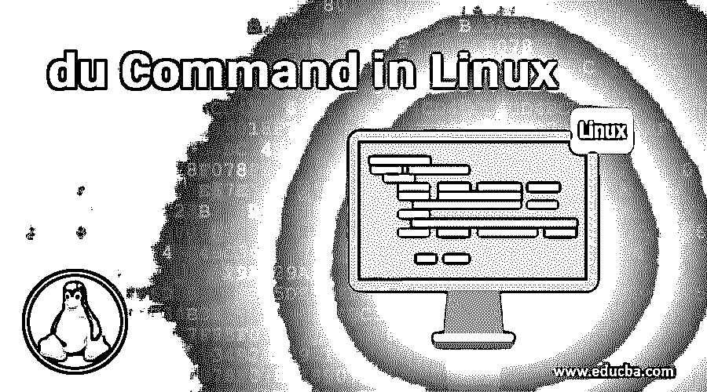

# Linux 中的 du 命令

> 原文：<https://www.educba.com/du-command-in-linux/>




## Linux 中的 du 命令简介

du 命令也称为“disk usage”命令，它给出了输入文件和存储在内存目录中的文件所使用的磁盘内存空间总量的估计值。它用于测量和识别占用大量磁盘内存的特定文件和目录的内存使用情况。当我们给出目录中的文件名时，du 将给出该目录中磁盘的内存使用量的估计值。

在这个主题中，我们将学习 Linux 中的 du 命令。

<small>网页开发、编程语言、软件测试&其他</small>

### du 命令用法和语法

du 命令的基本语法是:

**语法:**

```
du [OPTIONS]... [FILE]...
```

当没有指定的文件时，du 将自动报告我们正在工作的当前目录中的磁盘内存使用情况。当我们执行不带选项的命令时，磁盘的内存使用以给定文件的字节或文件所在的目录以及该文件的子目录的内存使用为单位。

```
du ~/Documents
```

我们可以给多个文件名和目录名作为 du 命令的输入:

```
du ~/Documents ~/Pictures ~/.zsg
```

du 不处理我们没有授权的文件或目录。该命令将抛出一个错误，因为 du 命令将无法读取该目录。对于这种情况，我们需要在命令的开头添加一个关键字“sudo ”,以便在这样的文件和目录上运行。

常用的 du 选项有:

-a 选项指示 du 显示特定目录中各个文件的磁盘内存使用情况。

```
du -a ~/Documents
```

h 选项用于以简单易懂的方式获取一个目录的空间使用情况。

例如，如果我们需要/Doc/lib 及其子目录的大小，可以运行以下命令:

```
sudo du -h /var
```

使用 Sudo 是因为用户无法读取该目录。

**输出:**

```
...
6.0K      /Doc/lib/apt/mirrors/partial
10.0K   / Doc/lib/apt/mirrors
255M   /Doc/lib/apt
2.7G      /Doc/lib/
```

还有另一个名为-s 的选项，它用于给出特定目录的估计值。

要在输出中排除子目录的内存使用，请使用-s 选项，它将只给出给定目录的总内存大小，

```
sudo du -sg /var
2.7G      /var
```

当我们想知道多个目录的总大小时，我们可以使用-c 选项，它将给出给定目录大小的总和。

```
sudo du -csg /Doc/log /Doc/lib
1.5G      /Doc/log
3.9G      /Doc/lib
5.4G      total
```

一个名为 max-depth 的选项，用于获取不同级别子目录的内存使用空间。我们可以给出命令的级别，以获取子目录的特定级别的磁盘空间使用情况。

### Linux 中 du 命令的示例

下面是下面提到的例子:

```
sudo du -h --max-depth=2 /Doc/lib
...
524K    /Doc/lib/usbutils
4.5K      /Doc/lib/acpi-support
251M   /Doc/lib/apt
3.5G      /Doc/lib
```

一个名为 as-apparent-size 的选项，可用于估计特定文件内存在多少空间或数据。

```
sudo du -sg --apparent-size /var/lib
2.5G      /var/lib
```

du 是一个命令，可用于获取所有以特定字母或单词开头的目录。它用于识别外壳的模式并根据它提供信息。

```
sudo du -csg ~/P*
90M      /home/linuxize/Pictures
152M   /home/linuxize/Photos
242M   total
```

du 命令可以在管道的帮助下与其他命令结合使用。管道可以用来连接 du 命令和 Linux 中的其他命令。

举个例子，如果我们想要打印系统中的前 4 个大目录，我们可以给出排序命令的 du 输出，根据我们给出的目录大小对目录进行排序，我们使用管道来获取该命令的输出，我们将它提供给 top 命令，在那里只打印前 4 个目录。

```
sudo du -sg /var/ | sort -rsg | head -4
4.1G      /var/
2.5G      /var/lib
2.8G      /var/lib/pic
1.5G      /var/lib/pics/recent
```

### 结论

UNIX 系统或 Linux 系统中的 du 命令主要用于评估文件的空间使用情况。我们已经讨论了不同的命令选项和磁盘内存使用输出示例，它以可读格式给出，表示并给出了目录大小的值，我们还看到了用于估计磁盘上 n 个最大文件和文件夹的命令。通过这些不同的命令选项，我们很好地了解了如何使用 du 命令。

df 命令只能提供关于系统内部输入文件的磁盘空间使用情况的信息，但是 du 命令可以提供给定目录或文件所使用的磁盘内存空间的实际估计量。我们可以通过在 Linux 系统的终端键入命令 man du 来获得不同的命令选项。

### 推荐文章

这是一个 Linux 下的 du 命令指南。这里我们讨论 Linux 中 du 命令的例子以及用法和基本语法。您也可以看看以下文章，了解更多信息–

1.  [Linux 中的 GCC 命令](https://www.educba.com/gcc-command-in-linux/)
2.  [Linux 系统命令](https://www.educba.com/linux-system-commands/)
3.  [Linux 中的 chmod 命令](https://www.educba.com/chmod-command-in-linux/)
4.  [Linux 中的顶级命令](https://www.educba.com/top-commands-in-linux/)


