# Linux 历史命令

> 原文：<https://www.educba.com/linux-history-command/>

## Linux 历史命令简介

在 Linux 生态系统中，history 命令用于获取先前在同一终端中触发的旧命令的列表。在 history 命令的帮助下，我们能够重用旧的命令，而不是键入整个命令。历史记录特性并非在所有的 shell 环境中都可用。它在 Korn 的 bash 有售。历史记录功能在 Bourne shell 中不可用。每当我们在 Linux shell 上触发任何命令时。借助于相同的事件号，已执行或未执行的命令具有它们自己的事件号。我们能够唤起旧的命令。

**历史命令语法:**

<small>网页开发、编程语言、软件测试&其他</small>

`history [OPTION]`

*   **history:** 我们可以在语法或者命令中使用 history 关键字。它会将参数作为一个选项。它将向最终结果提供旧命令的列表，或者只提供特定命令的列表。
*   **选项:**我们可以提供不同的标志作为与历史命令兼容的选项。

### Linux 历史命令是如何工作的？

在 Linux 环境中，历史不是命令。最终用户认为这是一个命令。但是在内置关键字的帮助下，我们能够在历史 shell 文件的帮助下取出旧的命令。所有的历史命令都保存在"。bash_history”文件。在同一个文件中，我们能够获取所有的历史命令。任何用户登录 shell 终端时。默认情况下，“。bash_history”文件将创建并存储所有的 Linux 命令。bash_history”文件。我们也可以在同一个文件中进行编辑和修改。

在 shell 终端中工作时，我们会触发多个命令。所有的

被触发的命令(考虑正确执行或不执行的命令)将存储在”。bash_history”文件。如果我们需要对历史命令执行一些操作。在撑腰，在”。bash_history "文件仅在使用中。

以下是“历史记录”命令中可用的选项列表:

| **Sr 号** | **文件名** | **描述** |
| One | -丙 | 它将清除历史记录列表。它将删除所有的条目。bash_history”文件。 |
| Two | -d | 它将删除位置偏移处的历史记录条目。 |
| Three | ［构成动植物的古名或拉丁化的现代名］ | 这将有助于将新的历史行追加到“.”。bash_history”文件。 |
| Four | 同-EN | 它将读取历史记录行，但不会从中读取。bash_history "文件放到当前历史列表中。 |
| Five | -r | 它在帮助阅读“的内容。bash_history”文件，并将其用作终端的当前历史。 |
| Six | -w | 它会将当前历史写入到”。bash_history”文件，并帮助覆盖当前的历史文件内容。 |
| Seven | 构成名词复数 | 它会将参数存储在。bash_history”文件作为单个条目。 |

### Linux History 命令示例

下面给出了 Linux 历史命令的例子:

#### 示例#1

历史命令

在 Linux 环境中，这是一个非常简单和常见的历史命令。它将打印所有工作终端的历史命令。

**代码:**

`history`

**说明:**

*   按照上面的命令，我们可以在终端窗口中打印所有的历史命令。历史上我们总共有 1002 个命令。

**输出:**

**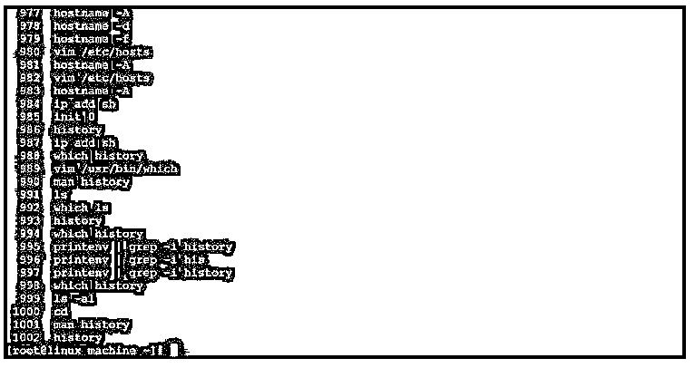

** 

#### 实施例 2

历史命令–打印受限命令

在 history 命令中，我们可以打印最近执行的命令的数量。

**代号** **:**

`history 10`

**说明:**

*   按照上面的命令，我们可以打印历史命令，但是只能打印 shell 窗口中执行的最后 10 个命令。

**输出:**

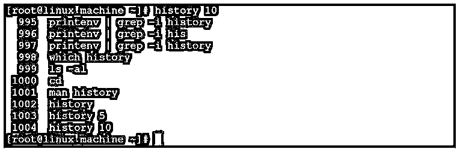

#### 实施例 3

历史命令–执行带有事件编号的命令

在历史命令中，我们可以执行带有命令事件编号的历史命令。我们不需要编写完整的命令。

**代码:**

`!20`

**说明:**

*   在历史命令中，我们获取命令的信息以及与命令相关的事件 id。如果我需要执行“ip add sh”命令而不输入它。我可以借助与之相关联的事件 id(即“20”)来做到这一点。

**输出:**

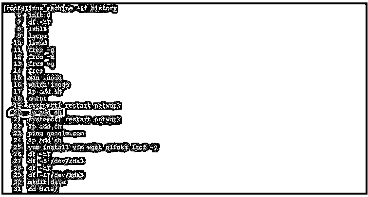

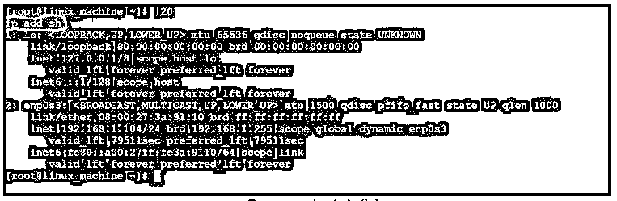

#### 实施例 4

历史命令–仅打印带有事件 ID 的命令

在历史命令中，我们只能在执行之前打印命令。为此，我们需要使用带有历史命令事件 id 的“p”选项。

**代码:**

`!20:p`

**说明:**

*   如果我们只需要打印命令而不执行它。我们需要使用“p”选项。所以它不会执行命令，而只是打印命令。

**输出:**

**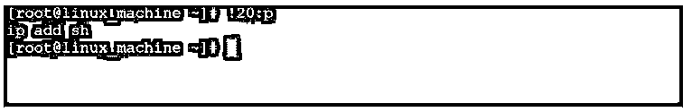

** 

#### 实施例 5

历史命令-使用 Grep 命令

在历史命令中，我们可以将历史命令与不同的命令结合使用，如 grep、tail、less、more 等。

**代码:**

`history | grep -i "which"`

**说明:**

*   在历史命令中，我们能够从历史命令的数量中找到具体的命令。我们正在从整个历史命令中查找“which”关键字。

**输出:**

**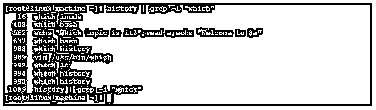

** 

#### 实施例 6

历史命令-获取最近的命令

在历史命令中，我们能够在终端上获取并执行最近的命令。

**代码:**

`!!`

**说明:**

*   根据上述命令，我们可以执行最近的命令。

**输出:**

**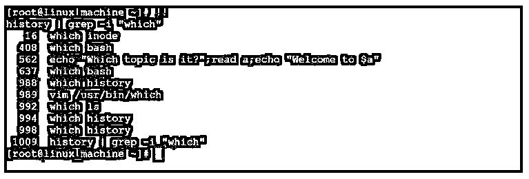

** 

#### 实施例 7

历史命令–带“-d”选项

在历史命令中，我们可以借助关联的事件 id 删除特定的历史命令。

**代码:**

`history -d 1012`

**说明:**

*   按照上面的命令，我们将从历史文件中删除特定的历史命令记录。我们正在删除“1012”事件 id 命令。

**输出:**

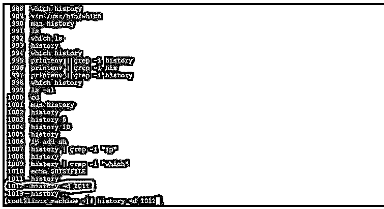

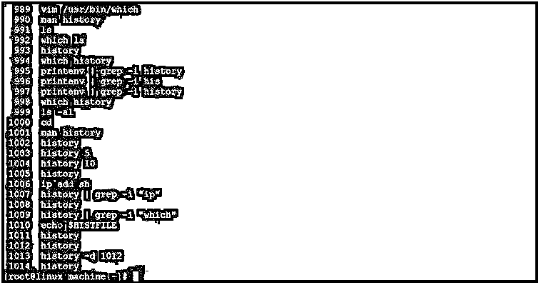

#### 实施例 8

历史命令–带“-c”选项

我们能够删除当前登录终端的所有历史命令。

**代码:**

`history -c`

**说明:**

*   我们可以一次性删除所有的历史命令。我们需要在 history 命令中使用“-c”选项。

**输出:**

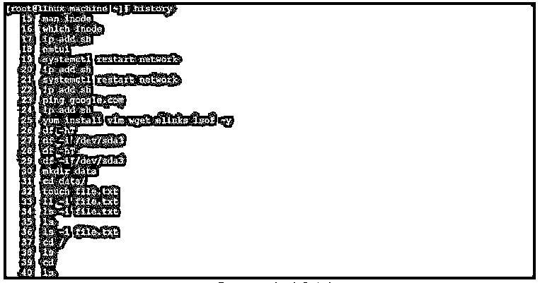

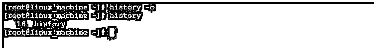

### 结论

我们已经看到了“Linux 历史命令”的完整概念，以及正确的示例、解释和具有不同输出的命令。history 命令有助于在终端窗口中查找所有执行过的历史命令。旧命令或历史命令存储在。bash_history”文件。我们有使用历史命令的不同选项的功能。

### 推荐文章

这是一个 Linux 历史命令指南。这里我们分别用例子讨论 linux 历史命令是如何工作的。您也可以看看以下文章，了解更多信息–

1.  [Linux 用户](https://www.educba.com/linux-users/)
2.  [Linux comm](https://www.educba.com/linux-comm/)
3.  [Linux mdadm](https://www.educba.com/linux-mdadm/)
4.  [Linux rm 命令](https://www.educba.com/linux-rm-command/)

