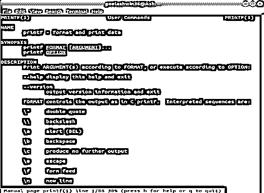
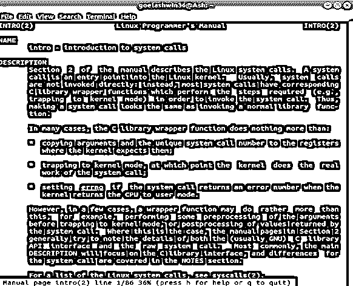
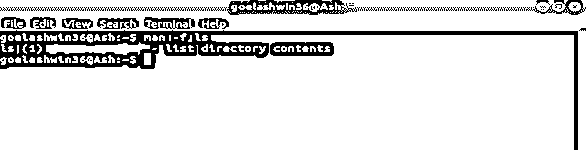
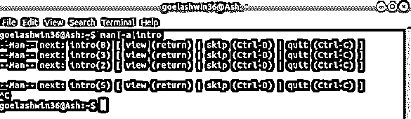
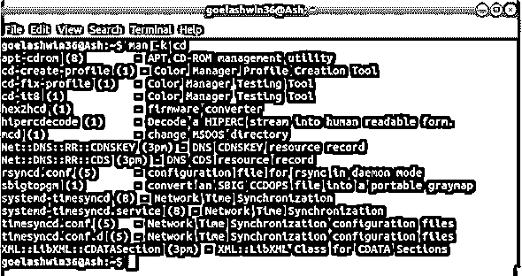

# Linux man 命令

> 原文：<https://www.educba.com/linux-man-command/>

## Linux man 命令简介

这个人代表手动。man 命令显示我们在终端上运行的任何命令的用户手册。在这个主题中，我们将学习 Linux man 命令。它显示命令的详细信息，如名称、概要、选项、描述、退出状态、返回值、FIL、错误版本、作者、示例。

*   每本手册都可以分为以下几个部分:
*   可执行程序或外壳命令
*   系统调用(它包含内核提供的函数)
*   库调用(它包含程序库中的函数)
*   比赛
*   特殊文件(通常位于/dev 中)
*   文件格式和约定，例如/etc/passwd
*   杂项(包括宏包和约定)，例如 man (7)，Groff(7)
*   系统管理命令
*   内核例程[非标准]

**语法**

<small>网页开发、编程语言、软件测试&其他</small>

`$man [OPTION] [COMMAND NAME]`

**选项**

它显示特定命令的整个手册页。

**语法**

`$ man [COMMAND NAME]`

**例子**

`$ man printf`

使用这个命令只是返回 printf 命令的手册页。

**输出:**

### Linux 中如何使用 Man 命令？

使用 man 命令非常简单。只需输入您想要访问其用户手册的工具的名称。

**语法**

`$ man [command/tool name]`

**例子**

`$  man  ls`

### 如何显示特定部分的手册页？

所有可用的手册页都分为多个部分。某些部分包含同名的手册页条目。Man 命令允许您直接访问特定部分的手册页。要做到这一点，只需在命令名前键入节号。

**语法**

`$ man [section num]  [command name]`

**例子**

`$ man 2 intro`

**输出:**

### 如何搜索手册页并打印简短描述？

我们不记得相同名称的手动条目的节号。

为了克服这个问题，我们有一个命令选项–f，它显示与输入匹配的所有手册页。

**语法**

`$  man  -f  [command name]`

**例子**

`$   man  -f  ls`

**输出:**

### 如何显示输入的所有手册页？

如果您想逐个显示与特定输入相对应的所有手册页，只需使用–a 命令即可。

**语法**

`$  man –a [command name]`

**例子**

`$ man  -a  intro`

**输出:**

上面的输出是在系统中为命令生成的。你可以通过按回车键来浏览要阅读的页面。您可以通过按 Ctrl–d 跳过页面。您可以通过单击 Ctrl–c 退出。

### 如何将输入视为正则表达式进行搜索？

该命令使您能够搜索并列出手册页，将输入视为正则表达式。为此，您必须使用–k 命令选项。

**语法**

`$   man  -k [command name]`

**例子**

`$  man  -k   cd`

**输出:**

在上面的示例中，通过将命令 cd 视为正则表达式在所有手册页中进行搜索，并返回包含找到它的章节号的手册页。

### 如何显示手册页的位置？

如果您只想知道手册页的位置，可以使用–w 命令。

**语法**

`$   man  -w [command name]`

**例子**

`$   man  -w  ls`

**输出:**

在上面的示例中，显示了 ls 命令的位置。

### 如何在 Web 浏览器上显示手册页？

您可以使用–H 命令选项在 web 浏览器上显示手册页。

**语法**

`$  man  -H [browser command]  [command name]`

**例子**

`$  man  -Hfirefox  printf`

### 如何让 Man 命令区分大小写？

缺省情况下，man 命令在搜索手册页时会忽略大小写。但是，如果要启用区分大小写，可以使用–I 命令选项。

**语法**

`$ man  -I [command name]`

**例子**

`$  man  -I  printf`

#### –无子页面选项

很自然地，一个人试图破译在方向线上给出的一组手册页名，这些名称与包含下划线或连字符的一个单独的手册页名成比例。

**例子**

`$  man  -aw git  diff`

上述命令显示以下手册页。

`/usr/share/man/man1/git-diff.1.gz`

要禁用这种行为，我们必须使用选项–no-subpages。

**例如:**

`man –aw –no-subpages  git diff`

上面的命令将显示 git 和 diff 的手册页。

**输出:**

`/usr/share/man/man1/git.1.gz
/usr/share/man/man3/git.3pm.gz
/usr/share/man/man1/diff.1.gz`

#### -p 选项

该选项决定使用哪个寻呼机。很自然，man 会使用 pager–s。这个选项取代了环境变量$manpager，从而取消了环境变量$pager。

#### -r 选项

如果寻呼机使用的是 less 的最近形式，那么这个人就试图设置它的提示和一些更合理的选项。

**例子**

手册页名(秒)第 x 行

这里 sec 指定了节，名称表示手册页的名称。x 表示当前行的编号。这是由环境变量$less 完成的。

#### -E 选项

此选项生成非默认字符编码的输出。用于向后兼容编码，如 latin1、ascii 或 utf8，以及真正的字符编码，如 UTF-8。

#### 退出状态

当 man 终止时，它返回下列退出状态之一。

0–它将在程序成功执行时返回。

1–如果有用法、语法或配置文件错误，将返回该值。

2–如果出现操作错误，将会返回。

3–如果子进程返回非零退出状态，则返回该值。

16-如果搜索的页面、文件或关键字不存在或不匹配，将返回。

#### 文件

该男子使用以下文件:

/usr/share/man–全局手册页层次结构

/etc/manpath . config–man–db 配置文件。

/usr/share/man/index。(Bt | db | dir | PAG)-传统全局索引数据库缓存

/usr/cache/man/index。(Bt | db | dir | PAG)-符合 FHS 标准的全局索引数据库缓存。

#### 其他常规选项

-h，–help–打印帮助消息，然后退出。

-v，–version–打印版本消息，然后退出。

-c 文件，–config-file = file–使用配置文件 file，而不是默认路径~/。人行通道

-d，–debug–打印调试信息。

-D，–默认–它将该人的行为设置为默认

### 推荐文章

这是一个 Linux man 命令指南。这里我们已经讨论了 man 命令及其用法。Man 是用户应该知道的重要命令。您也可以看看以下文章，了解更多信息–

1.  [Linux 模拟器](https://www.educba.com/linux-emulator/)
2.  [Linux 大小](https://www.educba.com/linux-size/)
3.  [Linux 存储库](https://www.educba.com/linux-repository/)
4.  [Linux Kill 信号](https://www.educba.com/linux-kill-signals/)

