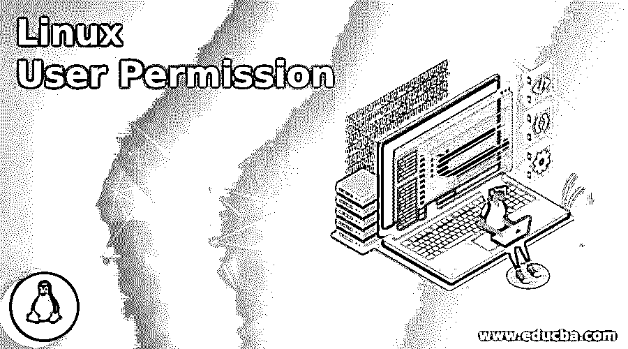
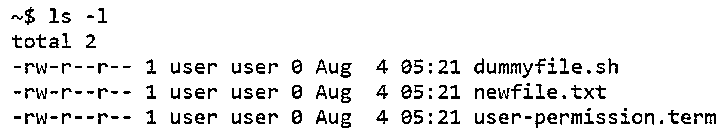
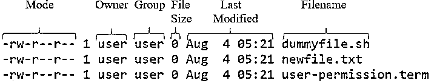
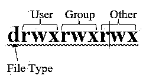
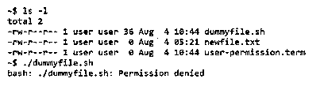
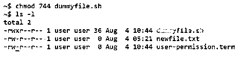

# Linux 用户权限

> 原文：<https://www.educba.com/linux-user-permission/>

## Linux 用户权限介绍

下面的文章提供了 Linux 用户权限的概要。在 Linux 中，像任何其他操作系统一样，同步多个用户在同一台服务器上工作。一个用户的工作不会干扰另一个用户的工作。从长远来看，当多个用户同时工作时，有可能相互之间共享文件，这导致了暴露一些机密信息的风险，甚至由于多个用户可以写入或修改而导致数据丢失。

为了解决这个问题，Linux 有一个基于谁应该拥有什么权力来限制用户的特性，并且哪个用户需要获得什么权力的整个概念取决于用户许可。随着即将到来的基于云的系统的概念，Linux 中的用户权限现在扮演了一个更重要的角色，需要开发人员仔细考虑。

<small>网页开发、编程语言、软件测试&其他</small>

### Linux 用户权限的语法

让我们看看用户权限的语法。每当人们看到用户许可时，只有一件事存在于人们的头脑中，那就是如何改变。但是，这只是其中的一部分，另一部分是关于如何操作以及 Linux 中的用户权限能够提供的额外功能。

下面给出了 5 个命令:

**1。chmod:** 该命令用于修改访问权限。

**语法:**

`chmod <Permission Number>FileName`

**2。su:** 这个命令允许以超级用户的身份执行操作。

**语法:**

`su`

**3。sudo:** 这个命令也和 su 一样。

**语法:**

`sudo`

**4。chown:** 这是用来改变文件所有权的。

**语法:**

`chown <username> FileName`

**5。chgrp:** 为了改变文件的组所有权，使用该命令。

**语法:**

`chgrp <New Group> FileName`

虽然当前部分的下一个主题可能在语法上不太准确，但这是一个需要了解的重要概念，这个主题就是用户和组。这些是应用所有权和权限规则的实体。用户只不过是属于系统用户的一组 id，或者可能是某些管理工作的占位符，它们或者负责运行非交互流程或后台流程，称为系统用户，另一个负责通过登录系统运行交互流程，这些用户称为常规用户。之前我们看到过超级用户，它只不过是一个“大老板”，可以凌驾于任何人的许可之上。

另一方面，组只不过是零个或更多用户的集合。此外，属于某个组的用户不一定不能成为另一个组的成员。这与我们在工作场所的分发列表非常相似。一个可以在 HR 邮件的分发列表中，也可以在 own 团队邮件的分发列表中。

### Linux 用户权限在 Linux 中是如何工作的？

为了了解 Linux 中用户权限的工作原理，我们需要了解构建整个用户权限通道的小组件。

**我们在哪里可以找到用户权限？**

**语法:**

`ls -l`

**输出:**

**

** 

**描述:**

这里，第一个块指的是特定文件名的不同模式。文件名是最后一个块，如 dummyfile.sh、newfile.txt。在下一节中，我们将了解输入 ls -l 时的不同组件。

**用户权限的组成:**

在这里，模式是了解用户权限的主要部分。与此同时，所有者和组是第二重要的东西，它在理解谁是受许可影响的组个体中起着重要作用。

在接下来的几节中，让我们分别详细了解模式、所有者和组。

**1。模式:**模式由各种子组件组成。

**2。文件类型:**第一节提到了文件类型。在一个场景中，有两种类型的文件，其中一种是普通文件，最终用连字符(-)表示，另一种是特殊文件类型，通常用字符表示。例如，d 表示文件名最终是一个目录。有很多其他特殊的文件，但没有一个重要的信息记住这篇文章。

**3。权限类别:**接下来的 9 个字符表示权限类别，每个三元组表示 3 个组中的每一个。用户是文件名的所有者，组是用户所属的簇，其他是不属于组的簇的所有用户。

每个类都有 3 个不同的符号权限，它们是:

*   R: 这是指提供对文件的只读访问。
*   **W:** 这是指提供对文件的写访问，也包括读访问。
*   **X:** 这是指提供对文件的执行访问，也包括读写访问。

如果没有提供，我们用连字符来代替。例如，r–意味着该文件对该类只有读权限。

现在我们已经了解了用户权限的不同方面，接下来我们将看看如何更改特定文件的权限。为此，我们将使用 chmod 语法。

### 例子

对于 dummyfile.sh 文件，我们将首先尝试运行该文件，在这个过程中，我们会遇到一个错误。接下来，我们将用户的用户权限更改为可执行，然后再次尝试运行并分析输出。

**代码:**

可执行权限之前

`ls -l
./dummyfile.sh`

更改权限

`chmod 744 dummyfile.sh`

执行脚本

`./dummyfile.sh`

**输出:**

可执行权限之前

更改权限后

执行脚本

**说明:**

*   这里的主要思想是理解我们是如何得出 744 这个数字的。这是经验法则。如果文件需要读权限，则为 4，如果文件还需要写权限，则为 2，如果文件还需要执行，则为 1。
*   因此，对于用户类，我们拥有全部 3 个访问权限，即 4+2+1 = 7。对于另外两个权限类，我们只读取了 4 个。

### 结论

至此，我们已经深入研究了 Linux 中的用户权限，首先从较小的方面开始，然后共同开始添加，最后能够展示当我们更改权限时执行的 shell 文件。在我们结束之前，有一件重要的事情是要明白，权力越大，责任越大，因此在向用户、组或其他人提供许可之前，需要对许可进行充分的考虑。

### 推荐文章

这是一个 Linux 用户权限指南。这里我们讨论一下入门，linux 用户权限在 linux 中是如何工作的？还有例子。您也可以看看以下文章，了解更多信息–

1.  [Linux tracepath](https://www.educba.com/linux-tracepath/)
2.  [Linux 挂载命令](https://www.educba.com/linux-mount-command/)
3.  [Linux 粉碎](https://www.educba.com/linux-shred/)
4.  [Linux comm](https://www.educba.com/linux-comm/)

