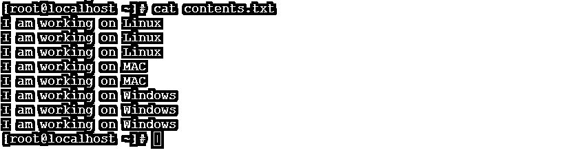
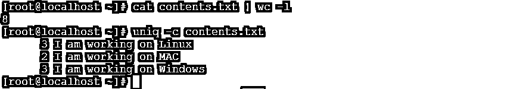
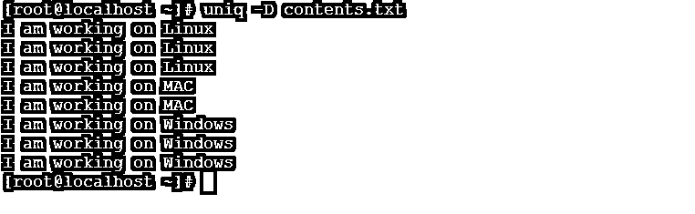
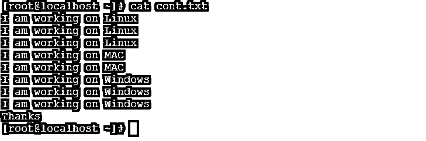
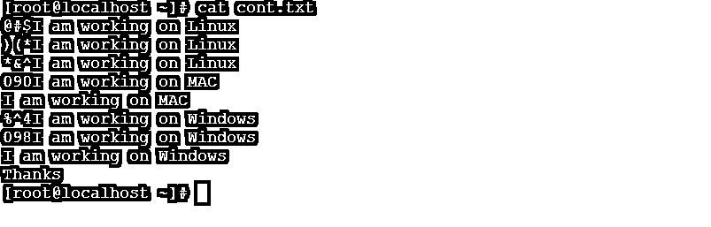
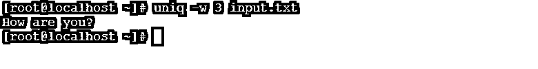

# Linux uniq

> 原文：<https://www.educba.com/linux-uniq/>

## Linux uniq 简介

Linux uniq 命令行实用程序有助于过滤掉文件中重复或重复的记录。换句话说，它将检测相邻的重复行，并从输入数据或文件中忽略/删除重复行。

这个工具是由理查德·M·斯托曼和大卫麦肯齐写的。

<small>网页开发、编程语言、软件测试&其他</small>

**语法:**

`uniq [ OPTION ] ... [ INPUT [ OUTPUT ] ]`

uniq 语法很简单。按照上面的语法，“输入”指的是输入数据或输入文件。它将包含需要过滤掉的重复数据的重复行。如果“INPUT”关键字没有指定，那么“uniq”将读取标准输入。“输出”指的是输出文件，我们可以在其中存储由“uniq”命令生成的经过过滤的输出数据。

### Linux uniq 命令是如何工作的？

Linux uniq 命令就像一个过滤程序，它会在排序后使用。uniq 命令将获得重复或复制的输入数据或输入文件。借助于 uniq 中可用的不同过滤器动作或关键字。我们将过滤掉输入文件中的相邻数据或重复数据，并将最终结果处理到输出文件中。

**Note:** It will filter out the adjacent duplicate data only. If the number of duplicate records comes in serially, then only it will filter out and remove the duplicate records. Consider it as a single record. If the same record will come in the input file (without duplicate) but in a different location (except the previous adjacent location), then it will print in the output file. The duplicate data exactly match with each other, i.e. it is case sensitive.

### 实现 Linux uniq 命令的例子

下面给出了实现 Linux uniq 命令的示例:

#### 1.Uniq 命令

uniq 命令将有助于从输入文件中删除重复的数据或记录。

`uniq contents.txt`

**说明:**我们有样本文本文件“contents.txt”。它在同一个文件中有一些数据(参考截图 1。现在我们使用 uniq 命令过滤掉重复的数据(参考截图 1)。

**输出:**

#### 2.唯一计数命令

在 uniq count 命令中，我们将使用前缀值确定该行在输入文件或数据中重复的次数。要计算输入文件中重复记录的数量，我们可以在 uniq 命令中使用“-c”选项。

`uniq -c contents.txt`

**说明:**在 contents.txt 文件中，一共有 8 条记录。没有重复的记录有三条。借助"-c "选项，我们将获得重复计数记录的数量信息。

**输出:**

#### 3.Uniq 重复命令

它将显示或打印输入文件中的唯一记录。不会显示重复或重复的记录。对于重复的记录，我们可以在 uniq 命令中使用“-d”选项。

`uniq -d contents.txt`

**说明:**从输入文件(contents.txt)中，我们只会识别重复的唯一记录。

**输出:**

#### 4.Uniq 全部-重复

在所有重复命令的帮助下，我们将能够从输入文件中获得所有记录。对于所有重复的记录，我们可以在 uniq 命令中使用“-D”选项。

`uniq -D contents.txt`

**说明:**从输入文件“contents.txt”中，我们可以借助 uniq 中的全重复功能打印所有记录。

**输出:**

#### 5.Uniq 唯一命令

unique 命令将有助于识别输入文件中的唯一记录或数据。对于唯一的记录，我们可以在 uniq 命令中使用“-u”选项。

`uniq -u cont.txt`

**说明:**在输入文件“cont.txt”中，我们在文件中只有一个唯一的词，即“thanks”。借助“-u”唯一选项，我们能够从输入数据或文件中识别。

**输出:**

#### 6.使用–f N 命令的 Uniq

这个 uniq 命令允许在比较线的唯一性时跳过“N”字段。

**Note:** In the input file, it is not mandatory the number of records or input data should start with the numbered sequence.

`uniq -f 3 cont.txt`

**说明:**在 cont.txt 输入文件中有输入记录数(参考截图 3 (a))。我们能够打印间隔为“1”(“N”)的唯一记录[“N”值取决于客户要求]

**输出:**

#### 7.使用–s N 命令的 Uniq

uniq–s N 命令类似于-f N 选项。但是它会跳过“N”个字符，但不会跳过“N”个字段。

`uniq -s 3 cont.txt`

**解释:**在 cont.txt 输入文件中，我们有多行包含特殊字符和数字的内容(参见截图 1)。借助“-s”选项，您将跳过输入文件中的特殊字符或数字。“N”表示数值。相同数量的值将有助于跳过输入文件中的特殊字符。

**Note:** As per the “N” value, the number of characters will skip. Then after the uniq command will omit the duplicate data or records from the input file (refer to screenshot 2).

**输出:**

#### 8.Uniq 使用–w N 命令

uniq–w N 命令类似于跳过字符。在 uniq 命令的帮助下，我们可以将比较限制在设定的字符数(“N”值)。

`uniq -w 3 input.txt`

**说明:**在 input.txt 文件中，我们有 3 条记录开始组成 3 个字母单词，即“How”(参考截图 1)。借助“-w”选项和“N”值(3)，我们将跳过输入文件的前 3 个字符并拥有一个字符序列(参考截图 2)。

**输出:**

### 结论

我们已经看到了“Linux uniq”的完整概念，以及正确的示例、解释和带有不同输出的命令。uniq 命令就像一个过滤程序。它将根据用户要求过滤出数据。过滤数据或输出数据将进一步使用外壳作业和其他应用程序开发任务。

### 推荐文章

这是一个 Linux uniq 的指南。在这里，我们还将讨论简介以及 Linux uniq 命令是如何工作的？以及不同的示例及其代码实现。您也可以看看以下文章，了解更多信息–

1.  [Linux 过滤命令](https://www.educba.com/linux-filter-commands/)
2.  [Linux gzip](https://www.educba.com/linux-gzip/)
3.  [Linux tee 命令](https://www.educba.com/linux-tee-command/)
4.  [Linux OD](https://www.educba.com/linux-od/)

