# Linux 过滤器命令

> 原文：<https://www.educba.com/linux-filter-commands/>

## Linux 过滤器命令简介

根据用户要求，linux 过滤器命令将读取标准输入，在其上执行必要的动作或操作，并将最终结果写入标准输出格式。过滤器是 Linux 操作系统中的一个小而专门的程序，用于从用户/客户端获得有意义的输入，并在少数其他过滤器和管道的帮助下执行一系列操作，以获得高度唯一或指定的最终结果。这将有助于以一种非常主导的方式处理信息，如 shell 作业、修改实时数据、报告等。

**过滤命令语法:**

<small>网页开发、编程语言、软件测试&其他</small>

`[filter method] [filter option] [data | path | location of data]`

### Linux 操作系统中的过滤方法

下面给出了不同的过滤方法:

*   Fmt
*   更多
*   较少的
*   头
*   尾巴
*   Sed
*   发现
*   Grep, Egrep, Fgrep, Rgrep
*   镨
*   Tr
*   分类
*   Uniq
*   AWK

#### 1.Fmt

fmt 是简单和最佳的文本格式化程序。重新格式化输入数据并以标准输出格式打印最终结果是很有帮助的。

**代码:**

`cat site.txt
fmt -w 1 site.txt`

**说明:**

*   在 site.txt 文件中，我们有一些名字。但是它在一个单独的行中，并且被空间分开。
*   fmt 命令有助于在单行中将多个单词显示到由空格分隔的各个记录中。

**输出:**

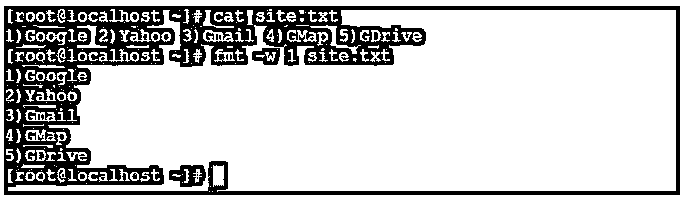

#### 2.更大的

“更多”命令对于文件分析很有用。它将读取大文件。它将以页面格式显示大文件数据。向下翻页和向上翻页键不起作用。要显示新记录，我们需要按“enter”键。

**代码:**

`cat /var/log/messages | more`

**说明:**

*   我们正在通过 more 命令读取 Linux 的大文件“/var/log/messages”。

**输出:**

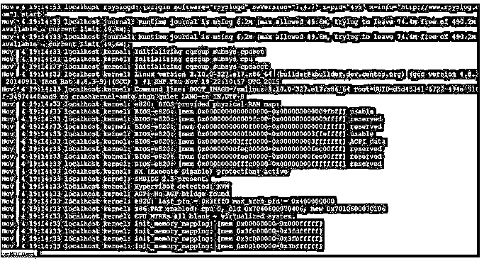

#### 3.较少的

less 命令类似于 more 命令，但它在处理大文件时速度更快。它将以页面格式显示大文件数据。向下翻页和向上翻页键将起作用。要显示新记录，我们需要按“enter”键。

**代码:**

`cat /var/log/messages | less`

**说明:**

*   我们正在通过 less 命令读取 Linux 的大文件“/var/log/messages”。

**输出:**

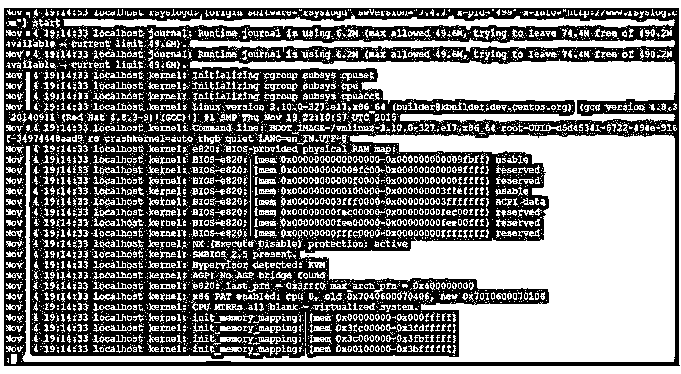

#### 4.头

顾名思义，我们能够过滤/读取初始或顶部的行或列数据。默认情况下，它将读取给定数据的前 10 行或记录。如果我们需要读取更多的行，那么我们需要借助“-n”关键字指定需要读取的行数。

Note: The record calculation will start from the top of the file or data.

**代码:**

`head -n 7 file.txt`

**说明:**

*   我们有样本文件数据，其中有 10 条记录。
*   现在我们使用默认的“head”命令来读取数据文件。
*   如果我们需要读取或获取除默认值以外的数据，那么我们将使用“-n”关键字来读取记录的行数。

**cat file.txt**

**输出:**

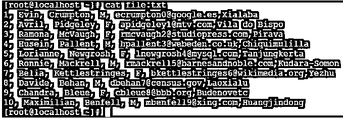

**head file.txt**

**输出:**

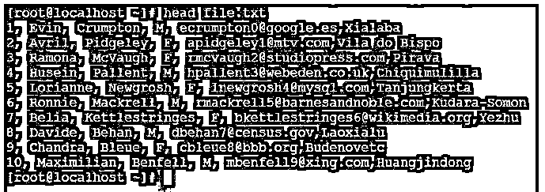

**head -n 7 file.txt**

**输出:**

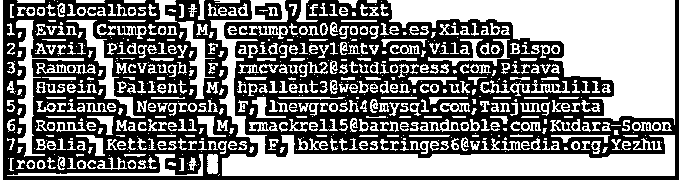

#### 5.尾巴

如果我们需要从文件底部获取数据，那么我们将使用 tail 命令。默认情况下，它将读取给定数据的最后 10 行或记录。如果我们需要读取更多的行，那么我们需要借助“-n”关键字指定需要读取的行数。

**代码:**

`tail -n 3 file.txt`

**说明:**

*   我们使用默认的“tail”命令来读取数据文件。
*   如果我们需要读取或获取除默认值以外的数据，那么我们将使用“-n”关键字来读取记录的行数。

**tail file.txt**

**输出:**

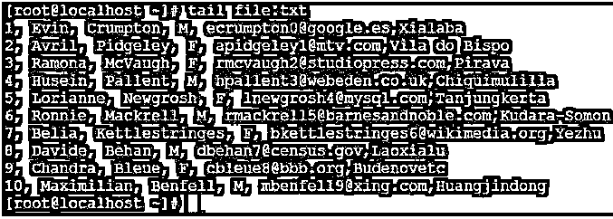

**tail -n 4 file.txt**

**输出:**

#### 6.Sed

对于过滤和转换文本数据，sed 是一个非常强大的流编辑器实用程序。在 shell 或开发工作中，过滤掉复杂的数据是最有用的。

**代码:**

`sed -n '5,10p' file.txt`

**说明:**

*   在 head 和 tail 命令中，我们能够从顶部或底部过滤记录的数量。
*   但是如果需要显示从起点到终点的记录。
*   然后我们需要使用 sed 命令。我们在 file.txt 中有 10 条记录，但我们只需要从第 5 行/第 7 行记录。

**cat file.txt**

**输出:**

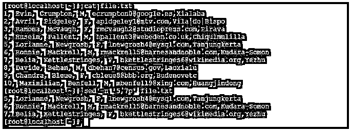

#### 7.发现

find filter 命令对于从 Linux 操作系统中查找文件非常有用。

**代码:**

`find / -name "file.txt"`

**说明:**

*   在 find 命令的帮助下，我们将过滤出 Linux 操作系统中必要的文件或目录。
*   我们需要在 find 命令中添加两个主要参数，即
*   搜索路径:“/”(我已经提供了根目录路径。)
*   文件名:“file.txt”(要过滤或搜索的文件名或目录名)

**输出:**

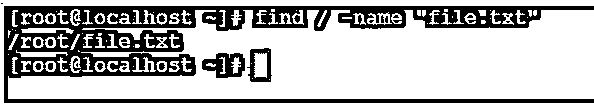

#### 8\. Grep, Egrep, Fgrep, Rgrep

grep、e grep、fgrep、rgrep 是类似的命令。从输入数据或文件中过滤或提取匹配的模式字符串会很有用。

**代码:**

`grep -i "Davide" file.txt`

**说明:**

*   在 grep 命令中，我们需要在命令中指定匹配的字符串。
*   该实用程序将从输入数据或文件(file.txt)中过滤出相同的匹配字符串(Davide ),并以“红色”格式显示匹配记录。

Note: We can use the “-i” keyword in the grep command. It will help to ignore the upper case or lower case letter while filtering the data.

**输出:**

#### 9.镨

pr 命令有助于将输入数据转换为具有适当列结构的可打印格式。

**代码:**

`yum list installed | pr --columns 2 -l 40`

**说明:**

*   在上面的 pr 命令中，我们在两列(使用'–columns '关键字)和 40 行(使用'-l '关键字)中打印输出数据。

**输出:**

#### 10.Tr

tr 命令将翻译或删除输入字符串或数据中的字符。我们可以将输入数据转换成大写或小写。

**代码:**

`echo "www.educba.com" | tr [:lower:] [:upper:]`

**说明:**

*   在上面的 tr 命令中，我们需要定义 set 1 中的输入文本或数据“:lower:]”，以及 set 2 中的输出数据“:upper:]”。

**输出:**

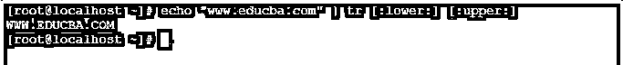

#### 11.分类

顾名思义，我们可以按升序对记录进行排序或过滤。

**代码:**

`sort char.txt`

**说明:**

*   我们有文本文件(char.txt)。
*   它以分散的方式包含字符的数量。
*   现在我们对同一个文件使用 sort 命令。
*   在对 char.txt 文件使用排序过滤器后。
*   该字符将以连续模式排序和显示。

**输出:**

**cat char.txt**

**sort char.txt**

#### 12.Uniq

uniq 命令对于从标准输入中省略重复的记录或行很有用。

如果要显示输入文件或数据中某一行或记录的出现次数。我们可以在 uniq 命令中使用“-c”关键字。

**代码:**

`uniq -c char.txt`

**说明:**

*   在 char.txt 文件中，我们有重复字符的个数在里面。
*   使用 uniq 命令后，它将删除重复字符并计算重复字符的数量。

**输出:**

**cat char.txt**

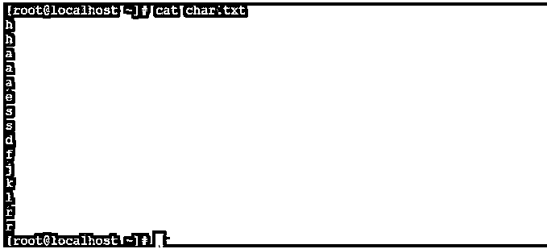

**uniq–c char . txt**

#### 13.AWK

在 awk 中，我们有读取文件的功能。但是在这里，我们使用整数变量来读取文件。

如果在 awk 命令中使用，下面是整数信息和含义。

*   **$0:** 读取完整文件或输入文本。
*   **$1:** 读取第一个字段。
*   **$2:** 读取第二个字段。
*   **$n:** 读取第 n 个字段。

Note: If we are not using any separator keyword “-F” in the awk command. Then the awk command considers the space in the text file or input data and separates the result as per the $variable provided in the same awk command.

**代码:**

`cat file.txt | awk '{print $1}'`

**说明:**

*   在 file.txt 中，我们有样本数据。
*   如果我们使用$0，那么整个数据将被读取。
*   如果我们使用$1，那么只有第一列数据会被过滤掉。

**cat file.txt**

**输出:**样本文件查看。

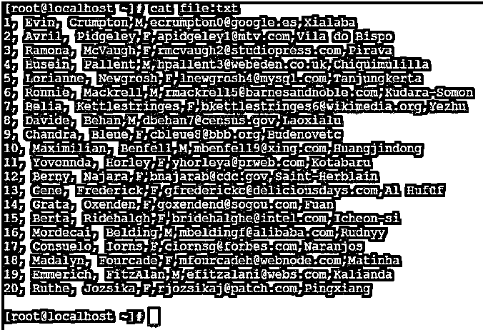

**cat file . txt | awk“{ print $ 0 }”**

**输出:**用“$0”输出。

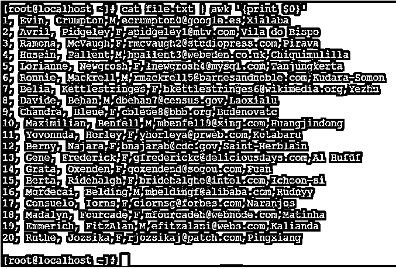

**cat file . txt | awk“{ print $ 1 }”**

**输出:**用“$1”输出

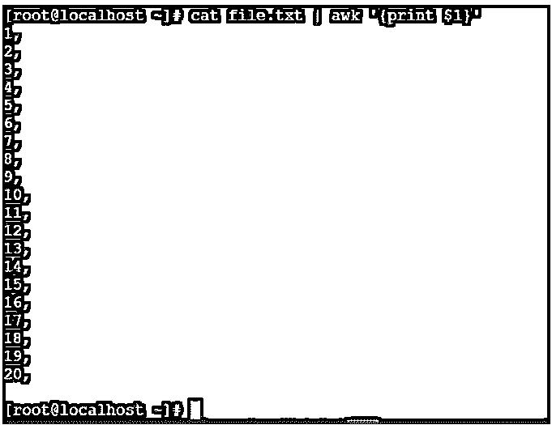

### 结论

我们已经看到了“Linux Filter Commands”的完整概念，以及正确的示例、解释和带有不同输出的命令。基本上过滤工具是 Linux 操作系统自带的，但是我们可以在操作系统中安装一些第三方的过滤工具。在 Linux 或任何其他平台上开发任何代码或 shell 作业时，过滤器数据都非常重要。借助 filter 命令或实用程序，我们能够从输入数据中提取有价值的数据。

### 推荐文章

这是一个 Linux 过滤器命令的指南。在这里，我们讨论 Linux 过滤命令和不同类型的过滤方法的介绍。您也可以看看以下文章，了解更多信息–

1.  [Linux 应用程序](https://www.educba.com/linux-apps/)
2.  [Linux 中的 Head 命令](https://www.educba.com/head-command-in-linux/)
3.  [Linux 重命名命令](https://www.educba.com/linux-rename-command/)
4.  [Linux tee 命令](https://www.educba.com/linux-tee-command/)

