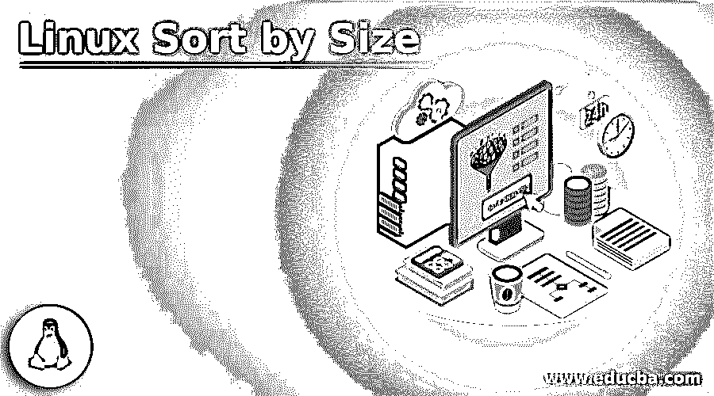
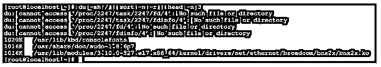
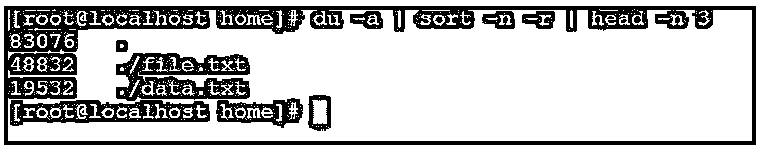
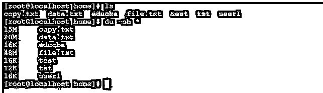
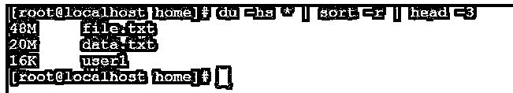
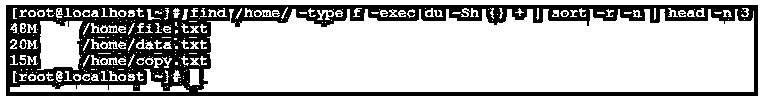

# Linux 按大小排序

> 原文：<https://www.educba.com/linux-sort-by-size/>

## Linux 简介按大小排序

在 Linux 操作系统中，我们使用“排序”来按照特定的顺序对多个文件进行排序。我们可以根据大小、名称等对文件进行分类。对普通文件进行排序时，排序基于 ASCII 格式。如果我们需要根据大小对文件进行排序，我们可以使用千字节、兆字节、千兆字节等。sort 命令有助于识别 Linux 环境中的大文件。清理不需要的大文件，保持环境健康，真的会很有帮助。Linux 排序实用程序是由迈克·哈尔特尔和保罗·埃格特编写的。

**排序命令的语法:**

<small>网页开发、编程语言、软件测试&其他</small>

`sort [OPTION]... [FILE]...
sort [OPTION]... --files0-from=F`

*   **sort:** 我们可以在语法或命令中使用“sort”关键字。它将采用不同的参数，如选项、文件名、路径等。按照提供的参数，它将按照给定的参数或选项对必要的文件进行排序。
*   **选项:**我们可以提供不同的标志作为与“排序”命令兼容的选项。
*   **文件:**我们可以为“排序”命令提供具体的文件或路径。这将有助于根据给定的参数识别文件。

### Linux 的按大小排序命令是如何工作的？

在 Linux 操作系统中，必须检查文件和文件夹的大小。如果规模会增加，而我们还没有采取必要的行动。服务器或环境将处于不健康状态，或者服务器可能无法工作。为了避免此类事件，我们可以使用 sort 命令行实用程序来识别大文件和文件夹。

sort 命令将接受不同的参数，如选项、文件、文件路径等。根据参数，sort 命令将根据文件大小对文件进行排序。

以下是根据文件大小在排序命令中兼容的选项列表。

| **服务请求编号** | **选项** | **描述** |
| One | -b，–忽略前导空格 | 这将有助于忽略前导空白。 |
| Two | -d，–字典顺序 | 它将只考虑空格和字母数字字符。 |
| Three | -f，–忽略大小写 | 这将有助于将小写字符转换为大写字符。 |
| Four | -g，–常规-数字-排序 | 这将有助于比较一般的数值。 |
| Five | -我，–忽略-不打印 | 它将只考虑可打印的字符。 |
| Six | -M，–月排序 | 这将有助于比较月份参数，如[compare(unknown)< ' JAN ' |
| Seven | -h，–人类数字排序 | 这将有助于比较人类可读的数字，如 2K 1G。 |
| Eight | -n，–数字排序 | 这将有助于比较字符串数值。 |
| Nine | -R，–随机排序 | 这将有助于排序的随机散列的关键。 |
| Ten | –随机来源=文件 | 这些参数有助于从文件中获取随机字节。 |
| Eleven | -r，–反向 | 这将有助于扭转比较的结果。 |
| Twelve | –sort = WORD | 这将有助于根据单词进行排序，但我们需要使用特定的标志，如通用-数字-g，人类-数字-h，月份-M，数字-n，随机-R，版本-V。 |
| Thirteen | -V，–版本排序 | 这是文本中的自然排序(版本)数字。 |

### Linux 按大小排序的例子

下面是提到的例子:

#### 示例#1

排序命令–对大文件进行排序

sort 命令，我们能够对环境中最大的文件大小进行排序。这是在 Linux 操作系统中练习 sort 命令最常见的方式。我们需要在 sort 命令中使用“-r 和-n”选项。

**代码:**

`du -ah / | sort -n -r | head -n 3`

**说明:**

*   按照上面的命令，我们使用带有不同选项的 sort 命令，比如"-n & -r "。我们正在对“/”位置上的大文件进行排序，并且只打印前 3 个最大的文件。

**输出:**

**

** 

#### 实施例 2

排序命令–对工作目录中的文件进行排序

在 sort 命令中，我们可以对当前工作目录中最大的文件进行排序。

**代号** **:**

`du -a | sort -n -r | head -n 3`

**说明:**

*   在 sort 命令中，我们可以对当前工作目录中的文件进行排序，并打印前 3 个最大的文件。当前工作目录是“/home”。

**输出:**

#### 实施例 3

排序命令–按文件大小排序

在 Sort 命令中，我们可以搜索出文件的数量。从相同的文件中，我们可以以人类可读的格式对文件的大小进行排序，如 K、M、g。我们可以使用“-r”选项进行递归搜索。

**代码:**

`du -hs * | sort -r | head -3`

**说明:**

*   在上面的排序命令中，我们能够找到前 3 个大文件。在第一个截图中，我们得到了“/home”目录中文件的数量。按照上面的排序命令，我们能够找到前 3 个文件，它们的大小很大，请参考第二个截图。

**输出:**

#### 实施例 4

排序命令–带查找选项

在 Linux 环境中，我们可以根据文件名和文件大小对文件进行分类。但是我们也可以结合使用 sort 命令和不同的 Linux 命令，比如 find。

**代码:**

`find /home/ -type f -exec du -Sh {} + | sort -r -n | head -n 3`

**说明:**

*   按照上面的命令，我们将 sort 命令与 find 命令结合使用。我们在“/home”目录中找到了前三个大文件。

**输出:**

### 结论

我们已经看到了“Linux 按大小排序”的完整概念，以及正确的示例、解释和带有不同输出的命令。Sort 命令将帮助根据大小和字符串对多个文件进行排序。我们可以将排序命令与多个命令杜理科、查找等一起使用。

### 推荐文章

这是一个按大小排序的 Linux 指南。在这里我们分别用例子来讨论 Linux sort by size 命令是如何工作的。您也可以看看以下文章，了解更多信息–

1.  [Linux wget](https://www.educba.com/linux-wget/)
2.  [Linux tracepath](https://www.educba.com/linux-tracepath/)
3.  [Linux 导出](https://www.educba.com/linux-export/)
4.  [Linux 网络命令](https://www.educba.com/linux-network-command/)

