# Linux 更多命令

> 原文：<https://www.educba.com/linux-more-command/>

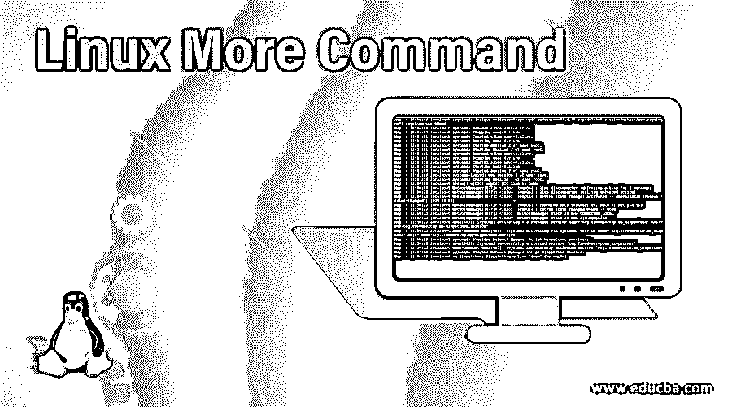

## Linux More 命令简介

在 Linux 操作系统中，more 命令用于在命令提示符下查看或读取较大的文件大小。more 命令还允许最终用户向下滚动和向上滚动输出页面。这个工具主要是由 Eric Shienbrood 和加州大学伯克利分校编写的。

**Note:** In Linux, the “cat” command is also useful to see or read the file content but when the size of the files is too high then initial or starting file content will not visible in the “cat” command. It will be visible in more command.

**语法:**

<small>网页开发、编程语言、软件测试&其他</small>

`more [options] file [...]`

*   **more:** 在命令|语法中使用 more 关键字。它将参数集作为选项和文件名，并显示完整的屏幕输出。
*   **选项:**我们可以提供不同的标志作为 more 命令的选项。
*   **文件:**输入文件名。

### Linux More 命令是如何工作的？

在 Linux 中，more 命令用于查看大文件大小。通常，查看日志文件是有用的。更多命令显示文件的完整屏幕视图。在 Linux 中，我们是一个与更多命令相关的更多命令，即更少的命令，这两个命令具有不同的特性和用途。

在 more command 中，我们也可以通过键盘按键来操作显示屏。以下是在更多命令中使用的快捷键。

*   **回车键:**用于逐行向下滚动页面
*   **b 键:**用于转到输出的后一页
*   **空格键:**用于转到输出的下一页
*   如果我们需要搜索任何字符串，这将非常有用

**Note:** We can use the “cat” and “more” command to display the file output but the major thing is the scroll option is not working in the “cat” command and the scroll option is working in “more” command.

### 实现 Linux More 命令的例子

下面是 linux 命令的例子，给出如下:

#### 1.带“-d”选项的更多命令

更多的命令，我们可以引导或帮助用户在更多的命令控制台或输出窗口中导航。我们需要在 more 命令中使用“-d”选项。

**注意:**如果用户按错了键，请按“h”键寻求帮助。

**命令:**

`more -d /var/log/messages`

**解释:**我们从 Linux 文件系统(/var/log/messages)中读取日志文件。按照上面的 more 命令，我们使用“-d”选项读取文件。在输出窗口中，我们可以看到最终用户的导航说明(使用“h”键)。

**输出:**

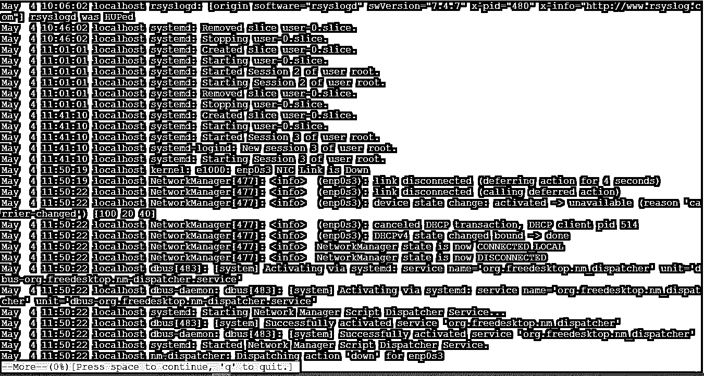

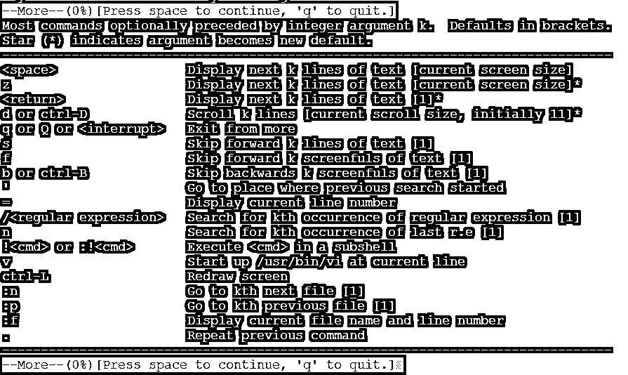

#### 2.带“-f”选项的更多命令

在 Linux more 命令中，如果我们在命令中使用"-f "选项，那么该选项不会将长文本或行换行并显示为原样。

**Co**T2】mmand:

`more -f /var/log/messages`

**解释:**在 more 命令中使用“-f”选项仅类似于普通的 more 命令，但它不会扭曲长行并按原样显示输出。

**输出:**

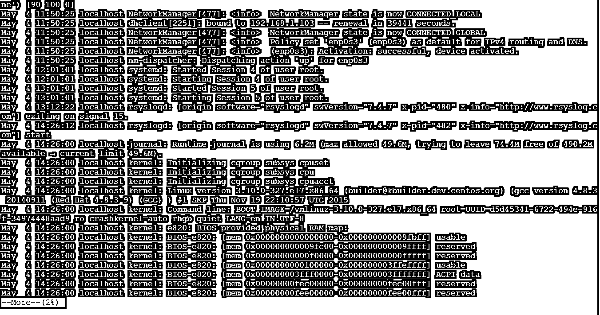

#### 3.带“-p”选项的更多命令

在 more 命令中，它将清除屏幕并在新窗口中显示输出。我们需要在 more 命令中使用“-p”选项。

**命令:**

`more -p /var/log/messages`

**说明:**我们可以列出“/var/log/”目录中文件的数量，并得到其中日志文件的数量(参见截图 1 (a))。但是我们需要一个输出来启动新的屏幕，然后我们可以在 move 命令中使用“-p”选项(参考截图 1 (b))。

`ls /var/log/`

**输出:**

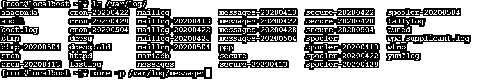

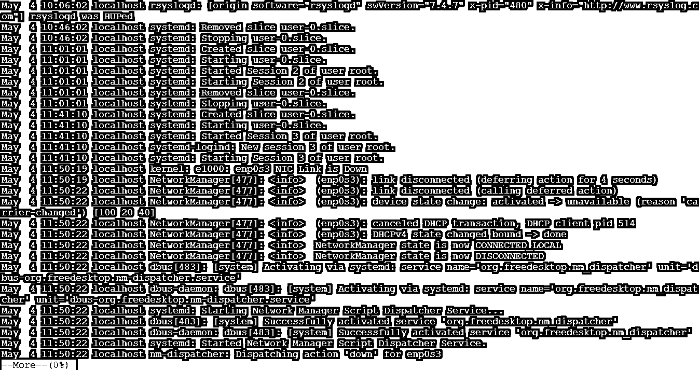

#### 4.带“-c”选项的更多命令

在 more 命令中，输出页面将通过重叠前一显示输出页面显示在同一区域。我们需要在 more 命令中使用“-c”选项。

**命令:**

`more -c /var/log/messages`

**解释:**根据上述命令，我们正在分析消息日志文件“/var/log/messages”。输出页面将显示在与先前显示的输出页面重叠的区域的相同范围内。为了显示类似的最终结果，我们需要在 more 命令中使用“-c”选项。

**输出:**

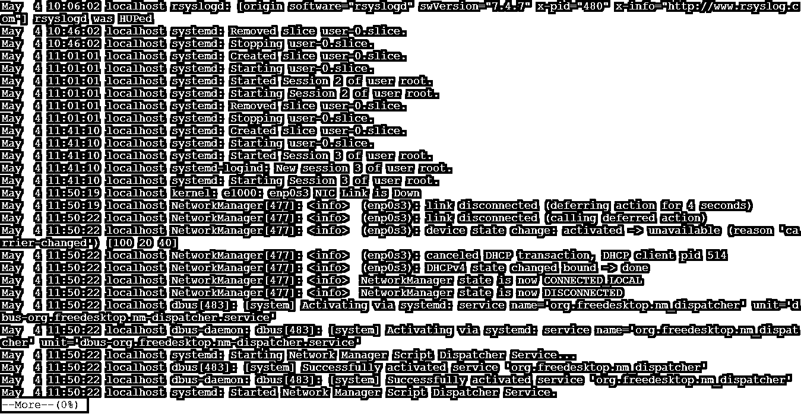

#### 5.带"-s "选项的更多命令

在 Linux More 命令中，有删除文件中不需要的空间的功能。我们需要在 more 命令中使用“-c”选项。

**Note:** The “-s” option is not permanently removing the unwanted spaces from the input file. It just removes the spaces while displaying the output content on the screen.

**命令:**

`more -s /var/log/messages-20200504`

**解释:**按照上面的命令，我们使用一个特定的日期日志文件(/var/log/messages-20200504)来读取数据。在同一个文件中，文件中有很多可用的空格(参考截图 2 (a))。现在我们需要一个输出来省略输入文件中不需要的空格。我们在 more 命令中使用“-s”选项来删除输入文件中不需要的空格(参见截图 2 (b))。

**输出:**

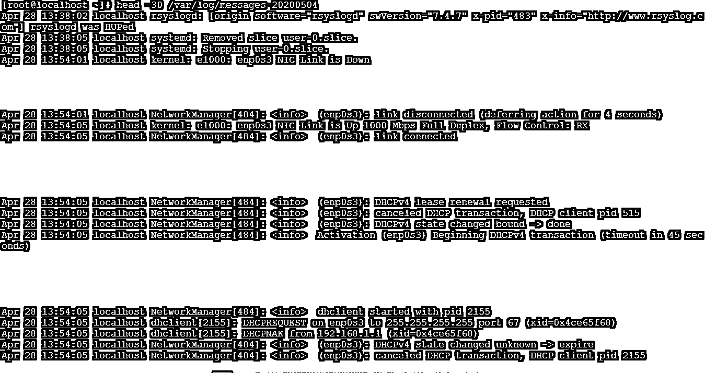

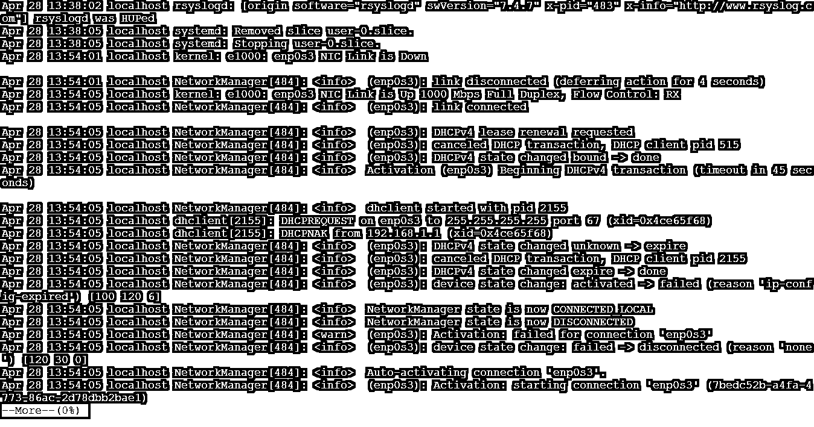

#### 6.带跳转命令的更多命令

在 more 命令中，我们可以直接跳转到我们需要的行号。不需要逐行检查记录的数量。我们需要在 more 命令中指定行号。

**命令:**

`more +2000 /var/log/messages-20200428`

**解释:**按照上面的 more 命令，我们使用的是特定的日志文件(/var/log/messages-20200428)。同一文件中的记录总数为 3242 条(参考截图 3 (a))。如果我们需要达到第 2000 个记录，那么逐个记录会更加困难。在 more command 中，我们可以直接移动到记录号 2000(参见截图 3 (b))。

**输出:**

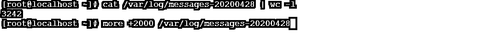

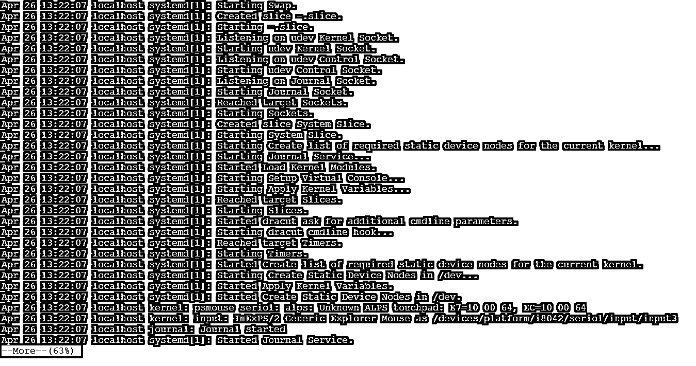

### 结论

我们已经看到了“Linux More Command”的完整概念，以及正确的示例、解释和具有不同输出的命令。more 命令用于读取大文件。普通文本编辑器无法读取大文件的次数，然后更多的命令是有用的。

### 推荐文章

这是一个 Linux More 命令指南。这里我们也讨论一下 Linux more 命令的介绍和工作原理？以及不同的示例及其代码实现。您也可以看看以下文章，了解更多信息–

1.  [Linux gzip](https://www.educba.com/linux-gzip/)
2.  [Linux 过滤命令](https://www.educba.com/linux-filter-commands/)
3.  [Linux 中的 Mkdir 命令](https://www.educba.com/mkdir-command-in-linux/)
4.  [Linux 创建文件](https://www.educba.com/linux-create-file/)

