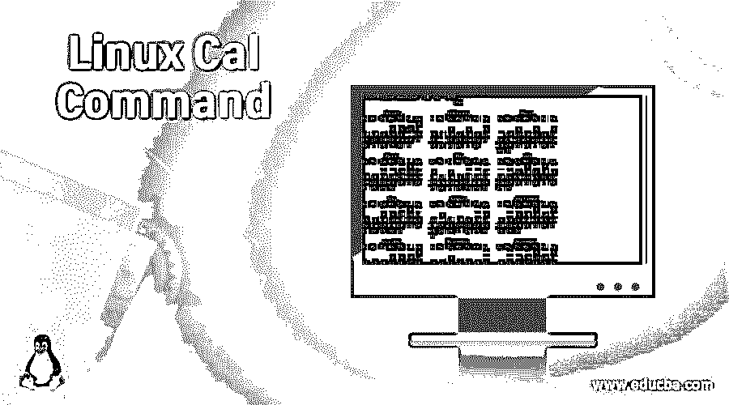
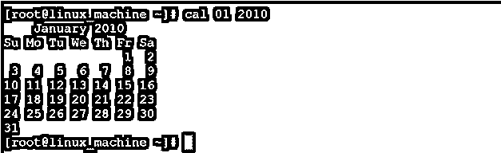
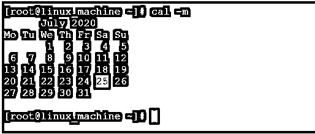
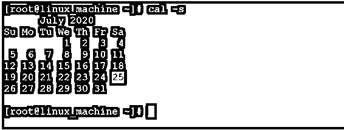

# Linux Cal 命令

> 原文：<https://www.educba.com/linux-cal-command/>

## Linux Cal 命令简介

在 Linux 生态系统中，cal 代表日历。cal 是一个命令行实用程序，用于在 Linux 终端窗口上显示日历信息。这将有助于打印单月日历，多月或多月日历，以及全年。如果我们只是简单地输入没有任何选项的“cal”命令，那么它将打印日历的当前月份。cal 命令是 util-linux 包的一部分。

注意:在 cal 命令中，有打印从 1 到 9999 的年份的功能。但是我们需要用 cal 命令指定整年。(例如。如果我们需要打印 1999 年的日历信息。那么我们就不能使用“99”我们需要完全指定年份“1999”。

<small>网页开发、编程语言、软件测试&其他</small>

**语法:**

`cal [options] [[[day] month] year]`

*   **cal:** 我们可以在语法或者命令中使用 cal 关键字。它将两个参数作为选项和日期参数。根据所提供的参数，它将以日历格式提供月份或年份信息。
*   **选项:**我们可以提供不同的标志作为与 cal 命令兼容的选项。
*   **日期、月份、年份:**根据需要，我们可以通过“cal”命令使用日期、月份和年份的不同参数。

### Linux Cal 命令是如何工作的？

基本上，cal 是在 Linux 终端窗口上打印月或年日历信息的命令行实用程序。cal 命令将接受带有日期和年份参数的不同兼容选项。根据参数,“cal”命令将打印请求的日历信息。

以下是 cal 命令中可用的选项列表。

| **选项** | **描述** |
| -1，-1 | 它将简单地显示当前月份的信息。 |
| 三，三 | 它将打印上个月、当前月和下个月的月份信息 |
| 星期天 | 它将通过将星期日视为开始周来开始一个月 |
| 星期一 | 它将通过将星期一视为开始周来开始一个月 |
| 朱利安 | 默认情况下，cal 将显示公历。但是在“-j”选项的帮助下，它将显示儒略历。所有的日子都从月初开始计算。 |
| -是-年 | 它将打印完整的当前全年 |
| -V，-版本 | 它将打印 cal 命令的版本信息。 |
| 救命啊 | 它将显示与 cal 命令兼容的帮助选项。 |

### 实现 Linux Cal 命令的示例

下面是一些例子:

#### CalCommand

在 Linux 环境中，这是一个非常简单和常见调用命令。它将在 Linux 终端中打印当前月份的信息。

**命令:**

`cal`

**说明:**根据上面的命令，cal 命令正在打印日历的当前月份。当前月份是 2020 年 7 月。它还会突出显示当前日期，即 7 月 25 日。

**输出:**

**T2】**

 **#### Cal 命令–打印特定的月历

默认情况下，我们能够打印带有突出显示日期的当前月历。如果我们想打印具体的月份和年份，那么我们可以在 Linux 终端上打印。

**Co**T2】mmand:

`cal 01 2010`

**说明:**根据我们的要求，我们可以打印具体的月份和年份日历。根据下面的截图，我们正在打印 2010 年 1 月的日历。

**输出:**

#### Cal 命令–带“-m”选项

在 cal 命令中，我们可以打印从星期一开始的月历。我们需要在 cal 命令中使用“-m”选项。

**命令:**

`cal -m`

**说明:**一般在 cal 命令中，一个月的开始周是星期日。但是根据我们的要求，我们可以把它从星期天改为星期一。根据下面的截图，我们已经改变了从周一开始的一周。

**输出:**

#### cal command–带“-s”选项

在 cal 命令中，我们可以打印从星期日开始的月历。我们需要在 cal 命令中使用"-s "选项。

**命令:**

`cal -s`

**说明:**根据我们的要求，我们可以在调用命令中显示从周日开始的一周。根据下面的截图，七月的第一周是星期天。

**输出:**

#### cal command–打印上个月、当前月和下个月的日历

在 cal 命令中，我们可以在一个命令中打印上个月、当前月和下个月的日历。

**命令:**

`cal -3`

**说明:**根据上述命令，我们可以打印三个月的日历信息。当前月份是 7 月；我们可以打印七月的前一个月和下一个月的日历信息，即六月和八月。

**输出:**

**T2】**

 **#### Cal 命令–带“-j”选项

在 cal 命令中，我们能够在 Linux 终端上打印儒略历。我们需要在 cal 命令中使用“-j”选项。

**命令:**

`cal -j`

**说明:**根据上面的命令，我们可以打印儒略历。在儒略历中，所有的日子都是从月初开始计数的。

**输出:**

**T2】**

 **#### Cal 命令–打印日历

在 cal 命令中，我们可以打印完整的一年日历。我们可以打印从 1 年到 9999 年的日历。

注意:在打印一年的日历时，我们需要在 cal 命令中指定完整的一年。

**命令:**

`cal1800`

**说明:**根据下面的截图，我们可以打印出 1800 年的完整月历。

**输出:**

**T2】**

 **### 结论

我们已经看到了“Linux cal 命令”的完整概念，以及正确的示例、解释和具有不同输出的命令。cal 命令对于打印特定年份的所有月份非常重要。我们可以使用带有多个选项的 cal 命令，如月份、Julien 日历、更改工作日等。

### 推荐文章

这是一个 Linux 调用命令的指南。在这里，我们还将讨论简介以及 linux cal 命令是如何工作的？以及不同的示例及其代码实现。您也可以看看以下文章，了解更多信息–

1.  [Linux 写](https://www.educba.com/linux-write/)
2.  [Linux tracepath](https://www.educba.com/linux-tracepath/)
3.  [Linux 读取](https://www.educba.com/linux-read/)
4.  [Linux comm](https://www.educba.com/linux-comm/)

********