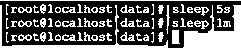
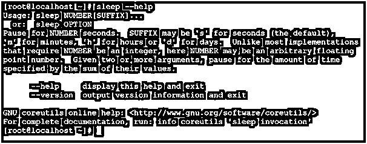
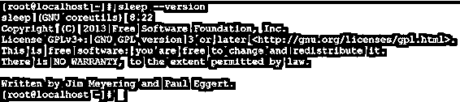

# Linux 睡眠

> 原文：<https://www.educba.com/linux-sleep/>

## Linux 睡眠简介

在 Linux 生态系统中，sleep 命令用于在一定时间内暂停一个任务或命令的执行。时间值由数值定义。换句话说，在 Linux 环境中创建一个模拟作业也是有用的。它可以在实时 shell 窗口中使用，也可以在 shell 或 bash 作业中使用，或者可以在两者的组合中使用。

睡眠命令实用程序是由吉姆迈耶林和保罗埃格特编写的。

<small>网页开发、编程语言、软件测试&其他</small>

注意:默认情况下，睡眠值是一秒。但是我们可以使用后缀值来定义特定时间间隔的睡眠值。

**语法:**

`sleep NUMBER[SUFFIX] ...`

睡眠选项如下所示:

*   **sleep:** 我们可以在语法或者命令中使用 sleep 关键字。它将接受像数值或后缀值这样的参数。sleep 命令将有助于暂停 Linux 环境中任何 shell 或 bash 作业或任何命令的执行。
*   **数字:**我们可以提供睡眠命令中的数值。相同的数值将用于在 Linux shell 上将命令或作业暂停一段时间。
*   **后缀:**在睡眠命令中，我们可以使用后缀值来减少将时间值转换成第二个值的计算次数。

### Linux 睡眠命令是如何工作的？

在 Linux 中，有不同的方法来暂停或保持命令或作业。sleep 命令是在特定时间内暂停执行作业或命令的方法之一。在较旧的 Linux 版本中，没有使用带有浮点数的 sleep 命令的功能。但是在现代的 Linux 中，有在 sleep 命令中使用浮点数的功能。

睡眠命令将接受该数值。相同的数值将用于暂停下一个计划作业或下一个要运行的计划命令。我们可以在 sleep 命令中使用后缀值。下面是可以在 sleep 命令中使用的后缀值列表。

*   **s:**“s”后缀值代表秒。
*   **m:**“m”后缀值代表分钟。
*   **h:**“h”后缀值代表小时。
*   **d:**“d”后缀值代表日。

**Note:** By default, the sleep command is using the second value as the time value. If you would need to extend the time stamp, then we can use the suffix values in the sleep commands.

### 实现 Linux 睡眠命令的例子

在 sleep 命令中，我们能够将 shell 窗口暂停一段特定的时间。默认情况下，具体时间以秒为单位。

**Note:** If we run only the sleep command, then it will not work. We should provide a list of some value in seconds.

#### 示例#1

**命令:**

`sleep 5`

**解释:**根据上面的睡眠命令，我们使用“5”值。sleep 命令必须使用任何值；否则，该命令将不起作用。一旦该命令被点击，shell 窗口将在接下来的 5 秒内被阻塞。5 秒钟后，shell 窗口将恢复正常，并能够执行正常的 Linux 查询。

**输出:**

#### 示例# 2–带后缀值

在 Linux 环境中，我们可以在 sleep 命令中使用后缀值。

**Note:** The default successful value of the Sleep code is “0”.

**Co**T2】mmand:

`sleep 5s
sleep 1m`

**说明:**根据需要，我们可以在 sleep 命令中定义后缀值。根据下面的截图 2 (a)，我们在 sleep 命令中使用了“s”(第二个)后缀。同样，我们可以使用“m”(分钟)后缀。所以会暂停屏幕 1 分钟(参考截图 2 (a))。

**输出:**

#### 示例# 3–使用 Linux 命令

在 Linux 环境中，我们也可以在 Linux 命令中使用 sleep 命令。

**命令:**

`sleep 5s && cat test_job.sh`

**解释:**根据上面的命令，我们在 Linux 命令之前使用 sleep 命令。命令的执行保持 5 秒钟(参见截图 3 (a))。之后会执行命令(参考截图 3 (b))。

**输出:**

#### 示例# 4–使用 Bash 作业

在 Linux 生态系统中，我们也可以在 bash 作业中使用 sheep 命令。

**命令:**

`./test_job.sh`

**外壳作业:**

`#!/usr/bin/bash
sleep 5s
echo "Hello"`

**解释:**根据上面的 bash 作业，我们使用了 sleep 命令。运行作业时，首先，它将暂停执行 5 秒钟(参见屏幕截图 4 (a))。之后将执行 echo 命令(参考截图 4 (b))。

**输出:**

#### 示例 5–关于睡眠命令的帮助

我们有获得睡眠命令帮助的功能。要获得任何帮助，我们需要在 Sleep 命令前使用“help”关键字。

**命令:**

`sleep --help`

**说明:**根据上面的命令，我们能够得到睡眠命令的基本帮助。它将打印一般信息，如命令如何，命令做什么，等等。

**输出:**

#### 示例 6–睡眠实用程序

我们具有在 Linux 环境中检查睡眠实用程序版本的功能。

**命令:**

`sleep --version`

**说明:**根据上面的版本命令，我们可以得到睡眠命令的版本信息。它用于检查睡眠命令的功能。大部分情况下建议使用新版本或最新版本。

**输出:**

### 结论

我们已经看到了“Linux 睡眠命令”的完整概念，以及正确的示例、解释和具有不同输出的命令。sleep 命令有助于暂停作业或命令的执行。我们可以将 sleep 命令与 Linux 命令以及 shell 作业结合使用。

### 推荐文章

这是一本 Linux 阅读指南。在这里，我们讨论 Linux Read 命令及其不同命令的概述，以及示例和代码实现。您也可以浏览我们推荐的其他文章，了解更多信息——

1.  [Linux 的 18 大优势](https://www.educba.com/advantage-of-linux/)
2.  [Linux 系统命令介绍](https://www.educba.com/linux-system-commands/)
3.  [Linux 发行版](https://www.educba.com/linux-distributions/)
4.  [Linux 操作人员综合指南](https://www.educba.com/linux-operators/)

