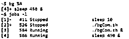
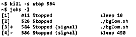

# Linux bg 命令

> 原文：<https://www.educba.com/linux-bg-command/>

## Linux bg 命令简介

Linux 世界里的 BG 命令代表后台。在作业暂停后，脚本有时必须在后台运行部分进程。在某些情况下，处理一组命令会变得非常耗时，主要是当命令需要大量的内存处理，或者某些文件处理可能比通常或任何其他进程需要更多的时间，否则，人们会希望在其他地方或其他时间运行这些进程，并同时执行其他一些操作。这听起来像是打开另一个终端并继续执行脚本，但接下来会发生什么呢？如果需要运行大量这样的脚本，我们最终会有多个终端。另一种方法是使用 bg 命令在后台运行实用程序，我们将在本文中详细介绍。

### 什么是 Linux bg 命令？

在 Linux 中，我们有前台和后台的概念。这些术语只不过是 Linux 中脚本的执行方式。在前台运行脚本只不过是在终端中运行它，使得终端不可用于任何其他执行。和后台使终端可用于任何其他命令执行。

<small>网页开发、编程语言、软件测试&其他</small>

这些执行方法属于作业控制的范畴，它本质上为开发人员带来了不仅停止或暂停流程执行，而且根据用户要求恢复或继续执行的能力。这个实用程序通过用& sign 运行脚本来处理。另一个重要的实用工具是通过将暂停的作业作为后台作业运行来重新启动它们。这就是 bg 司令部管的！

bg 命令的另一个重要特性是能够用作外部或内部命令。内部命令是外壳上下文中的命令。这实质上意味着不需要产生其他进程来执行这些命令中的命令。内部命令通常执行起来更快，因为 Linux 不需要在 PATH 变量中寻找这些命令。需要在 PATH 变量中搜索外部命令，这些命令不是 shell 中的内置命令。Linux 所做的是，它在路径变量中查找文件，路径变量通常是/bin 或/usr/bin 以及带有该命令的可执行文件。

**语法:**

接下来，我们将学习语法。基本语法如下:

`bg id_of_job_to_run`

如果需要在后台运行多个作业 id，我们将使用:

`bg id_of_job_to_run1 id_of_job_to_run2 id_of_job_to_run3 …..`

现在，在这个连接处，我们应该知道如何理解作为命令 bg 的参数的作业 id？在后面的部分中，我们还想了解如何暂停或停止当前在会话中运行的作业？

为了理解我们如何在 shell 中获得作业 id，我们将运行命令 jobs 或 jobs -l，它最终将列出所有作业及其旁边相应的 id。通过引入%作为作业规范，可以在 shell 中引用这些作业 id。

以下符号组合可用于指代相应的作业 id:

**% <编号> :** 使用这种组合的方式是通过引用当您传递命令 jobs -l 时暴露的作业列表，输出只是一个列表，每个作业 id 都有一个序列号。这个序列号正好代替了<号>。例如，假设我们有来自 jobs -l 的以下输出。

**1。** -1111 运行 ping 19.90.72.0

**2。** 2222 运行 AdRaNeAmV.py &

**3。** + 9999 停止了 abc.py

现在，如果我们写%3，那么本质上，我们指的是作业 id 9999。

**%String:** 如果记得可执行文件的名称，就使用这种特定的方法。如果我们知道在前面的例子中有一个名为 abc_xyz.py 的 python 文件，我们可以用 abc 或 abc_x 或文件名的任何子字符串替换<字符串>。它会自动搜索包含该子字符串的工作描述，并将其引用到该子字符串。如果有多个文件具有相似的子字符串，我们需要格外小心地用您想要引用的特定内容替换<字符串>。

**%+或%%:** 该特定引用作业 id 引用当前作业。

**%-:** 与前面的参照方式不同，这种方式是参照以前的作业 id。

下一件事是我们如何暂停一个作业以便在后台运行它。一旦我们知道了进程 Id，我们将实例化这三种方法中的任何一种，以便执行适当的操作。第一种方法是在前台执行命令时按 Ctrl+Z。接下来是使用 kill -s stop <process_id>命令。最后但并非最不重要的方法是使用 pkill 命令，语法是:</process_id>

`pkill -stop <Process_Id>`

现在，一旦我们暂停了一个特定的进程，我们就知道它最初遵循的是什么进程 ID。我们现在将使用

`bg <Process_Id>`

这将最终在后台启动我们挂起之前正在运行的进程！

### 实现 Linux bg 命令的示例

在本节中，我们将通过一个示例来了解 Linux bg 命令的工作原理:

#### 示例#1

使用&在后台运行脚本:

**命令:**

`./bgCom.sh &`

**输出:**

#### 实施例 2

运行另一个作业，然后按 Ctrl+Z 暂停它。

**命令:**

`sleep 450`

**输出:**

按 Ctrl+Z 后的输出

#### 实施例 3

列出工作。

**命令:**

`jobs -l`

**输出:**

#### 实施例 4

重新运行暂停的作业，即我们通过 Ctrl+Z 暂停的作业，然后列出当前正在运行的作业。在这里，我们将运行列表 4 中列出的作业。

**命令:**

`bg %4`

**输出:**

#### 实施例 5

使用 kill 命令暂停任何其他作业:

**命令:**

`kill -s stop 584`

**输出:**

### 结论

在本文中，我们通过一个示例介绍了 bg 命令在实际生活中的用法，以及一些关于如何运行后台作业的概念。使用这种功能，用户可以轻松地限制打开许多终端窗口来运行作业，并且一旦资源可用，就可以轻松地启动终止的作业。

### 推荐文章

这是一个 Linux bg 命令指南。在这里，我们讨论 Linux bg 命令及其不同命令的概述，以及示例和代码实现。您也可以浏览我们推荐的其他文章，了解更多信息——

1.  [Linux 的 18 大优势](https://www.educba.com/advantage-of-linux/)
2.  [Linux 系统命令介绍](https://www.educba.com/linux-system-commands/)
3.  [Linux 发行版](https://www.educba.com/linux-distributions/)
4.  [Linux 操作人员综合指南](https://www.educba.com/linux-operators/)

