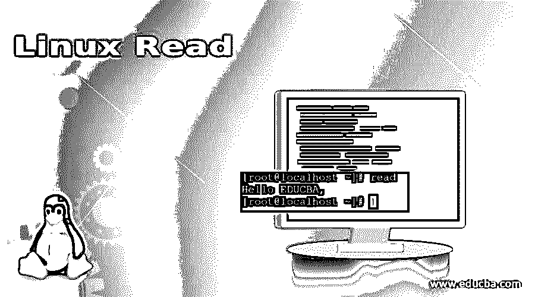
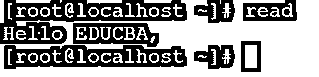

# Linux 读取

> 原文：<https://www.educba.com/linux-read/>

## Linux Read 命令简介

在 Linux 生态系统中，read 命令用于读取文件描述符。换句话说，read 命令主要用在 bash 环境中。在 bash 中，read 命令用于 Linux 环境下字符串的分词。read 命令是 Linux 生态系统中的一个内置实用程序。

**语法:**

<small>网页开发、编程语言、软件测试&其他</small>

`read [options] [name...]`

*   **read:** 我们可以在语法或者命令中使用 read 关键字。它将接受两个参数作为输入，即选项和名称。按照要求，read 命令将对字符串进行分词。
*   **选项:**我们可以提供不同的标志作为与读取命令兼容的选项。
*   **name:**read 命令，name 参数将指定存储来自 split 操作的实际字。

### Linux Read 命令是如何工作的？

read 实用程序是 Linux bash 环境中一个非常强大的实用程序。如前所述，它用于字符串的工作分段。read 命令使用选项和名称。它将接受不同的标志作为选项，name 参数将存储来自拆分操作的实际单词。

基本上，read 是 Linux 环境中的一个内置命令。它附带了基本的操作系统包。因此，不需要在 Linux 环境中添加任何额外的包。

| **选项** | **描述** |
| **-l** | 它将显示环境中所有 Readline 函数的名称。 |
| **-p** | 它将打印 readline 函数名和它们可以被重新读取的绑定。 |
| **-P** | 它将显示环境中当前的 readline 函数名和绑定。 |
| **-s** | 它将打印绑定到宏的 readline 键序列以及字符串输出。然后将重新读取输出。 |
| **-S** | 它将打印绑定到宏的 readline 键序列以及字符串输出。 |
| **-v** | 它将打印 readline 变量名和值。可以重新读取输出。 |
| **-V** | 它将打印环境中所有可用的当前 readline 变量名和值。 |

### 实现 Linux Read 命令的例子

下面是 Linux Read 的例子:

#### #1.读命令

在 read 命令中，我们能够读入用户输入。相同的输入可以传递给不同的命令或作业。因此，在下一个实例中，不同的命令或作业可以使用 read 命令作为输入来执行执行操作。

Note: To access the read command value, we can use or call the system variable “REPLY”.

**命令:**

`read`

**说明:**read 命令可以接受用户输入。我们只需要修改 read 命令并输入输入信息或变量值(参考截图 1 (a))。默认情况下，消息将存储在系统变量中。这时我们将调用系统变量“REPLY”。将显示输入的消息(参见屏幕截图 1 (b))。

**输出:**

`echo $REPLY`

#### #2.带变量的读取命令

在 Linux 环境中，我们可以访问不同变量中的读命令值。根据要求，我们可以在 read 命令中定义变量。

**Note:** there is no need to call the system generated variable “REPLY”.

**Co**T2】mmand:

`read variable1`

**说明:**根据上面的 read 命令，我们正在强行使用自己的变量来存储输入值(参考截图 2 (a))。相同的变量将用于查看读取命令消息(参见屏幕截图 2 (b))。

Note: Here the read command message will not store in the “REPLY” variable.

**输出:**

`echo “$variable1”`

#### #3.外壳模式下的读取命令

我们可以使用“cd”命令来读取来自任何位置的命令。类似地，我们可以通过“波浪号(~)”选项实现相同的功能。

**命令:**

`echo "Which topic is it?";read a;echo "Welcome to $a"`

**说明:**在 live shell 模式下，我们也可以使用 read 命令。它会要求用户输入。一旦用户输入了输入值。它将按照 read 命令输出打印消息。

**输出:**

#### #4.使用“-p”选项读取命令

在 read 命令中，我们可以在 shell 提示符下输入用户输入时提供提示。为了在 shell 上提供任何提示，我们需要在 read 命令中使用“-p”选项。

**命令:**

`read -p "Please Enter Your Mobile No : "`

**解释:**按照上面的命令，我们给终端用户输入相关字符的点击。这将有助于在输入任何用户输入时给出重要的信息。

**输出:**

#### #5.使用“-n”选项读取命令

在读取命令中，我们有限制特定字符数的功能。为了限制字符数，我们需要在 read 命令中使用“-n”选项。

**命令:**

`read -n 6 -p "Enter Pin Code : "`

**解释:**在上面的命令中，我们用一个特定的阈值来限制用户输入(我们使用了 6 个字符)。如果字符将被删除超过 6 个，那么提示将自动消失。

**输出:**

#### #6.使用“-s”选项读取命令

在 read 命令中，我们可以保护敏感数据。在输入关键信息时，我们可以隐藏信息。为了保护关键信息，我们需要在 read 命令中使用“-s”选项。

**命令:**

`read -s -p "Enter Password : "`

**解释:**根据上面的 read 命令，我们正在以一种安全的方式接受用户输入。用户输入不会显示在屏幕上，但读取命令接受用户输入。

**输出:**

### 结论

我们已经看到了“Linux Read Command”的完整概念，以及正确的示例、解释和具有不同输出的命令。read 命令广泛用于 shell 和应用程序级作业。我们可以以不同的方式使用 read 命令，如接受用户输入、安全输入、字符限制、输入提示等。

### 推荐文章

这是一本 Linux 阅读指南。在这里，我们讨论 Linux Read 命令及其不同命令的概述，以及示例和代码实现。您也可以浏览我们推荐的其他文章，了解更多信息——

1.  [Linux 的优势](https://www.educba.com/advantage-of-linux/)
2.  [Linux 系统命令](https://www.educba.com/linux-system-commands/)
3.  [Linux 发行版](https://www.educba.com/linux-distributions/)
4.  [Linux 操作员](https://www.educba.com/linux-operators/)

