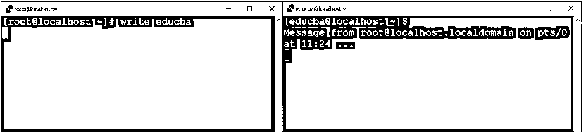
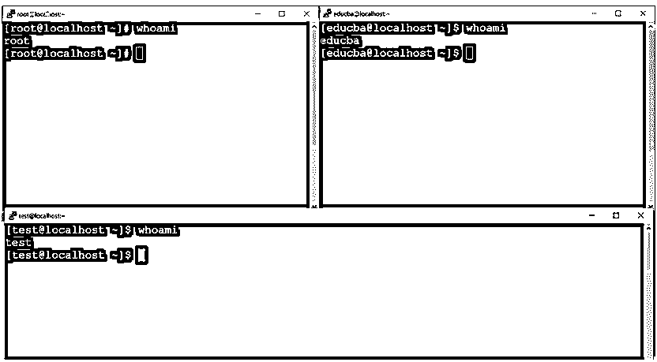
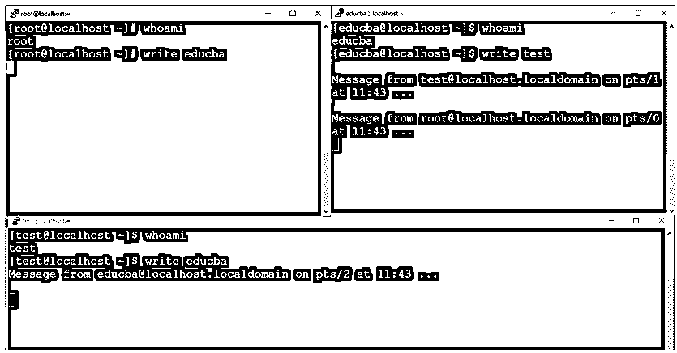
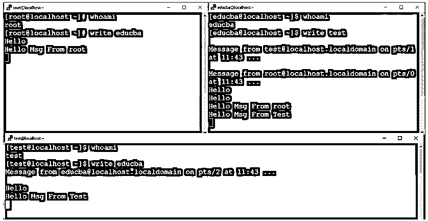

# Linux 写入

> 原文：<https://www.educba.com/linux-write/>

## Linux 写命令简介

在 Linux 生态系统中，write 命令用于与不同终端中的其他登录用户进行通信。它只是从一个终端到另一个或用户终端的通信。在通信通道中，我们还可以将线路从一个用户复制到另一个用户。在 Linux 中，write 命令位于 util-Linux 包中。

**语法:**

<small>网页开发、编程语言、软件测试&其他</small>

`write user [ttyname]`

*   **write:** 我们可以在语法或者命令中使用 write 关键字。它将接受两个参数作为输入，即用户名和终端号。write 命令将有助于与输入的用户进行通信。
*   **用户:**我们可以提供需要沟通的用户名。这里，我们可以同时使用 LDAP 和静态用户。对于 LDAP 用户或静态用户没有限制。
*   **ttyname:**write 命令，我们需要提供给用户。我们需要连接到哪个终端进行通信。

### Linux 写命令是如何工作的？

在 Linux 环境中，我们拥有从一个终端到其他终端与用户通信的功能。这将有助于从一个用户向其他用户发送或复制行。当任何用户将与不同的用户通信时。最终用户将收到以下格式的消息。

`Message from yourname@yourhost on yourtty at hh:mm ...`

*   **消息:**会随消息显示关键字。
*   **yourname@yourhost:** 它将打印出发送消息的用户的用户名。除了用户名，它还会显示主机名。通信或消息是从哪台主机发送的。
*   **yourtty:** 显示信息发送方的终端信息。
*   **hh: mm:** 它会显示时间戳。用户在哪个时间戳发送消息。通常，时间戳以 24 小时为单位。

**注:**沟通何时结束。最终用户将输入中断命令或字符。“EOF”指示将在通信结束时显示。在这个指示的帮助下，当前用户将理解通信的结束。

### 实现 Linux 写命令的例子

下面是一些例子:

#### 1.写命令:一对一通信

在写命令中，我们能够与不同的终端用户通信。我们可以在 shell 窗口中发送消息或复制行。

**注意:**通过写命令与不同用户通信时。请确保最终用户应该在 Linux 环境下的任何终端上登录。如果用户没有登录，那么写命令将不起作用。

**命令:**

`write educba`

**输出:**

截图 1 (a)

截图 1 (b)

截图 1 (c)

**说明:**根据上述命令，我们正在使用 write 命令与“educba”用户进行通信(参考截图 1 (a))。我们正在发起从根用户到 educba 用户的通信。在 educba shell 窗口中，用户可以看到下面的消息(参见截图 1 (b))。12:30 来自 pts/0 上 root@localhost.localdomain 的消息…(该消息来自 root 用户。主机名是 localhost.localdomain。终端是 pts/0。通信时间是 12:30)。

根用户的通信何时会中断。“EOF”(文件结束)消息将打印在 educba 用户 shell 窗口上。在此消息的帮助下，educba 用户将获得对话已关闭的指示(参见屏幕截图 1 (c))。

#### 2.写命令:多重通信

在 Linux 环境中，我们可以通过写命令与多个终端用户通信。

**注意:**在与多个用户通信时。请在消息中提供用户名。避免来自多个用户的消息冲突。

**Co**T2】mmand:

`write educba
write root
write test`

**输出:**

截图 2 (a)

截图 2 (b)

截图 2 (c)

**解释:**根据上面的命令，我们能够在 Linux 环境下与不同的用户进行通信。这里，我们与三个不同的用户进行交流，即 educba、test 和 root 用户(参见截图 2 (a))。在 write 命令的帮助下，我们能够与上述三个用户进行通信(参见截图 2 (b))。

在与多个用户交流的同时，交流非常困难。因为我们无法验证哪个消息来自哪个用户。为了避免这种情况，我们可以在用户消息的末尾添加用户名。因此，最终用户将识别消息来自哪个用户(参见屏幕截图 2 (c))。

#### 3.写命令:版本信息

在 write 命令中，我们能够获得版本信息。为了显示版本信息，我们需要在 write 命令中使用“-V”选项。

**命令:**

`write –V`

**输出:**

**说明:**根据上述写命令，我们可以打印写命令上的版本信息。检查功能是有帮助的。最好保留最新版本的软件包。因为在最新版本中，旧的 bug 被修复了。在新版本中，特性包括。

#### 4.写命令:帮助

我们有获得写命令帮助的功能。要获得任何帮助，我们需要在 write 命令中使用“-h”选项。

**命令:**

`write -h`

**输出:**

**解释:**根据上面的命令，我们正在获取基本信息或有关写命令的帮助。它将打印 write 命令的基本用法以及如何使用。

### 结论

我们已经看到了“Linux Write Command”的完整概念，以及正确的示例、解释和带有不同输出的命令。write 命令广泛用于从一个用户 Linux 终端到另一个用户 Linux 终端的通信。这将有助于共享复杂的命令。信息交流非常快。它可以在互联网上工作，也可以在内联网上工作。

### 推荐文章

这是一个 Linux 写作指南。这里我们也讨论一下简介和 linux 写命令是如何工作的？以及示例及其代码实现。您也可以看看以下文章，了解更多信息–

1.  [Linux 正则表达式](https://www.educba.com/linux-regular-expression/)
2.  [Linux Inode](https://www.educba.com/linux-inode/)
3.  [Linux 别名命令](https://www.educba.com/linux-alias-command/)
4.  [在 Linux 中设置 IP 地址](https://www.educba.com/set-ip-address-in-linux/)

