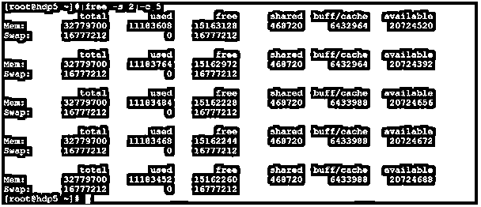

# Linux 自由命令

> 原文：<https://www.educba.com/linux-free-command/>

## Linux 自由命令介绍

在 Linux 操作系统中，free 命令用于获取有关可用随机存取内存总量、系统中已用内存量和可用交换内存量的信息。free 命令或实用程序还显示内核使用的缓冲存储器。

这个免费的命令行工具是由 Brian Edmonds 编写的。

<small>网页开发、编程语言、软件测试&其他</small>

**自由命令的语法**

`free [options]`

*   **free:** 在命令|语法中使用 free 关键字。它将参数作为一个选项，并为结果提供内存信息。
*   **选项:**我们可以提供不同的标志作为兼容自由命令的选项。

### Linux 自由命令是如何工作的？

Free command 是 Linux 操作系统中一个非常轻量级的实用程序。按照 free 命令选项，它向最终用户显示内存信息。输出的内存信息将是不同的变量，如字节、kb、MB、GB 等。

free 命令中有七个主要组件。但是，显示信息格式将会改变，但组件会保持原样。

*   **total:** 系统中存在的物理(RAM)内存总量。
*   **已用:**显示已用(RAM)内存
*   **空闲:**显示未使用的(RAM)内存
*   **shared:** 显示临时文件系统使用的内存总量。

**Note:** if it will apply to the system then only it will display otherwise it will show as zero.

*   **buffers:** 显示内核缓冲区使用的内存
*   **缓存:**显示页面缓存使用的内存
*   **可用:**这将是可用于启动新应用程序的总内存量。

**Note:** it will be without swapping.

### Linux 自由命令的例子

下面举几个例子:

#### 示例# 1–自由命令

Linux free 命令以千字节为单位提供关于内存和交换的信息。这是获取内存信息最简单的方法。

**命令:**

`free`

**说明:**

根据上面的命令，我们可以获得 Linux 机器的物理内存(RAM)以及交换内存信息。在“free”命令的帮助下，我们获得了 kb 格式的内存信息。在内存信息中，它包括总内存、用户内存、空闲内存、共享内存、缓冲区/高速缓存内存和可用内存。

**输出:**

#### 示例 2–自由命令–带有“-b”选项

free 命令以字节格式提供物理随机存取存储器和交换存储器信息。

获取字节格式的内存信息。我们需要在 free 命令中使用“-b”选项。

**Co**T2】mmand:

`free -b`

**说明:**

Linux free 命令是一个非常轻量级的命令行实用程序，用于以不同的格式获取内存信息。在上面的 free 命令的帮助下，我们正在以字节格式获取物理随机存取内存和交换内存信息。为了获得相同的信息，我们需要在 free 命令中使用“-b”选项。

**输出:**

#### 示例# 3–自由命令–带“-m”选项

free 命令以兆字节格式提供物理 RAM 和交换内存信息。

获取兆字节格式的内存信息。我们需要在 free 命令中使用“-m”选项。

**命令:**

`free -m`

**说明:**

在 Linux 生态系统中，通常使用兆字节信息来检查内存状态。按照上面的 free 命令，我们正在以兆字节的格式获取物理随机存取内存和交换内存信息。为了获得相同的信息，我们需要在 free 命令中使用“-m”选项。

**输出:**

#### 示例# 4–自由命令–带“-g”选项

free 命令以千兆字节的格式提供物理 RAM 和交换内存信息。

获取千兆字节格式的内存信息。我们需要在 free 命令中使用“-g”选项。

**命令:**

`free -g`

**说明:**

对于每个 Linux 机器或 Linux 虚拟机，千兆字节("-g ")选项将不起作用，因为内存分配不超过千兆字节。按照上面的 free 命令，我们正在获取千兆字节格式的物理随机存取内存和交换内存信息。为了获得相同的信息，我们需要在 free 命令中使用“-g”选项。

**输出:**

#### 示例 5–自由命令–带有“-h”选项

在 Linux Free 命令中，有一个工具可以获取内存信息，并以人类可读的格式交换信息。

以人类可读的格式获取内存信息。我们需要在 free 命令中使用“-h”选项。

**命令:**

`free -h`

**说明:**

如果任何人不属于 IT 或计算机背景，那么理解兆字节或吉字节格式的内存信息会更不同。为了克服这种情况，我们可以使用上面的命令以人类可读的格式获取内存信息。为了获得相同的信息，我们需要在 free 命令中使用“-h”选项。

**输出:**

#### 示例# 6——自由命令——带有“-t”选项

在 free command 中，我们可以在输出中再添加一行，以给出关于总内存统计的更具体的信息。

以额外的行格式获取内存信息。我们需要在 free 命令中使用“-t”选项。

**命令:**

`free -t`

**说明:**

按照上面的 free 命令，我们用额外的行获取内存信息。当我们需要总内存统计时，即添加物理随机存取内存和具有已用状态的交换内存。然后我们可以在 free 命令中使用"-t "选项。

**输出:**

#### 示例# 7–自由命令–带“-s -c”选项

在 free 命令中，我们可以在特定的时间间隔后获得内存信息状态。

我们需要使用“-s”选项来表示秒的时间间隔，使用“-c”选项来显示空闲命令的数量。

**命令:**

`free -s 2 -c 5`

**说明:**

按照上面的 free 命令，我们每 2 秒得到一次 free 命令输出，并显示命令输出 5 次。

**输出:**

### 结论

我们已经看到了“Linux 自由命令”的完整概念，以及正确的示例、解释和具有不同输出的命令。free 命令用于获取 Linux 机器的实时物理随机访问内存和交换内存信息。它将主要用于 Linux 服务器的系统监控和报警部分。

### 推荐文章

这是一个 Linux 自由命令的指南。在这里，我们讨论 Linux 自由命令是如何工作的，以及实现相应命令的例子。您也可以阅读以下文章，了解更多信息——

1.  [Linux 过滤命令](https://www.educba.com/linux-filter-commands/)
2.  [Linux 中的 Shell 是什么？](https://www.educba.com/what-is-shell-in-linux/)
3.  [Linux 中的 PS 命令](https://www.educba.com/ps-command-in-linux/)
4.  [Linux 中的 mv 命令](https://www.educba.com/mv-command-in-linux/)

