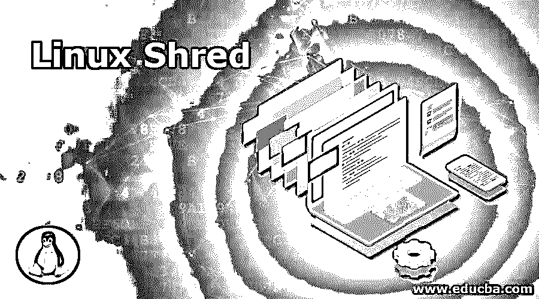
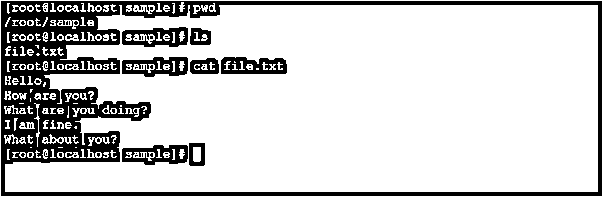
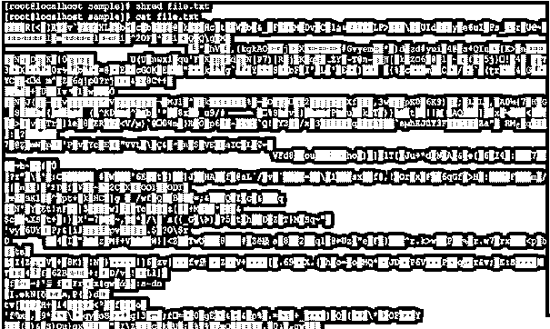
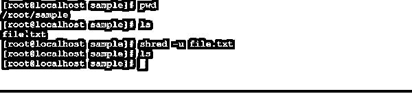
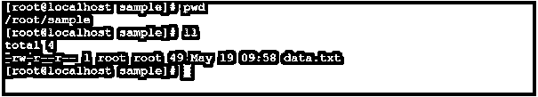
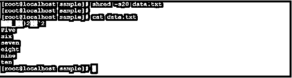
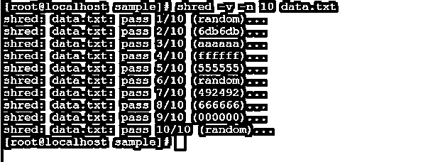

# Linux 粉碎

> 原文：<https://www.educba.com/linux-shred/>

## Linux Shred 简介

Linux shred 命令；会以第三方工具或软件无法从同一 shred 文件中恢复数据的方式覆盖该文件。这是销毁关键数据或信息的最安全的方法，并且您不希望允许在任何时间点恢复数据。

Linux shred 命令行实用程序是由 Colin Plumb 编写的。

<small>网页开发、编程语言、软件测试&其他</small>

### Shred 命令的语法

`shred [ OPTION ]... [ FILE ]...`

*   **Shred:** 命令|语法中的 free 关键字。它需要两组参数作为选项和文件名来分解数据。
*   **选项:**我们可以提供不同的标志作为与 shred 命令兼容的选项。
*   **文件:**提供粉碎命令的输入文件

### Linux Shred 命令是如何工作的？

在大多数操作系统中，当我们从标准硬盘中删除任何文件或数据时，数据不会按照标准时间永久删除。如果任何人获得了相同的硬盘驱动器，并试图恢复数据或文件(没有粉碎)，那么在第三方应用程序或工具的帮助下，我们能够从硬盘驱动器恢复被删除的数据。

shred 命令接受 shred 命令中不同的有效标志选项，并根据提供的输入文件覆盖数据。

注意:请确保您将非常小心地触发 shred 命令。如果你不小心粉碎了文件，那么文件数据的恢复是非常困难的。

Linux 生态系统中有几种不同类型的 shred 选项。

| **Sr 号** | **粉碎选项** | **选项含义** | **描述** |
| One | -f， | –力 | 如有必要，它将更改权限以允许写入 |
| Two | 同-EN | –迭代 | 默认情况下，shred 命令将文件粉碎 3 次。我们可以提供用户输入来覆盖“N”次 |
| Three | –随机来源 | 尤其是文件 | 它将从文件中获取随机字节 |
| Four | 构成名词复数 | –尺寸 | 它将粉碎这么多字节 |
| Five | -你 | –移除 | 它会在覆盖文件后截断并删除 |
| Six | -v | –冗长 | 它将显示实时过程 |
| Seven | ［加在以-u 结尾的法语词源的名词之后构成复数］ | –精确 | 它不会将文件大小向上舍入到下一个完整的块 |
| Eight | -z | –零 | 为了隐藏粉碎，它将添加一个带有零的最终覆盖 |
| Nine | 救命 | 帮助选项 | 它将显示帮助选项 |
| Ten | –版本 | 版本信息 | 它将显示输出版本信息 |

### Linux Shred 的例子

下面举几个例子

#### 示例# 1–粉碎命令

简单的 Linux shred 命令只是覆盖输入文件数据。这是 shred 命令系列中最简单的命令。它将使用 shred 命令的默认参数运行。

**命令:**

`cat file.txt | grep ^t`

**说明:**

我们有一个示例目录，在同一个目录中有文件名“file.txt”。里面有记录/行(参考截图 1(a))。我们使用 file.txt 作为 Linux shred 命令的输入。shred 命令将覆盖数据，数据格式完全改变(参见屏幕截图 1(b))。恢复碎片文件数据非常困难。

**输出:**

截图 1 (a)

截图 1 (b)

#### 示例 2–带有“-n”选项的 Shred 命令

Linux shred 命令；我们可以定义文件粉碎的次数。

我们可以在 shred 命令中使用“-n”选项。

**命令:**

`shred -n 10 file.txt`

**说明:**

按照上面的命令，我们在输入文件“file.txt”上使用 shred 命令。我们在 shred 命令中使用“-n”选项。它将覆盖文件十次。覆盖的默认值是三。

**输出:**

#### 示例# 3–带有“-u”选项的 Shred 命令

在 shred 命令中，我们可以覆盖文件，也可以删除相同的 shred 文件。

我们可以在 shred 命令中使用“-u”选项。

**命令:**

`shred -u file.txt`

**说明:**

在 Linux 生态系统中，我们需要在同一个 shred 命令中删除 shred 文件。在示例目录中，我们有输入文件，即 file.txt。我们在 shred 命令中使用“-u”选项。您将会看到，当我们使用“-u”选项时，文件将会从当前位置粉碎并删除。

**输出:**

#### 示例# 4–带有“-s”选项的 Shred 命令

shred 命令，我们根据需求分解行数。剩余的内容或数据或记录按原样呈现。

我们需要在 shred 命令中使用“-s”选项。

**注意:**“-s”值应以字节数为单位。

**命令:**

`shred -s20 data.txt`

**说明:**

在示例目录中，我们创建了一个新的输入文件“data.txt”。我们在其中输入一些记录，文件大小为 49 字节(参见截图 2 (a))。按照上面的命令，我们将输入文件从 0 字节分解到 20 字节。根据“-s”选项值，数据将被粉碎(参见屏幕截图 2 (b))。

**输出:**

截图 2 (a)

截图 2 (b)

#### 示例 5–带有“-v”选项的 Shred 命令

在 shred 命令中，有一个工具可以显示由 shred 命令执行的实时操作。要获得实时执行消息状态，我们需要在 shred 命令中使用“-v”选项。

注意:我们可以在任何 shred 命令选项中使用“-v”选项。在命令中使用“-v”选项没有限制。

**命令:**

`shred -v -n 10 data.txt`

**说明:**

在 shred 环境中，我们拥有获取实时查询状态的功能。要获得 shred 命令信息，我们需要在命令中使用“-v”选项。按照下面的输出，我们得到了实时的 shred 命令更新，命令在哪里，它在做什么。命令执行完成后，客户端光标将进入原始状态。

**输出:**

### 结论

我们已经看到了“Linux Shred Command”的完整概念，以及正确的示例、解释和具有不同输出的命令。它可以多次粉碎文件。由于 shred 命令，我们有数据或文件被完全覆盖或删除的可靠性，没有人可以恢复相同的数据或文件。

### 推荐文章

这是一个 Linux 粉碎指南。在这里，我们讨论 Linux Shred 命令如何与相应的命令和示例一起工作，以便更好地理解。您也可以看看以下文章，了解更多信息–

1.  [Linux uniq](https://www.educba.com/linux-uniq/)
2.  [Linux 中的 Mkdir 命令](https://www.educba.com/mkdir-command-in-linux/)
3.  [Linux gzip](https://www.educba.com/linux-gzip/)
4.  [删除目录 Linux](https://www.educba.com/remove-dir-linux/)

