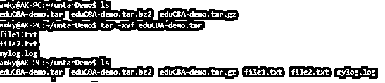
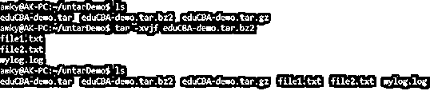
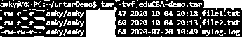
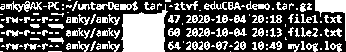
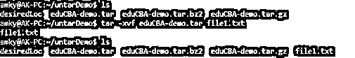
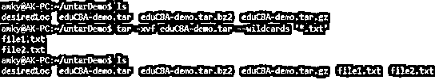

# Linux Untar

> 原文：<https://www.educba.com/linux-untar/>

## Linux Untar 的定义

**Untar** 定义为一个命令，使用户能够提取用 tar、tar.bz2、tar.bz2 压缩格式压缩的文件。该命令用于文件操作中的两个特定实用程序。它首先帮助用户在压缩模式下解压缩文件，换句话说，在解压缩或提取完成后，该命令帮助用户解压缩文件。列出内容、提取单个文件或目录是命令 untar 的一些广泛使用的实用程序。在本文中，我们将浏览该命令的所有实用程序，并使用一些示例深入了解它们的更多细节！

**语法:**

<small>网页开发、编程语言、软件测试&其他</small>

在 Linux 中，与其他广泛使用的命令相比，untar 的可用选项较少，我们将在本节中详细讨论所有这些选项，并在本文的后面深入探讨 Linux 中的 **untar** 命令的工作方式。

**1。提取焦油文件**

**语法:**

`tar -xvf <tar file name with .tar extension>`

**2。tar.gz 文件的提取**

**语法:**

`tar - xvzf <tar file name with .tar.gz extension>`

**3。tar.bz2 文件的提取**

**语法:**

`tar -xvjf <tar file name with .tar.bz2 extension>`

**4。在所需位置解压缩 tar 存档文件**

**语法:**

`tar -xvf <full location of tar file> -C <location to specified directory>`

**5。列出 tar 存档文件**的内容

**语法:**

`tar -tvf <full location of tar file>`

**6。tar.gz 档案文件列表内容**

**语法:**

`tar -ztvf <full location of tar file>`

**7。tar.bz2 归档文件**的列表内容

**语法:**

`tar -jtvf <full location of tar file>`

**8。从 tar 存档文件**中提取单个文件

**语法:**

`tar -xvf <full location of tar file> <file name to be extracted>`

**9。从 tar 存档文件中提取所有匹配特定文件 regex** 的文件

**语法:**

`tar -xvf <full location of tar file> --wildcards ‘<file type>’`

### Untar 命令在 Linux 中是如何工作的？

最近，我们从互联网上下载的大多数文件都是用一种特定的压缩格式压缩的，这就是一些格式，tar，tar.gz，tar.bz2。在早期，tar 文件格式被用于创建档案以在磁带上存储文件，因此 tar 的完整形式是 **T** ape **AR** chive。Untar 是导致 tar 文件形成的过程的反转过程。

在计算世界里，有两个不同版本的 **tar** ，分别是 **BSD tar** 和 **GNU tar** 。默认情况下，大多数 Linux 都预装了 **GNU tar。**untar 的另一个类似过程是 gzip 实用程序，带有命令 **gunzip** 。现在，讨论 untar 的不同效用选项，它们是以下 4 个选项:

**x**–为 **tar** 命令提供选项，从给定的 tar 文件中提取文件。

**v**–命令 **tar** 在文件被提取时列出它们。

**z**–命令 **tar** 命令解压，如果没有这个命令，默认情况下 **tar 命令**会压缩而不是解压。

**f**–帮助指定需要在 untar 过程中使用的文件名。

在上面的几个选项中，我们查看了所有广泛使用的实用程序。除此之外，我们还有其他实用程序，如:

*   **通配符选项:**该选项允许用户搜索文件提取类型。例如，我们希望只解包。tar 文件中的 jpeg 扩展名，该文件还包含其他文件类型。使用–通配符'<'文件类型>将允许用户只提取指定的文件类型。
*   C 选项:该选项有助于将指定的文件解压缩到特定的路径位置；以防有人特别需要这个工具。
*   **Delete 选项:**虽然不是 untar 选项的一部分，但与 untar 密切相关的一个实用程序是从 tar 归档中删除文件。使用–delete 选项可以帮助用户删除 tar 归档中的特定文件。

有了上面提到的所有实用工具，这个命令就成了任何 Linux 开发人员无意中掌握的技能。

### 例子

让我们讨论 Linux Untar 的例子。

#### 示例#1

tar 文件的提取

**语法:**

`tar -xvf eduCBA-demo.tar`

**输出**

在这里，我们可以看到，当我们拥有目录时，最初没有这样的文件，但是当我们解压缩文件时，所有文件内容都被提取并解压缩到我们运行命令的位置。类似的解释也适用于下面的两个例子(tar.bz2 和 tar.bz2)。

#### 实施例 2

tar.gz 文件的提取

**语法:**

`tar - xvzf eduCBA-demo.tar.gz`

**输出:**

**T2】**

 **#### 实施例 3

tar.bz2 文件的提取

**语法:**

`tar -xvjf eduCBA-demo.tar.bz2`

**输出:**

#### 实施例 4

在所需位置解压缩 tar 存档文件

**语法:**

`tar -xvf eduCBA-demo.tar -C desiredLoc`

**输出:**

在这里，我们看到 desiredLoc 位置下没有任何文件，当我们提取文件时，所有文件内容都被提取到指定的位置，即 desiredLoc。

#### 实施例 5

列出 tar 存档文件的内容

**语法:**

`tar -tvf eduCBA-demo.tar`

**输出:**

#### 实施例 6

列出 tar.gz 档案的内容

**语法:**

`tar -ztvf eduCBA-demo.tar.gz`

**输出:**

#### 实施例 7

列出 tar.bz2 存档文件的内容

**语法:**

`tar -jtvf eduCBA-demo.tar.bz2`

**输出:**

**T2】**

 **#### 实施例 8

从 tar 存档文件中提取单个文件

**语法:**

`tar -xvf eduCBA-demo.tar file1.txt`

**输出:**

#### 实施例 9

从 tar 存档文件中提取与特定文件正则表达式匹配的所有文件

**语法:**

`tar -xvf eduCBA-demo.tar --wildcards ‘*.txt’`

**输出:**

在这个例子中，我们看到只有扩展名为“txt”的文件在这个位置被解压！

### 结论

有了一组示例和对 **untar** 命令工作方式的解释，读者的用法和利用就更加清楚了，现在我们让您用命令实用程序中的选项来试验更多可能的不同排列组合。尽管不是强制性的，但建议对 tar、tar.bz2、tar.bz2 文件类型的任何解压缩过程使用 **untar 命令**，因为这些文件总是有最新的选项可供其使用。

### 推荐文章

这是一个 Linux Untar 的指南。在这里，我们还讨论了定义、语法、参数，以及 Untar 命令在 Linux 中是如何工作的，并给出了例子。您也可以看看以下文章，了解更多信息–

1.  [Linux Ping](https://www.educba.com/linux-ping/)
2.  [Linux 中的 Vim 命令](https://www.educba.com/vim-command-in-linux/)
3.  [Linux nslookup](https://www.educba.com/linux-nslookup/)
4.  [Linux Diff 命令](https://www.educba.com/linux-diff-command/)

****