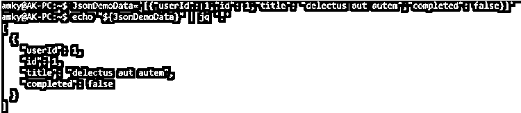
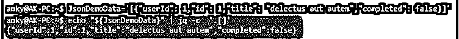
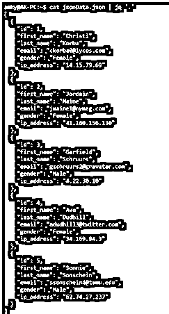
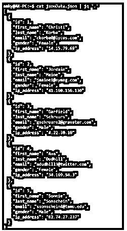
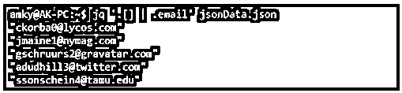
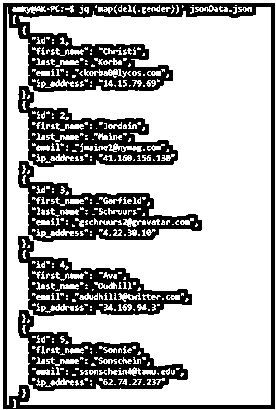
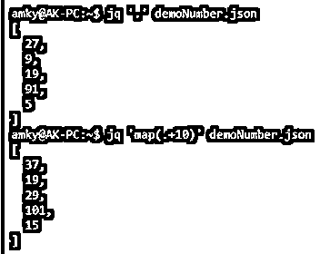
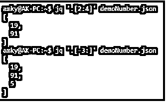

# Linux JQ

> 原文：<https://www.educba.com/linux-jq/>

## Linux JQ 的定义

JQ 被定义为具有类似于过滤器的效用的命令。当所说的实用程序类似于过滤器时，我们想要说的是，命令将参数作为输入，根据过滤器提取数据，并提供输出。我们提到过 JQ 迎合的特定类型的数据吗？还没有！该命令非常特定于 JSON 文件的 ask。在 Linux 中，直接读取 JSON 文件并不简单，就像我们读取任何其他类型的文件一样，因此，一个特定的实用程序包含了 JQ 命令！

### Linux JQ 的语法

在 Linux 中，有各种各样的选项可用于 JQ，我们将在本节中详细讨论所有这些选项，并在文章的后面深入探讨 Linux 中 JQ 命令的工作方式。但是在进行挖掘之前，让我们先来看一看语法:

<small>网页开发、编程语言、软件测试&其他</small>

**1。读取 JSON 数据**

`echo “${variable name}” | jq ‘.’`

这里，我们可以用存放 JSON 数据的变量的名称来替换变量名。

**2。读取 JSON 数据**的-c 选项(读取或打印各行中的每个 JSON 对象)

`echo “${variable name}” | jq -c ‘.[]’`

**3。JSON 文件读取**

`jq ‘.’ <json file name>`

**4。用“|”读取 JSON 文件**

`cat <json file name>   | jq '.'`

**5。JSON 中读取的单个键值**

`jq '.[] | .<key name>' <json file name>`

**6。JSON 中读取的多个键值**

`jq '.[] | .<key names separated by comma>' <json file name>`

7 .**。从 JSON 数据中删除密钥**

`jq 'map(del(.<key name to be deleted>))' <json file name>`

**8。JSON 数据中的值映射**

`jq 'map(.<operation required>)' <json file name>`

**9。在 JSON 数据中按索引和长度搜索值**

`jq '.[<start of index>:<end of index>]' <json file name>`

### JQ 命令在 Linux 中是如何工作的？

正如我们已经提到的 JQ 命令，它特别忽略了 JSON 数据特定的文件，因为这些文件不像普通文本文件那样容易阅读。如果您熟悉 sed 和 awk 命令，您可以在相同的行上处理 jq 命令，除了 jq 命令只适用于 JSON 文件。此外，需要确保 jq 安装在 Linux 系统中，因为这个实用程序通常不会随任何 Linux 发行版附带标签。

要运行安装，需要在控制台中运行 install 命令。该命令如下所示:

`sudo apt-get install jq`

现在，一旦为顺利运行实用程序命令做好准备，我们就可以开始在命令行界面中试验这些命令了。现在，另一件重要的事情是学习什么是 JSON。扩展一下缩写 JSON 代表 JavaScript 对象符号。这种格式经常被使用，因为它对于存储和传输来说是轻量级的。

现在，是时候从上面提到的语法的许多命令来解释 jq 的效用了。第一个实用程序类似于打印存储 JSON 的变量，我们回显该变量，然后使用 jq 命令以人类可读的格式打印它。这样，如果我们合并-c 选项，我们可以通过打印不同列中的每个对象而不是原始 json 文件的列来使它更具可读性。接下来是关于读取包含 json 扩展名的文件。只需一个简单的 jq 语法和文件名就可以实现这个神奇的效果！另一个变化是使用 cat 命令以及 pipe 和 jq 命令来保持神奇的效果！

现在是时候讨论 JSON 的键值对发挥作用的实用程序了。当从各种可用选项中传递一个键名时，它会尝试过滤出与该键对应的值并显示出来。当发送多个键时，可以通过逗号分隔的值发送相同的键，键的相应值将显示出来！该命令的 del 选项有助于从 JSON 中删除一个键，而不改变 JSON 的任何其他部分，另一方面，map 选项有助于修改 JSON 中一个键的值。最后但同样重要的是，在通过索引进行值搜索时，jq 有助于通过索引和长度进行搜索。指定了开始和结束索引，并且根据指定的索引进行筛选。此外，如果其中一个索引未指定，则从开始(如果缺少开始)和结束(如果缺少结束)开始过滤。可以存在负索引，这也意味着命令将从 json 对象的末尾而不是顶部开始搜索！

### Linux JQ 的例子

下面是一些例子:

#### 示例#1

读取 JSON 数据

**代码:**

`JsonDemoData='[{"userId": 1,"id": 1,"title": "delectus aut autem","completed": false}]'
echo "${JsonDemoData }" | jq '.'`

**输出:**

#### 实施例 2

读取 JSON 数据的-c 选项

**代码:**

`JsonDemoData='[{"userId": 1,"id": 1,"title": "delectus aut autem","completed": false}]'
echo "${JsonDemoData}" | jq -c  '.[]'`

**输出:**

#### 实施例 3

JSON 文件读取

**代码:**

`jq '.' jsonData.json`

**输出:**

#### 实施例 4

用“|”读取 JSON 文件

**代码:**

`cat jsonData.json | jq '.'`

**输出:**

#### 实施例 5

JSON 中读取的单个键值

**代码:**

`jq '.[] | .email' jsonData.json`

**输出:**

#### 实施例 6

JSON 中读取的多个键值

**代码:**

`jq '.[] | .email, .ip_address' jsonData.json`

**输出:**

#### 实施例 7

从 JSON 数据中删除一个键

**代码:**

`jq 'map(del(.gender))' jsonData.json`

**输出:**

这里我们看到关键的 email id 被删除了，然后 json 出现了！

#### 实施例 8

JSON 数据中的值映射

**代码:**

手术前:

`jq '.' demoNumber.json`

每个元素加 10 后:

`jq 'map(.+10)' demoNumber.json`

**输出:**

#### 实施例 9

在 JSON 数据中按索引和长度搜索值

**代码:**

从索引 2 到索引 4 搜索元素:

`jq '.[2:4]' demoNumber.json`

在 json 文件中搜索最后 3 个元素:

`jq '.[-3:]' demoNumber.json`

**输出:**

在本例中，如果索引号是正数，该命令将根据元素的索引对其进行索引。另一方面，如果索引为负，该命令将假定从数组的最后一个开始搜索。因此，这个场景中的-3 意味着从最后开始的 3 个元素。

### 结论

有了这组例子和对 jq 命令工作方式的解释，就可以在 bash 脚本中创建这些实用程序，并用于各种目的。更有趣的是，这些命令将使我们能够通过使用 jq 命令来执行数据分析，只需让读者去寻找和铺平道路！

### 推荐文章

这是一个 Linux JQ 的指南。在这里，我们还讨论了 jq 命令的定义以及它在 Linux 中是如何工作的，并给出了不同的例子及其代码实现。您也可以看看以下文章，了解更多信息–

1.  [Linux Untar](https://www.educba.com/linux-untar/)
2.  [Linux Ping](https://www.educba.com/linux-ping/)
3.  [Linux nslookup](https://www.educba.com/linux-nslookup/)
4.  [Linux 大小](https://www.educba.com/linux-size/)

