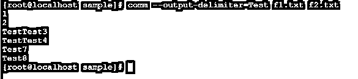

# Linux comm

> 原文：<https://www.educba.com/linux-comm/>

## Linux comm 简介

Linux comm 命令用于逐行比较两个排序后的文件，这些行是通用的，而这些行是唯一的，将写入标准输出。comm 命令提供了按列级别进行比较的功能。Linux comm command 是由理查德·M·斯托曼和大卫·麦肯齐编写的。

### 通信命令的语法

`comm [ OPTION ] … [ FILE 1 ] [ File 2 ]`

<small>网页开发、编程语言、软件测试&其他</small>

1.comm:在命令|语法中使用 comm 关键字。我们需要向 comm 命令提供 at list 两个文件作为参数。

2.选项:根据需要，我们可以在 comm 命令中提供有效的选项。如果我们在 comm 命令中不使用任何选项，那么 comm 命令会产生三个不同的列输出

*   第一列输出包含与文件 1 匹配的行
*   第二列输出包含与文件 2 匹配的行
*   第三个或最后一个输出列包含这两个文件共有或相似的行

3.如果我们提供两个排序后的输入文件作为 comm 命令的参数，那么只有该命令会被正确执行，不会出现错误。

### Linux comm 命令是如何工作的？

comm 命令读取这两个文件作为输入，但它只提供一个输出文件。输出文件将包含三个不同的输出列。第一列输出将显示第一个输入文件的唯一行。类似地，第二列输出将显示第二个输入文件的唯一行，最后一列或第三列将显示关于这两个文件的公共数据。

通常，各列由“制表符”分隔。如果输入文件或输入数据中包含分隔符，那么输出列将变得不明确。

### Linux comm 的例子

以下是提到的例子:

`Comm Command`

comm 命令是基本命令。现在我们来看看它的默认工作方式。

**命令:**

`cat f1.txt
cat f2.txt
comm f1.txt f2.txt`

**说明:**

我们有一个样本目录。在同一个目录下，我们有两个文件“f1.txt”文件和“f2.txt”文件(参考截图 1 (a) & (b))。在“f1.txt”文件中，我们有一些数据，同样格式的数据也存在于“f2.txt”文件中。在“f1.txt”和“f2.txt”上使用 comm 命令时，第一列将显示“f1.txt”文件的不常用数据，第二列将显示“f2.txt”文件的不常用数据，第三列将显示“f1.txt”文件和“f2.txt”文件的常用数据(参见截图 1 (c))。

**输出:**

截图 1 (a)

截图 1 (b)

截图 1 (c)

#### 示例# 1–带有-1 的 Comm 命令

在 comm 命令中，我们可以跳过列输出数据。要跳过第一列输出数据，我们可以在 comm 命令中使用“-1”选项。

**命令:**

`comm -1 f1.txt f2.txt`

**说明:**

在上面的命令中，我们比较了两个文件，如 f1.txt 和 f2.txt 文件。使用 comm 命令，我们将得到三个输出列。当使用“-1”选项时，我们可以跳过第 1 列输出，显示第 2 列输出。

**输出:**

#### 示例 2–带有-2 的 Comm 命令

在 comm 命令中，我们可以使用命令的“-2”选项跳过第二列输出数据。

**命令:**

`comm -2 f1.txt f2.txt`

**说明:**

在上面的命令中，我们比较了两个文件，如 f1.txt 和 f2.txt 文件。使用 comm 命令，我们将得到三个输出列。当使用“-2”选项时，我们可以跳过第 2 和第列输出，显示铰孔后的第 2 列输出。

**输出:**

#### 示例# 3–带-3 的 Comm 命令

在 comm 命令中，我们可以在命令中使用“-3”选项跳过第三列输出数据。

**命令:**

`comm -3 f1.txt f2.txt`

**说明:**

在上面的命令中，我们比较了两个文件，如 f1.txt 和 f2.txt 文件。使用 comm 命令，我们将得到三个输出列。使用“-3”选项时，我们可以跳过第 3 和第列输出，显示铰孔后的第 2 列输出。

**输出:**

#### 示例 4–检查订单选项

“检查顺序”选项对于检查输入文件数据的排序顺序是否正确非常有用。

如果输入数据没有排序，那么检查顺序选项将在 comm 命令中给出一个错误。

**命令:**

`comm --check-order f1.txt f2.txt`

**说明:**

我们在 comm 命令中使用检查订单选项。如果输入数据是已排序的格式，那么它不会出错，如果不是，那么它会出错。

**输出:**

#### 示例 5–不检查订单选项

nocheck order 选项并不检查输入文件的排序格式是否正确。

**命令:**

`comm --nocheck-order f1.txt f2.txt
od -N5 -c od.txt`

**说明:**

我们在 comm 命令中使用 nocheck order 选项。nocheck 选项不检查输入数据是否为排序格式。当我们需要跳过排序检查时，它会用到。

**输出:**

#### 示例# 6–输出分隔符选项

在 comm 命令中，默认情况下，我们将在三个不同的列中获得输出。但是，如果我们想根据分隔符改变输出，我们可以通过“输出分隔符选项”来实现。此选项是指定我们要用作分隔符的字符串所必需的。

**命令:**

`comm --output-delimiter=Test f1.txt f2.txt`

**说明:**

我们前面已经看到，在 comm 命令中，我们在三个不同的列中获得输出数据。在“输出分隔符”选项的帮助下，我们可以用自己的输入字符串替换空格。在上面的命令中，我们用字符串“Test”替换了空格。

**输出:**

### 结论

我们已经看到了“Linux comm Command”的完整概念，以及正确的示例、解释和带有不同输出的命令。comm 命令对于比较两个输入文件很有用，不管输入文件是否是已排序的格式(取决于条件)。在 comm 概念中，我们满足其中的多重比较条件。

### 推荐文章

这是一个 Linux comm 的指南。在这里我们讨论了 Linux comm 命令是如何工作的，并给出了相应的编程例子来实现这个命令。您也可以看看以下文章，了解更多信息–

1.  [Linux 中的帮助命令](https://www.educba.com/help-command-in-linux/)
2.  [Linux 目录结构](https://www.educba.com/linux-directory-structure/)
3.  [Linux 中的 PS 命令](https://www.educba.com/ps-command-in-linux/)
4.  [Linux 中的 Shell 是什么？](https://www.educba.com/what-is-shell-in-linux/)

