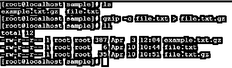
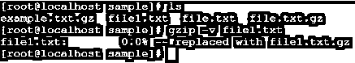
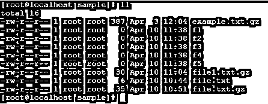
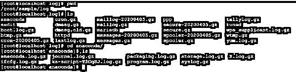
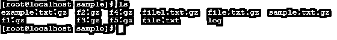
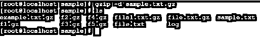

# Linux gzip

> 原文：<https://www.educba.com/linux-gzip/>

## Linux gzip 简介

Linux gzip 是一种压缩算法，用于减小文件大小并保持原始文件大小、时间戳和所有权。Linux gzip 也称为 gunzip。gzip 是一个软件应用程序或工具，用于压缩或解压缩具有现有文件属性的文件。在 Linux 操作系统中，我们有不同的压缩和解压缩技术，但 gzip 压缩速度更快，为每秒 43.95 MB，解压缩速度为每秒 88.25 MB。

**语法:**

<small>网页开发、编程语言、软件测试&其他</small>

`gzip [ option ]... [ file | path of directory ]...`

按照上面的 gzip 语法，我们需要在 gzip 命令中提供不同的选项，并提供我们需要压缩的文件或目录。

### Linux gzip 命令如何工作？

基本上 gzip 算法是基于“DEFLATE”算法。它是 LZ77 和霍夫曼编码的结合。在压缩任何数据或文件时，我们需要考虑不同的东西，如 10 字节的头、幻数(1f 8b)、DEFLATE 压缩方法、1 字节的头标志、4 字节的时间戳、压缩标志和操作系统 ID。如果需要，额外的报头被报头标志允许。在主体中，压缩的有效负载包含一个 DEFLATE。在页脚中，它包含 CRC-32 校验和、8 字节页脚值和原始未压缩数据的长度。借助页眉、正文和页脚，它将有助于压缩数据或文件。

本质上，gzip 通常用于压缩单个文件。但是，如果您想要压缩存档数据或数据集合，我们可以在单个 tar 存档中进行压缩。它也被称为焦油球。

### Linux gzip 的实现实例

下面是 Linux gzip 的例子:

#### 1.压缩文件

简单地说，我们可以用任何选项压缩单个文件。压缩后，原始文件将被删除并转换为压缩格式。

**命令:**

`gzip example.txt`

**说明:**在样本目录中，我们有 samle.txt 文件(参考截图 1 (a))。我们用默认的 gzip 方法压缩文件。gzip 保存了文件的时间戳、所有权和名称等原始文件信息。

**输出:**

截图 1 (a)

截图 1 (b)

#### 2.保持原始罚款

如果你想在压缩时保留原始文件，那么我们可以在 gzip 命令中使用“-c”关键字。

**命令:**

`gzip -c file.txt > file.txt.gz`

**说明:**在样本目录中，我们有 file.txt 文件(参考截图 2 (a))。我们正在压缩文件，但保持原始文件不变。按照上面的命令，我们使用“-c”关键字，它告诉 gzip 命令在标准输出上写并重定向到输出文件(参见截图 2 (b))。

**输出:**

截图 2 (a)

截图 2 (b)

#### 3.详细输出

如果你想输出每个文件的压缩或解压缩过程的名称和百分比，那么我们将在 gzip 命令中使用"-v "选项。

**命令:**

`gzip -v file1.txt`

**说明:**在示例目录中，我们有 file1.txt 文件。现在，我们使用详细选项“-v”压缩 file1.txt 文件。

**输出:**

#### 4.压缩多个文件

在 gzip 中，我们有压缩多个文件的功能。

**命令:**

`gzip f1 f2 f3 f4 f5`

**说明:**在样本目录中，我们有多个文件(f1、f2、f3、f4 和 f5)(参见截图 4 (a))。我们正在压缩所有的文件(参考截图 4 (b))。

**输出:**

截图 4 (a)

截图 4 (b)

#### 5.压缩目录文件

gzip 将递归压缩整个目录结构，并压缩目录及其子目录中的所有文件。

为了压缩目录，我们需要在 gzip 命令中使用“-r”选项。

**命令:**

`gzip -r log`

**说明:**

在示例目录中，我们有一个日志目录。在日志目录中，我们有多个文件和子目录(参见截图 5 (a))。在 gzip 命令中使用“-r”选项，我们可以压缩其中的所有文件和子目录(参考截图 5 (b))。

**输出:**

截图 5 (a)

截图 5 (b)

#### 6.压缩级别

在 gzip 中，有不同的压缩比例。根据我们的要求，我们可以改变压缩比，加快压缩速度。默认情况下，压缩率为-6。在 gzip 中，压缩比和压缩速度彼此成反比，即，如果压缩比高，则压缩速度低，或者压缩比小于压缩速度高。使用“-1”是压缩速度高但压缩比低。选项“-9”具有高压缩比，但压缩速度较低。

**Note:** If we will use the high compression ration option in gzip command. It will need more CPU | Computation power to execute the process | task.

**命令:**

`gzip -9 sample.txt`

**说明:**根据压缩速度和压缩比，我们可以使用 gzip 命令中的不同选项。在上面的例子中，我们使用了“-9”选项。它有一个高压缩比，但压缩速度较低。**T3】**

**输出:**

截图 6 (a)

截图 6 (b)

#### 7.解压缩文件

在 gzip 中，我们可以压缩多个文件和目录。这样，我们就可以减压了”。gz”文件。我们有通过 gzip 解压和压缩数据的功能。

为了解压缩数据，我们可以使用“-d”选项。

**命令:**

`gzip -d sample.txt.gz`

**说明:**在样本目录中，我们有压缩文件“sample.txt.gz”(参考截图 6 (a))。借助“-d”选项，我们可以将“sample.txt.gz”文件解压缩为原始文件格式。txt”。文件解压缩后，我们就能够进行正常的文件操作了。

**输出:**

截图 7 (a)

截图 7 (b)

### 结论

我们已经看到了不完整的“Linux gzip”概念，以及正确的示例、解释和带有不同输出的命令。gzip 软件用于文件和目录压缩和解压缩。这将有助于正确清理操作系统，并保持未使用的数据或文件的压缩格式。如果将来我们可以解压缩它，并使用相同的压缩文件。

### 推荐文章

这是一个 Linux gzip 的指南。在这里，我们讨论 Linux gzip 命令是如何工作的，以及它的不同命令、例子和代码实现。您也可以浏览我们推荐的其他文章，了解更多信息——

1.  [Linux tee 命令](https://www.educba.com/linux-tee-command/)
2.  [Linux OD](https://www.educba.com/linux-od/)
3.  [Linux uniq](https://www.educba.com/linux-uniq/)
4.  [Linux 创建文件](https://www.educba.com/linux-create-file/)

