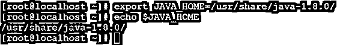
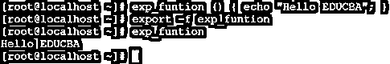
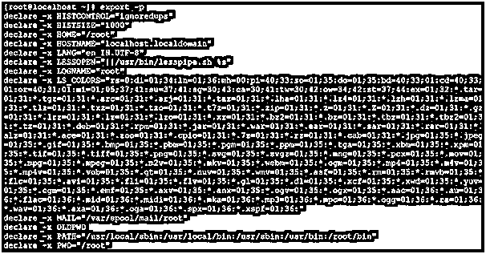
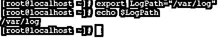
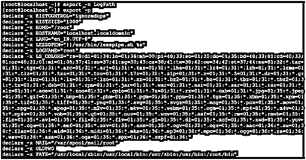
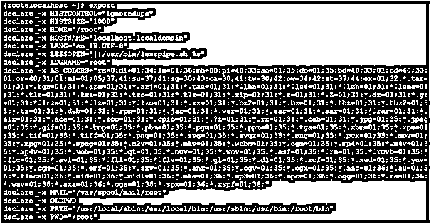
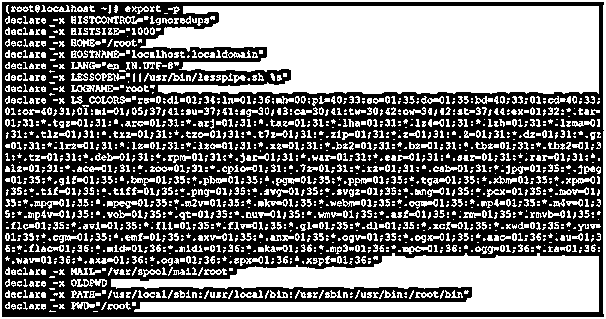

# Linux 导出

> 原文：<https://www.educba.com/linux-export/>

## Linux 导出简介

在 Linux 生态系统中，export 命令用于在服务器级别导出路径。它主要用于 Linux 级别的 shell 或 bash 作业。这是在 shell 作业上传递变量的一种非常重要的方式。export 命令也称为 BASH 内置命令。

下面是环境中存在的两个不同的导出路径或变量。

<small>网页开发、编程语言、软件测试&其他</small>

1.  全局路径
2.  会话级路径。

导出命令实用程序是由 Jim Meyering 编写的。

### 导出命令的语法

`export [-f -n] [name[ = value] ... ]`
或
`export -p`

*   **export:** 我们可以在语法或者命令中使用 export 关键字。它将以两种不同的方式工作，即命令与参数和导出路径。根据要求，export 命令将在全局级别或会话级别导出路径。
*   **-f:** 它将显示在实时 shell 环境中导出的所有名称的列表。
*   **-n:** 它将从导出列表中删除名称。
*   **-p:** 它会将名称作为函数导出。

### Linux 导出命令是如何工作的？

export 命令主要用于导出 shell 变量的路径，或者导出 Linux 环境下的路径应用程序路径。

导出路径是全局的或登录会话级别的，即全局变量/path 将在会话或服务器重新启动后可用，但登录会话路径或变量范围仅在当前会话中可用。如果服务器或会话将重新启动，会话的作用域将不再有效。

当我们导出路径时，shell 作业或应用程序作业也可以访问该路径。我们也可以导出软件路径。下游应用程序或软件将可以访问相同的导出软件路径。不需要为他们安装任何单独的软件包，他们可以使用或访问导出软件路径。

### 实现 Linux Export 命令的示例

下面是 Linux 导出命令的例子:

#### 示例# 1–导出名称值

在 Linux 环境中使用导出名称值是一种非常简单和常见的方法。当我们在 Linux 上导出名称值时，名称值的范围仅限于登录 shell。如果 shell 会话消失，那么 name-value 的作用域也将消失。

**Note:** If we need to keep the name value is permanent. We need to do the changes in the environment file of Linux.

**命令:**

`export JAVA_HOME=/usr/share/java-1.8.0/`

**说明:**根据上面的导出命令，我们正在导出 Linux 环境下的 JAVA_HOME 路径。但是默认情况下，如果 java 是由最终用户手动安装的，则路径不会被导出(参见屏幕截图 1 (a))。我们需要通过 export 命令导出 JAVA_HOME 路径(参考截图 1 (b))。但是导出名称值是临时的；它不会在环境中永久存在。一旦会话将被终止，导出名称-值将消失。

**Note:** To keep the name value is permanent in the Linux environment. We need to update the export command in the environment file.

**命令:**

`echo $JAVA_HOME`

**输出:**

**命令:**

`export JAVA_HOME=/usr/share/java-1.8.0/
echo $JAVA_HOME`

**输出:**

#### 示例 2–导出函数

在 export 命令中，我们可以导出 shell 终端函数。我们需要在 export 命令中使用特殊的"-f "标志。

**Co**T2】mmand:

`export -f exp_funtion`

**说明:**借助 export 命令，我们能够在 shell 提示符下导出函数。按照下面的命令，我们正在导出“exp _ funtion”函数。在导出函数之前，我们得到了“命令未找到错误”(参见截图 2 (a))。要导出函数，首先，我们需要用特定的函数名(我们已经使用了“exp _ funtion”函数名)在 shell 中编写函数。在 export 命令中，我们需要在命令中使用“-f”选项。一旦函数将被导出，我们就可以在 shell 作业中使用它们的名称或作为普通命令来访问函数(参见截图 2 (b))。

**命令:**

`exp_function`

**输出:**

**代码:**

`exp_function () { echo “Hello EDUCBA”; }
export -f exp_funtion
exp_function`

**输出:**

#### 示例 3–从导出列表中删除姓名

在导出命令中，我们可以从导出列表中删除导出名称列表。要从导出的列表中删除名称值，我们需要在 export 命令中使用“-n”选项。

**命令:**

`export -n LogPath`

**说明:**根据上面的导出命令，我们可以从导出列表中删除导出条目，因为我们都是 shell 环境。根据截图 3 (a ),我们列出了出口值列表。然后我们在 Linux 环境“LogPath”中添加导出值(参考截图 3 (b) & (c))。之后，我们将从 Linux 环境中删除相同的导出值(参见截图 3 (d))。

**命令:**

`export -p`

**输出:**

**命令:**

`export LogPath=” /var/log”
echo $LogPath`

**命令:**

`export -p`

**命令:**

`export -n LogPath
export -p`

#### 实施例 4

在 Export 命令中，我们能够打印环境中的所有导出值。它将显示 Linux 环境的所有全局导出值。

**命令:**

`export`

**解释:**根据上面的命令，我们将获得 Linux 级别的导出值。这些值在所有 shells 中都是全局可用的。

**命令:**

`export`

**输出:**

**

** 

#### 示例 5–打印登录 Shell 的导出值

在导出命令中，我们提供了打印导出值的功能，该功能仅适用于登录 shell。在 shell 窗口中可见的导出值不一定是全局有效的。

打印登录 shell 的当前导出值。我们需要在 export 命令中使用“-p”选项。

**命令:**

`Export -p`

**解释:**根据上面的命令，我们将获得当前登录 shell 的导出值。

`export -p`

**输出:**

**

** 

### 结论

我们已经看到了“Linux Export Command”的完整概念，以及正确的示例、解释和带有不同输出的命令。export 命令可以在全局或 shell 级别定义或导出路径或值。运行应用程序或 shell 级别的作业非常有用。

### 推荐文章

这是一个 Linux 导出指南。在这里，我们讨论 Linux Export 命令及其不同命令的概述、解释以及示例和代码实现。您也可以浏览我们推荐的其他文章，了解更多信息——

1.  [Linux 的优势](https://www.educba.com/advantage-of-linux/)
2.  [Linux 系统命令](https://www.educba.com/linux-system-commands/)
3.  [Linux 发行版](https://www.educba.com/linux-distributions/)
4.  [Linux 操作员](https://www.educba.com/linux-operators/)

