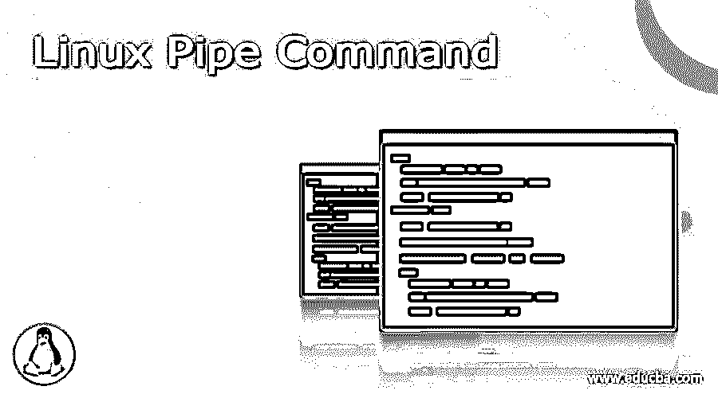

# Linux 管道命令

> 原文：<https://www.educba.com/linux-pipe-command/>

## 管道命令简介

管道是重定向的一个方面，即，将任何标准输出传送到另一个目标路径，这通常在 Unix 和 Linux 类操作系统中使用，以便将一个进程/命令/程序的输出发送到另一个/程序/命令/进程，用于任何进一步的处理。Linux/Unix 系统允许一个命令的 stdout 连接到其他命令的 stdin，这可以通过管道字符' | '来实现

管道命令用于传输两个或多个命令的输出，一个命令的输出将作为另一个命令的输入，这个命令输出将作为后续命令的输入，如此循环下去。我们也可以把它看作不同命令、程序或进程之间的虚拟连接。该进程的命令行被称为过滤器。

<small>网页开发、编程语言、软件测试&其他</small>

管道通常是单向的，这意味着数据将通过管道从左向右流动。

**概念**

UNIX 和 Linux 系统中的每个程序主要有 3 个内置数据流:

1)标准输入(0)–>标准输入
2)标准输出(1)–>标准输出
3)标准错误(2)–>标准错误

**每当我们使用“管道”时，“管道”命令将从命令中取出标准输出，并将其传输到后续命令的标准输入中。

**语法:**

管道命令语法很简单。

`command1 | command2 | command3 | .... | commandN`

**选项**

由于管道类似于重定向操作符，我们可以在不同的命令中使用它。下面提到了一些选择:

1) grep -I filename | sort:在这种情况下，grep 结果将从 filename 中获取，并将作为 sort 命令的输入，sort 命令将以默认模式对数据进行排序。

2) ls -l | ls File1:这里将列出文件列表，其输出将被传递给 ls 命令，以便从一堆文件和目录中搜索 File1。

3)sort-r file.txt | grep-I“Country”:在此选项中，sort 命令将从 file . txt 中获取输入，并以相反的顺序对数据进行排序，然后将输出传递给 grep 命令，该命令将从数据重定向中搜索关键字“Country”。

让我们在示例的帮助下更详细地理解管道命令概念的概念。

**1)列出所有文件和目录，并将输入传递给 more 命令**

`Command: ls -l | more`

**输出:**

注意:more 命令将 ls -l 的输出作为输入。该命令的结果将显示 ls -l 的输出，一次一屏，但只显示一微秒，之后 pipe 将像一个容器一样，接受 ls -l 的输出，并将结果作为输入传递给 more。该命令不会使用磁盘将 ls -l 命令的标准输出连接到 more 命令的标准输入，因为管道通常在操作系统的主内存中实现。

我们也可以使用下面的命令序列来获得与 I/O 重定向操作符相比较的结果。

**命令:**

`ls -l -> temp1
more -> temp1 (or more temp)
{content of the temp}
rm temp1`

以上两个命令的输出是相同的。

**2)使用 sort 和 uniq 命令对文件进行排序并打印不同的值**

**命令:**

`sort file.txt | uniq`

上述命令将首先对文件进行排序，并在终端上打印不同的数据集。

**3)使用 head 和 tail 命令打印文件特定范围内的行**

**命令:**

`cat file.txt | head -8 | tail -4`

上面的命令将使用 cat 命令打开文件，然后从 file.txt 中选择前 8 行，而不是后 4 行，并打印输出这两个命令共有的那些行。

4)使用 ls 发现列表，然后打印匹配文件中与特定模式匹配的所有行。

**命令:**

`ls -l | find . -type f -name '*.tmp' -exec grep -i 'country' {} \`；

执行命令时，将列出所有文件，并选择带有。tmp 扩展名，将搜索类似“国家”的模式，并打印那些包含国家关键字的行。

**5)使用 cat、tee、grep 和 wc 命令，以读取用户的输入，并存储在文件中，以打印行数**

**命令:**

`cat a.txt | grep "country India" | tee a.txt | wc -l`

上面执行的命令将打开文件，然后搜索文本“country India”，通过使用 tee 命令，它将存储在 a.txt 中，然后计算 a.txt 中的总行数

**6)使用 cat 和 sed 命令将特定文本替换为另一个文本**

**命令:**

`cat file.txt | sed -i s/country/state/g'`

当上述命令执行时，它将打开文件并搜索 country 关键字，并在输出文件中用 state 文本全局替换它

**7)使用 cat、cut 和 echo 命令，用分隔符**剪切出特定的列

**命令:**

`cat file_states.txt | cut -d ' ' -f 1 | sort -r`

该命令将处理带分隔符的 file_states.txt，并将剪切以“，”作为分隔符的第一列，然后以反向排序方式显示文件的内容。

**输出:**

### 结论

这样，在不同示例的帮助下，我们学习了 pipe 命令及其概念和应用。

### 推荐文章

这是一个 Linux 管道命令指南。在这里，我们讨论介绍，语法，管道命令以及概念和应用的例子。您也可以看看以下文章，了解更多信息–

1.  [Linux Curl 命令](https://www.educba.com/linux-curl-command/)
2.  [信任管理命令](https://www.educba.com/rust-admin-commands/)
3.  [Linux Cal 命令](https://www.educba.com/linux-cal-command/)
4.  [Linux 中的 GREP 命令](https://www.educba.com/grep-command-in-linux/)

