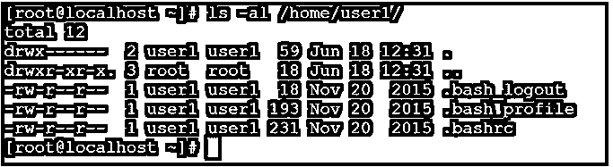
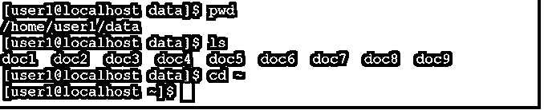
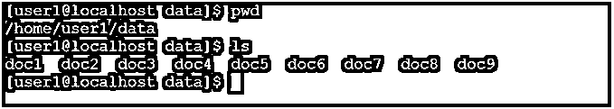
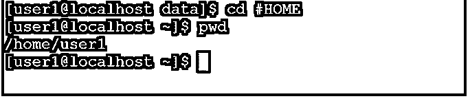

# Linux 主目录

> 原文：<https://www.educba.com/linux-home-directory/>

## Linux 主目录介绍

在 Linux 生态系统中，主目录也称为主目录。这是用户登录到 Linux 环境时的主要入口点。它负责将文件、文件夹、数据和软件存储在/home 目录中，并分别存储在各个用户配置文件中。

**主目录的语法**

<small>网页开发、编程语言、软件测试&其他</small>

`/home [ User Name ]`

*   **/home:** 我们可以使用/home 作为 Linux 主目录的默认路径。这是输入个人用户配置文件的主要或起始路径。
*   **用户名:**我们需要在“/home”路径中传递用户名。这将有助于输入个人用户配置文件路径(根据文件系统)。

### Linux 主目录命令是如何工作的？

当我们在 Linux 系统中创建任何用户时。创建用户时，将发生 5 个不同的步骤。用户目录的创建遵循同样的 5 个不同的步骤。当在 Linux 操作系统中添加任何用户时，默认情况下，用户目录将以相同的用户名创建在“/home”路径中。

用户目录也称为用户主目录。它将提供 shell 和 bash 的基本环境。这将有助于执行 shell 或一些应用程序级的作业。

默认情况下，文件列表将创建在用户“/home”目录中。

*   **bash_logout:** 文件负责在用户或终端注销时执行任何动作。
*   **bash_profile:** 当用户配置文件将在 Linux 环境中加载时，该文件负责执行任何操作。
*   Bashrc: 文件负责其中必要的东西。这将有助于 bash 或 shell 或其他应用程序。我们可以放入函数、别名、shell 或 bash 选项等。

正如我们已经看到的，默认的主目录路径将出现在“/home”路径中。但不是强制性的，它会一直存在。根据需要，我们可以为个人用户更改主目录。我们可以在“usermod”命令的帮助下更改默认的主目录(根据用户级别)。

### 实现 Linux 主目录的例子

下面是一些例子:

#### 1.主目录

当我们在 Linux 级别上创建任何用户时，用户主目录将自动在“/home”路径中以相同的用户名创建。

**命令:**

`ls /home/`

**输出:**

截图 1 (a)

`ls -al /home/user1/`

截图 1 (b)

**说明:**根据上面的命令，我们可以列出用户主目录的数量。在添加任何用户之前，环境中没有可用的主目录(参见屏幕截图 1 (a))。当我们在 Linux 环境中添加用户时。主目录将在“/home”路径中创建。主目录名仅类似于用户名(参考截图 1 (a))。用户可以使用相同的目录来存储多个文件、文件夹、数据等。它拥有在文件系统上存储或从主目录中检索数据的必要权限。

如前所述，当任何用户或主目录都将在“/home”路径下创建时。它将在同一个工作目录中创建默认的 3 个文件，即 bash_logout、bash_profile 和 bashrc。

`useradd user1
ls /home/`

#### 2.使用 cd 命令的主目录

在 Linux 环境中，我们拥有直接进入主目录的功能。为此，我们只需要在 shell 提示符下运行简单的“cd”命令。

**Co**T2】mmand:

`cd`

**输出:**

截图 2 (a)

`cd
pwd`

截图 2 (b)

**解释:**按照上面的命令，我们只是简单地使用“cd”命令。这是一个简单的命令，但是在 Linux 环境中很有用。当我们在任何当前目录下工作，并且我们需要从当前工作目录移动到主目录时。我们只是简单地使用“cd”命令。根据下面的截图 2 (a)，我们使用“用户 1”用户登录，当前工作目录是“/home/user1/data”。现在我需要移动或者回到主目录。我刚刚在 shell 窗口中使用了“cd”命令(参考截图 2 (b))。

`Whoami
Pwd
ls`

#### 3.带颚化符选项的主目录

我们可以使用“cd”命令从任何位置进入主目录。类似地，我们可以通过“波浪号(~)”选项实现相同的功能。

**命令:**

`cd ~`

**输出:**

截图 3 (a)

`cd ~`

截图 3 (b)

**说明:**如在主目录中看到的“cd”命令概念。类似地，我们可以看到带有波浪符号或选项的概念。根据下面的截图 3 (a)，当前的工作目录是“/home/user1/data”。不管我们在哪里。如果我们需要从当前的工作目录转移到主目录。我们可以在 cd 命令中使用波浪符号。按照上面的命令，我们从当前的工作目录移动到主目录(参见截图 3 (b))。

`ls
cd ~`

#### 4.带有主变量的主目录

在 Linux 环境中，我们拥有使用环境变量的功能。在“HOME”变量的帮助下，我们可以直接转到主目录。

注意:这将有助于在不同的 shell 作业或其他应用程序中直接呼叫总部。

**命令:**

`cd #HOME`

**输出:**

截图 4 (a)

`cd #HOME
pwd`

截图 4 (b)

**解释:**在 Linux 中，有大量的全局变量。“#HOME”变量是 Linux 操作系统中的一个全局变量。按照上面的命令，我们能够从任何工作目录移动到主目录。根据下面的截图 4 (a ),我们在“/home/user1/data”目录中。根据当前工作目录，我们能够从“/home/user1/data”目录移动到主目录(参见屏幕截图 4 (b))。

`pwd
ls`

### 结论

我们已经看到了“Linux 主目录命令”的完整概念，以及正确的示例、解释和带有不同输出的命令。主目录将定义结构的适当框架。它是 Linux 用户的主要授权存储。当任何用户将 Linux 操作系统添加进来时。默认情况下，主目录将分配给该用户。

### 推荐文章

这是一个 Linux 主目录指南。这里我们也讨论一下 linux 主目录命令的介绍和工作原理？以及不同的示例及其代码实现。您也可以看看以下文章，了解更多信息–

1.  [Linux 历史命令](https://www.educba.com/linux-history-command/)
2.  [Kali Linux NetHunter](https://www.educba.com/kali-linux-nethunter/)
3.  [卡利 Linux 侏儒](https://www.educba.com/kali-linux-gnome/)
4.  [Linux JQ](https://www.educba.com/linux-jq/)

