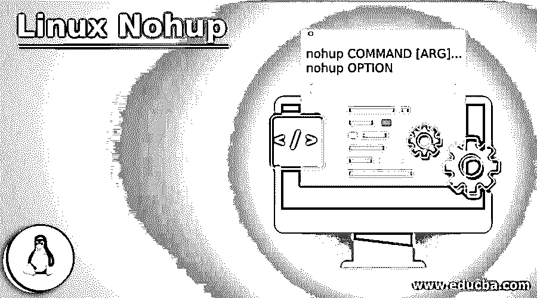
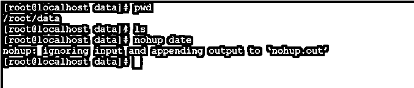
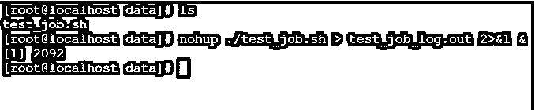
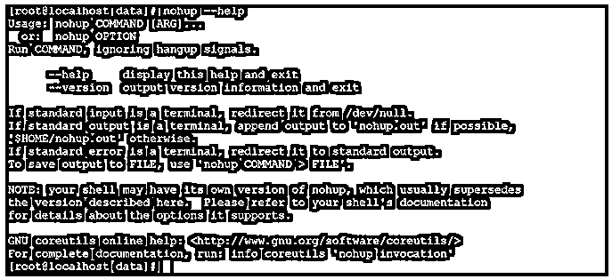

# Linux Nohup

> 原文：<https://www.educba.com/linux-nohup/>

## Linux Nohup 简介

在 Linux 生态系统中，当客户端或用户想要从 Linux 环境中注销时，用户打开的会话或程序将会关闭或终止。如果用户希望保留一些程序或应用程序，将会打开，或者在用户会话关闭后，它将处于运行状态。然后 nohup 实用程序出现了，在 nohup 实用程序的帮助下，我们可以在用户注销 Linux 会话后保持程序或应用程序处于运行状态。

nohup 命令实用程序是由 Jim Meyering 编写的。

<small>网页开发、编程语言、软件测试&其他</small>

Nohup 命令的语法

`nohup COMMAND [ARG]...
nohup OPTION`

*   nohup:我们可以在语法或命令中使用 nohup 关键字。它将以两种不同的方式工作，即带有参数和 nohup 选项的命令。根据命令输入，nohup 将保持作业处于运行状态，并保持标准输出和错误文件。
*   命令:我们可以提供兼容的 nohup 命令。
*   OPTIO:我们可以提供不同的标志作为与 nohup 命令兼容的选项。
*   ARG:根据要求，我们可以向 nohup 命令传递不同的参数。

### Linux Nohup 命令是如何工作的？

*   在 Linux 中，nohup 命令非常适合那些执行时间过长的 shell 作业。在这种情况下，我们需要使用 nohup 实用程序，并在 nohup 实用程序的帮助下执行那些长期运行的 shell 作业或应用程序作业。nohup 实用程序将保持对它的正确跟踪，并提供与分配的作业相关的所有日志信息。
*   nohup 命令将接受带参数的命令和 nohup 选项。根据输入，nohup 命令将作业保留在后台并保持运行状态。
*   默认情况下，nohup 命令的标准输出将重定向到 nohup.out 文件。nohup.out 将出现在当前工作目录中。
*   作业将在 nohup 实用程序的帮助下运行，标准错误将重定向到 nohup.out 文件，即在 nohup.out 文件中，您将获得标准输出日志以及标准错误日志。
*   根据需要，我们可以将输出日志文件重定向到除 nohup.out 文件之外的其他文件。

### 实现 Linux Nohup 命令的示例

下面是一些例子:

#### 1.NohupCommand

在 Linux 环境中使用 nohup 命令是一种非常简单和常见的方法。它将执行任何外壳或程序或命令，当 Linux 终端关闭时，程序或外壳作业仍将运行。输出日志将在 nohup.out 文件中更新。

**命令:**

`nohup date`

**解释:**根据上面的命令，我们使用 nohup 命令和 date 命令。我们提供命令参数作为 nohup 命令的输入。一次，我们会执行命令。它将创建 nohup.out 文件。该文件将包含所有日志或命令输出相关信息(参见屏幕截图 1 (a))。一旦作业或命令被 nohup 命令触发，nohup.out 填充将自动创建。敬请查收截图 1 (b)。

**输出:**

截图 1 (a)

`cat nohup.out`

截图 1 (b)

#### 2.Nohup 命令–在后台运行作业

在 nohup 命令中，我们可以在后台运行作业或命令。要在后台运行作业，我们需要在 nohup 命令中使用“&”。

**Co**T2】mmand:

`nohup ./test_job.sh &`

**说明:**借助 nohup 命令，我们能够在后台触发作业，并借助进程 id (1969)和 nohup.out 文件保持适当的作业跟踪。根据下面的截图 2 (a)，我们已经编写了一个 bash 作业“test_job.sh”。在 nohup 命令的帮助下，我们正在执行 bash 作业，该作业将在后台运行。

一旦作业将执行，它将显示整数。整数只是一个进程 id。进程 id 将有助于跟踪后端进程。我们还可以在同一个进程 id 的帮助下杀死作业(参考截图 2 (b))。

**输出:**

截图 2 (a)

`ps -ax | grep -i 1969`

截图 2 (b)

#### 3.Nohup 命令–重定向输出文件

在 nohup 命令中，我们能够将自己的输出或日志文件分配给任何 nohup 命令。它将在自己的位置创建自己的文件。要使用自己的日志文件，我们需要使用 nohup 命令中的重定向选项。

**命令:**

`nohup ./test_job.sh > test_job_log.out 2>&1 &`

**说明:**默认情况下，在 nohup 命令中，会创建 nohup.out 文件来存储作业或命令日志以及命令日志。但是如果我们不想存储日志 nohup.out 文件。然后为 nohup 命令保留或创建自己的日志文件。按照上面的命令，我们将日志输出重定向到当前工作目录中的“test_job_log.out”文件。

**注:**根据需要，我们可以在不同的位置定义或创建日志文件。

**输出:**

截图 3 (a)

`cat test_job_log.out`

截图 3 (b)

#### 4\. NohupCommand – Help

在 nohup 命令中，我们有了理解 nohup 实用程序或命令的功能。

**命令:**

`nohup --help`

**说明:**根据上面的命令，我们可以找到对 nohup 命令的基本理解。它将显示 nohup 实用程序中可用的默认命令的数量。

**输出:**

#### 5\. NohupCommand–Version

在 nohup 命令中，我们能够在当前的 Linux 操作系统中找到 nohup 版本。

**命令:**

`nohup --version`

**解释:**根据上面的命令，我们将获得 nohup 实用程序的版本信息。

**输出:**

### 推荐文章

这是一个 Linux Nohup 的指南。在这里，我们还将讨论简介以及 linux nohup 命令是如何工作的？以及示例及其代码实现。您也可以看看以下文章，了解更多信息–

1.  [Linux 添加用户](https://www.educba.com/linux-add-user/)
2.  [Linux 删除用户](https://www.educba.com/linux-delete-user/)
3.  [Kali Linux NetHunter](https://www.educba.com/kali-linux-nethunter/)
4.  [卡利 Linux 侏儒](https://www.educba.com/kali-linux-gnome/)

