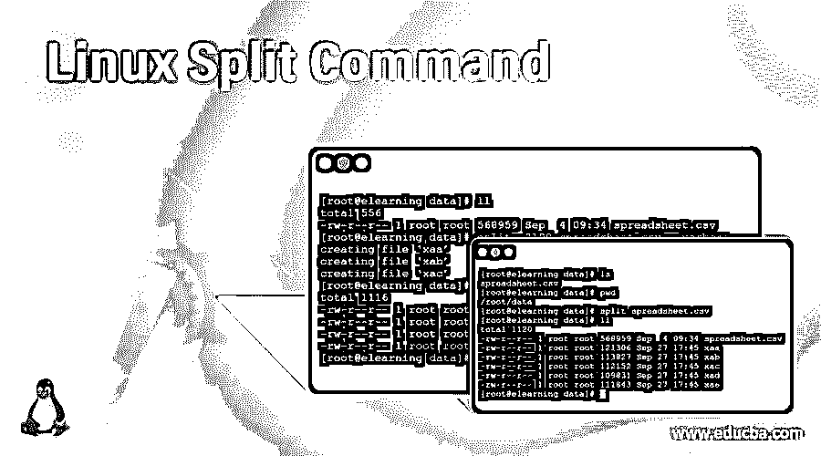
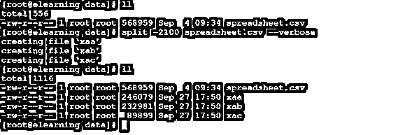
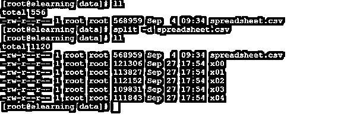
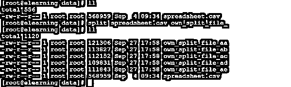

# Linux 分割命令

> 原文：<https://www.educba.com/linux-split-command/>

## Linux Split 命令简介

在 Linux 操作系统中，split 命令用于将大文件分割或拆分成小文件。根据要求，我们可以提供或定义分割文件中可用的行数。但是默认情况下，分割文件中有 1000 行可用。当我们创建任何分割文件时，前缀将是 PREFIXaa、PREFIXab、PREFIXac 等等。初始前缀将以字母“x”开头。通常，split 命令用于巨大的日志或归档数据。

拆分实用程序是由托尔比约恩·格兰隆德和理查德·M·斯托曼编写的。

<small>网页开发、编程语言、软件测试&其他</small>

**语法:**

`split [ OPTION ]... [ INPUT [ PREFIX ] ]`

*   **split :** 我们可以在语法或命令中使用“split”关键字。它将采用不同的参数，如选项、输入文件(如日志或归档文件)。按照提供的参数，它将把大文件分割成小文件。
*   **选项:**我们可以提供不同的标志作为与“split”命令兼容的选项。
*   **输入:**根据条件或要求，我们可以为 split 命令提供文件或文件路径。
*   **前缀:**如果我们不需要默认的前缀共振峰，而我们需要自己的前缀格式，那么我们可以使用相同的选项。

### Linux Split 命令是如何工作的？

Linux 是一个支持多用户的操作系统。它将支持多个服务器或应用程序。在运行这些服务器或应用程序时，它们会生成巨大的日志。很难访问日志以及读取相同的日志文件。在 Linux 环境中，我们有多种工具和实用程序来将大文件调整为小文件。拆分命令就是其中之一。spilt 命令用于将大文件分成小文件。默认拆分大小为 1000 行。根据要求，我们也可以改变默认大小。

以下是与 split 命令兼容的选项列表。

| 服务请求编号 | [计]选项 | 描述 |
| One | -a，–后缀-长度=N | 这将有助于生成“N”长度的后缀。默认大小为“2”。 |
| Two | –附加后缀=后缀 | 这将有助于在文件名后添加附加后缀。 |
| Three | -b，–字节=大小 | 这将有助于保持每个输出文件的字节大小 |
| Four | -C，–行字节=大小 | 这将有助于在每个输出文件中放置最多大小字节的行 |
| Five | -d，–数字后缀[=FROM] | 使用数字后缀代替字母后缀会有所帮助。起始值的变化为“0”(默认值)。 |
| Six | -e，–省略空文件 | 这将有助于不生成带有'-n '的空输出文件 |
| Seven | –过滤器=命令 | 这将有助于编写 shell 命令。但是文件名将是“$FILE” |
| Eight | -l，–lines =数字 | 这将有助于把每个输出文件的行数 |
| Nine | -n，–number =块 | 这将有助于生成组块输出文件 |
| Ten | -u，–无缓冲 | 使用“-n r/…”将有助于立即将输入复制到输出。 |
| Eleven | –冗长 | 它将在每个输出文件打开之前显示命令操作和诊断 |
| Twelve | 救命 | 它将打印 split 命令帮助并自动退出。 |
| Thirteen | –版本 | 它将打印分割命令版本信息并自动退出。 |

### 实现 Linux Split 命令的示例

在 Linux 环境中，我们能够将大文件分割成小文件。

#### 示例 1–Linux Split 命令

**命令:**

`split spreadsheet.csv
ll`

**说明:**

按照上面的命令，我们正在分割“spreadsheet.csv”文件。一旦我们分割了文件。它会将文件分成 5 个不同的文件。单个分割文件包含 1000 行。

**输出:**

**

** 

#### 示例# 2–使用自定义行号

在 split 命令中，我们可以将大文件分割成多个自定义输出行。

**命令:**

`split -2100 spreadsheet.csv --verbose`

**说明:**

按照上面的命令，我们将文件分成 2100 行。在这里，我们提供自定义输入。我们使用了“–verbose”选项来显示当前运行的输出。

**输出:**

**

** 

#### 示例 3–创建数字后缀分割文件

在使用 Linux Split 命令时，我们能够将 Split 后缀从字母改为数字。

**命令:**

`split -d spreadsheet.csv`

**说明:**

分割大文件时，分割的文件将按字母顺序排列。但是我们在 split 命令中使用了“-d ”,并用一个数值来改变后缀。

**输出:**

**

** 

#### 示例 4–自定义后缀名称

在 Linux 中，我们可以为 split 命令指定自己的或自定义的后缀名称。

**命令:**

`split spreadsheet.csv own_split_file_
ll`

**说明:**

按照上面的命令，我们将大文件“spreadsheet.csv”分割成小文件。我们已经将输出文件分成了我们自己的定制文件。对于自定义文件，我们从“own_split_file_”开始。

**输出:**

**

** 

#### 示例 5–避免零大小分割输出文件

在 split 命令中，在拆分大文件时，小文件或零文件可能会创建到最后。为了避免这种情况，我们可以在 split 命令中使用"-e "选项。

**命令:**

`split -e spreadsheet.csv`

**说明:**

在将大文件分割成小文件时，可能会在最后创建零大小的文件。为了避免这种情况，我们可以在 split 命令中使用"-e "选项。它将避免创建零大小的文件。

**输出:**

**

** 

### 结论

我们已经看到了“Linux Split Command”的完整概念，以及正确的示例、解释和具有不同输出的命令。根据需求，我们可以将大文件分割成小文件大小(或行数)。在 split 命令选项的帮助下，我们可以读取或访问这个巨大的文件。

### 推荐文章

这是一个 Linux Split 命令的指南。在这里，我们将讨论 Linux Split 命令及其不同命令的概述，以及示例和代码实现。您也可以浏览我们推荐的其他文章，了解更多信息——

1.  [Kali Linux 命令](https://www.educba.com/kali-linux-commands/)
2.  [Linux 中的顶级命令](https://www.educba.com/top-commands-in-linux/)
3.  [Linux 自动挂载](https://www.educba.com/linux-automount/)
4.  [Linux Sed 替换](https://www.educba.com/linux-sed-replace/)

