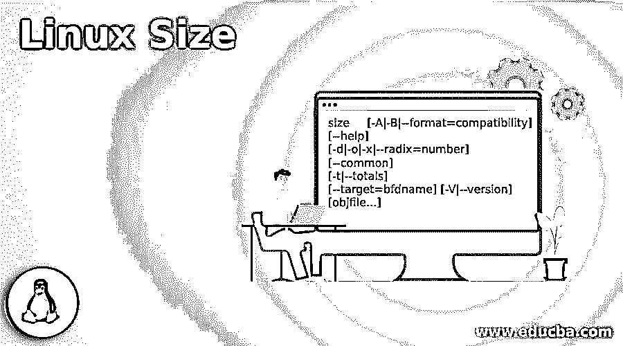
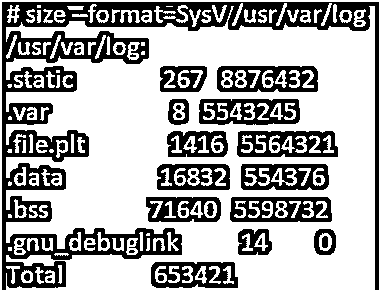
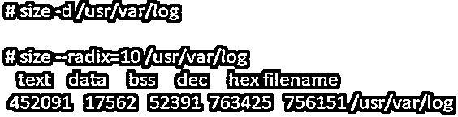
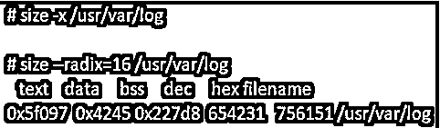
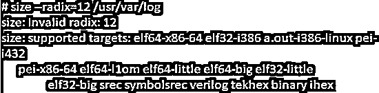
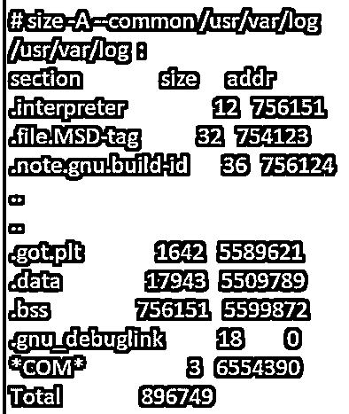
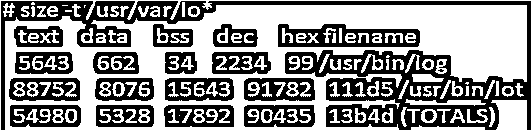

# Linux 大小

> 原文：<https://www.educba.com/linux-size/>

## Linux 大小的定义

Linux 中的 size 命令允许在其参数列表中列出目标文件或归档文件的分区大小和总大小。当我们没有在参数列表中指定目标文件时，那么默认情况下，使用' a.out '文件。在本教程中，我们将讨论它的语法，如何在 Linux 中使用 size 命令，它的选项，以及它们在不同例子中的用法。

**Linux 中 size 命令的语法:**

<small>网页开发、编程语言、软件测试&其他</small>

我们可以在 Linux 中以不同的格式和不同的选项使用 size 命令，如下所示:

`size     [-A|-B|--format=compatibility] [--help] [-d|-o|-x|--radix=number] [--common] [-t|--totals] [--target=bfdname] [-V|--version] [objfile...]`

### Linux 中的 Size 命令是如何工作的？

Linux 中的 Size 命令可以通过它的选项以不同的方式使用。下面是可以在 Linux 中与 size 命令一起使用的选项及其描述。

| **选项** | **描述** |
| -A &#124;-B–format = { sysv &#124; Berkeley } | 我们可以通过提及 SysV 或 Berkeley 中的格式来选择输出样式。默认情况下，如果没有提到格式，那么它采用 Berkeley。 |
| -o &#124;-d &#124;-x–radix = { 8 &#124; 10 &#124; 16 } | 以八进制、十进制或十六进制的顺序显示数字。 |
| -t-总计 | 仅打印伯克利格式的总尺寸。 |
| –常见 | 打印*COM* syms 的总大小 |
| –target =<bfdname></bfdname> | 要设置二进制对象文件格式 |
| @ | 从目标文件扫描选项 |
| 救命啊 | 显示“大小”命令中可用选项的列表。 |
| -v–版本 | 显示程序的版本。 |

### Linux Size 命令的示例

下面是一些例子:

#### 1.要获得默认大小的输出

size 命令将显示输出，该输出将为您提供关于 size 命令的 5 个值的信息，如 data、text、dec、bss 和 hex，如下所示。

**语法:**

`size directory_name`

**举例:**

`size /usr/var/log`

上面的结果是 Berkeley 格式的，我们也可以在如下所示的三个不同的命令中得到相同的输出:

#### 2.默认文件选项

如果参数中没有传递文件名，那么. out 文件将用作默认文件名，如下所示。在当前目录中，它将检查“a.out”文件并计算其大小，然后以 Berkeley 格式显示结果。

**语法:**

`size`

**举例:**

`size`

#### 3.要获得 SysV 格式的输出

当以 SysV 格式生成输出时，它将打印不同的部分以及每个部分名称的大小和地址。

**语法:**

`size –format=SysV dir_name`

**举例:**

`size --format=SysV /usr/var/log`

#### 4.以十进制指定输出值

当我们用参数列表传递选项'-d '时，我们将得到十进制格式的结果，如下例所示。

**语法:**

`size -d dir_name`

**举例:**

`size -d /usr/var/log`

#### 5.以八进制格式指定输出值

当我们用参数列表传递选项'-o '时，我们将得到八进制值格式的结果，如下例所示。

**语法:**

`size -o dir_name`

**举例:**

`size -o /usr/var/log`

#### 6.以十六进制格式指定输出值

当我们用参数列表传递选项'-x '时，我们将得到十六进制值格式的结果，如下例所示。

**语法:**

`size -x dir_name`

**举例:**

`size -x /usr/var/log`

#### 7.选项–基数

尺寸命令中的基数选项用于指定格式数，而不是使用十进制、十六进制或八进制。对于十进制，我们可以使用–radix = 10 的数字格式。

**语法:**

`size –radix=10 /dir_name`

**举例:**

`size --radix=10 /usr/var/log`

*   尺寸命令中的基数选项用于指定格式数，而不是使用十进制、十六进制或八进制。对于十进制，我们可以使用–radix = 10 的数字格式。

**语法:**

`size –radix=10 /dir_name`

**举例:**

*   尺寸命令中的基数选项用于指定格式数，而不是使用十进制、十六进制或八进制。对于八进制，我们可以使用数字格式–radix = 8。

**语法:**

`size –radix=8 /dir_name`

**举例:**

`size -o /usr/var/log`

*   尺寸命令中的基数选项用于指定格式数，而不是使用十进制、十六进制或八进制。对于十六进制，我们可以使用数字格式–radix = 16。

**语法:**

`size --radix=16 /dir_name`

**举例:**

`size --radix=16 /usr/var/log`

对于十进制、八进制和十六进制，我们只能分别使用 10、8、16 这样的格式数字。当我们使用任何其他格式的数字时，我们会得到一个错误，说“无效基数”。下面是一个无效基数格式的例子。

`size --redix=12 /usr/var/log`

#### 8.要显示公共符号计数

公共选项允许打印目标文件中所有公共符号的总数。默认情况下，格式将采取 Berkeley 文件格式，这也将用于包含在" bss "列的值中。

**语法:**

`size -A --common /dir_name`

**举例:**

`size -A --common /usr/var/log`

选项-A 用于 SysV 格式。在上面的例子中，最后一行有*COM*将给出值。

#### 9.以伯克利格式显示总数

选项-t(或 totals)允许在结果的末尾显示新的一行，打印列表中所有目标文件的值。使用-t 选项产生的结果如下所示。

**语法:**

`size -t /dir_name`

**举例:**

`size -t /usr/var/lo*`

### 结论

Linux 中的 size 命令是一个非常重要的命令，它允许在其参数列表中列出目标文件或归档文件的分区大小和总大小。当我们没有在参数列表中指定目标文件时，那么默认情况下，使用' a.out '文件。不同的格式用于显示输出格式，如十进制、八进制或十六进制。为了更好地理解，上面的教程中还解释了带有示例的选项。

### 推荐文章

这是一个 Linux 大小的指南。在这里，我们还将讨论大小命令的定义以及它在 linux 中是如何工作的？以及不同的示例及其代码实现。您也可以看看以下文章，了解更多信息–

1.  [Linux Kill 信号](https://www.educba.com/linux-kill-signals/)
2.  [Linux 观察命令](https://www.educba.com/linux-watch-command/)
3.  [Linux 分割命令](https://www.educba.com/linux-split-command/)
4.  [Linux 容器](https://www.educba.com/linux-container/)

