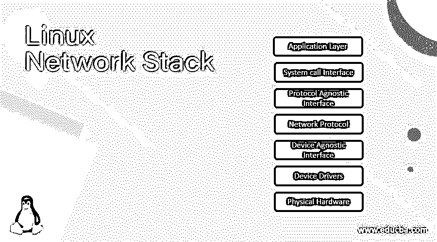
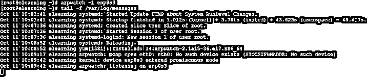
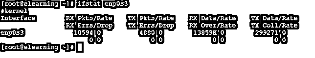

# Linux 网络堆栈

> 原文：<https://www.educba.com/linux-network-stack/>

## Linux 网络栈简介

在 Linux 操作系统中，网络堆栈对于应用程序与物理网络设备之间的通信非常有用。网络堆栈分为多层。有不同的网络层。同样不同的角色扮演着各自的角色。通常，所有操作系统都支持网络堆栈角色。在网络的帮助下，我们能够使用或连接不同的网络设备，如路由器、调制解调器、电缆调制解调器、ISDN 模式、Wi-Fi 设备、以太网卡、宽带连接器、令牌环卡等。在与不同设备通信时，物理层出现了。它以位格式表示数据，并仅以位格式与不同的设备物理层进行通信。

****Linux 网络协议栈的语法****

 **<small>网页开发、编程语言、软件测试&其他</small>**  **`Network Command/Utility [ OPTION ] ... [ FILE / IP / INPUT FILE / …]`

*   **网络命令/实用程序:**根据需要和用途，我们可以在语法或命令中使用“网络命令或实用程序”关键字。它将采取不同的参数，如选项，输入文件，IP 地址，不同的兼容选项。根据提供的参数，它将在屏幕上提供网络相关信息。
*   **选项:**我们可以提供不同的标志作为与“网络命令或实用程序”兼容的选项。
*   **文件/ IP /输入文件:**根据条件或要求，我们可以为“网络命令/实用程序”提供不同的选项或参数。

### Linux 网络栈是如何工作的？

Linux 是一个多用户支持操作系统，支持所有的网络堆栈功能。在与网络通信时，它会遵循这两种通信方式。首先，最终用户或客户端将请求访问或文件请求。第二，根据必要的访问或请求类型，请求将完全填充并设置对最终用户或客户端的确认。在这个网络过程中，许多不同的网络层出现了。

下面是图片中出现的图层列表。

*   应用层
*   系统调用接口
*   协议不可知接口
*   网络协议
*   设备无关接口
*   设备驱动程序
*   物理硬件
*   应用层:它涉及 TCP 和 UDP 协议。在应用层，不同的浏览器或其他访问互联网的应用程序在这一层工作。任何访问互联网的应用程序或作业都会在应用层进行考虑。当我们在任何工具或应用程序的帮助下打开或关闭网络级别的任何文件时，它将在同一个应用程序上中继。
*   系统调用接口:SCI 代表系统调用接口。这个调用将发生在应用层到内核层的时候。让我们继续编辑任何图像的示例。我们需要从网络或远程位置请求文件。在同样的情况下，我们向内核发送读取请求来编辑图像。
*   协议无关接口:在协议无关接口中，它将创建套接字。同一个创建的套接字负责两种类型的通信，即通话或监听。每个套接字都有自己的 ID。同一 id 将进一步专门用于一个应用。
*   网络协议:网络协议负责发送和接收数据。换句话说，我们可以说数据是如何发送或接收的。网络层控制网络中信息的发送和接收。具体来说，网络层在路由器级别或路由表上工作。这一层还提供网络路由信息。
*   设备不可知接口:设备不可知接口用于与内核级和网络驱动程序或设备驱动程序之间的数据通信或连接。
*   设备驱动程序:设备驱动程序层，在这一层中，网络设备将使用真正的设备驱动程序。该层被允许为传输准备数据。一旦数据准备好传输。它将通过网络设备传输数据。
*   物理硬件:物理硬件层也称为硬件层或网络硬件。在同一层上，数据包将从网络介质发送或接收。网络介质将是有线或无线的。

### 实现 Linux 网络栈的例子

让我们讨论 Linux 网络栈的例子。

*   #### Linux 网络堆栈:arpwatch

在 Linux 网络堆栈中，arpwatch 是一个用于观察以太网流量活动的实用程序。它还会观察变化的 IP 和 MAC 地址。

**命令:**

`arpwatch -i enp0s3
tail -f /var/log/messages`

**说明:**

按照上面的命令，我们正在使用网络实用程序，即 arpwatch。它正在监控“enp0s3”网络相间的活动，以及 arpwatch 实用程序是否发现相间电平有任何变化。它将在“/var/log/messages”文件中对其进行标记。

**输出:**

*   #### Linux 作业系统-ifstat

在 ifstat 实用程序的帮助下，我们能够获得网络接口的详细信息。

**命令:**

`ifstat enp0s3`

**说明:**

在 ifstat 命令中，我们正在获取网络界面的详细信息，即“enp0s3”。

**输出:**

*   #### Linux 网络堆栈–nload

在 nload 实用程序的帮助下，我们能够获得关于网络流量的详细信息。

**命令:**

`nload`

**说明:**

按照上面的命令，我们能够获得系统的网络负载或流量信息。

**输出:**

**T2】**

 ***   #### Linux 网络堆栈–hping

在 Linux 中，我们有分析 TCP 和 IP 的功能。

**命令:**

`hping3 -S 192.168.56.60 -p 80`

**说明:**

按照上面的命令，我们正在分析 IP 地址 192.168.56.60 上的 TCP 端口 80。

**输出:**

### 结论

我们已经看到了“Linux 网络堆栈”的完整概念，以及正确的示例、解释和带有不同输出的命令。当数据在不同的应用程序级别或作业级别之间流动时，了解网络流的方式以及不同的层非常重要。

### 推荐文章

这是一个 Linux 网络协议栈的指南。这里我们讨论一下 Linux 网络协议栈的介绍，语法，Linux 网络协议栈是如何工作的？举例说明。您也可以浏览我们的其他相关文章，了解更多信息——

1.  [Linux Kill 信号](https://www.educba.com/linux-kill-signals/)
2.  [Linux 自动挂载](https://www.educba.com/linux-automount/)
3.  [Linux 大页面](https://www.educba.com/linux-hugepages/)
4.  [Linux 容器](https://www.educba.com/linux-container/)

****