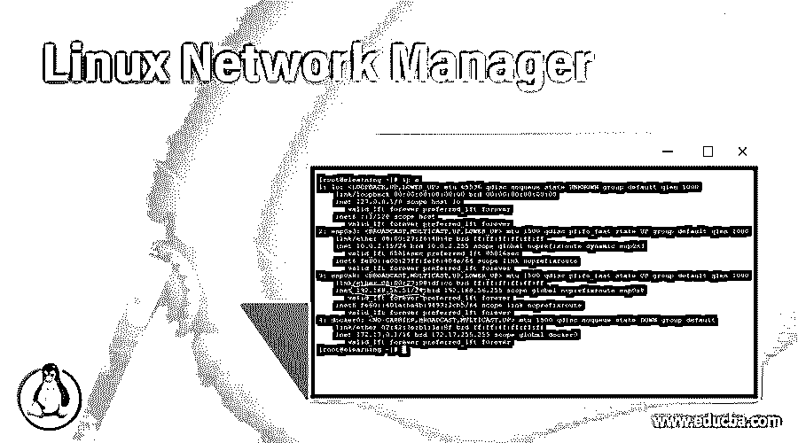
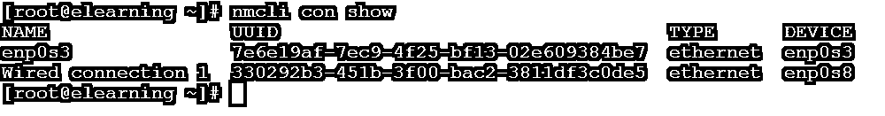
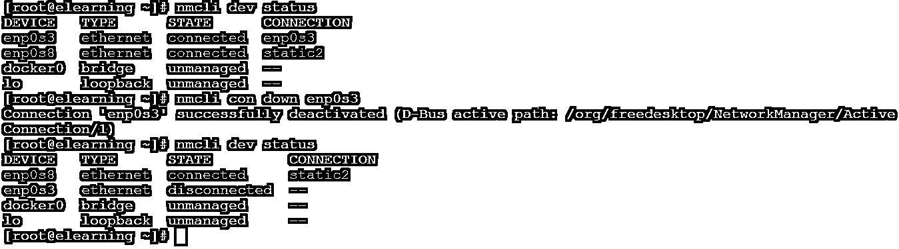
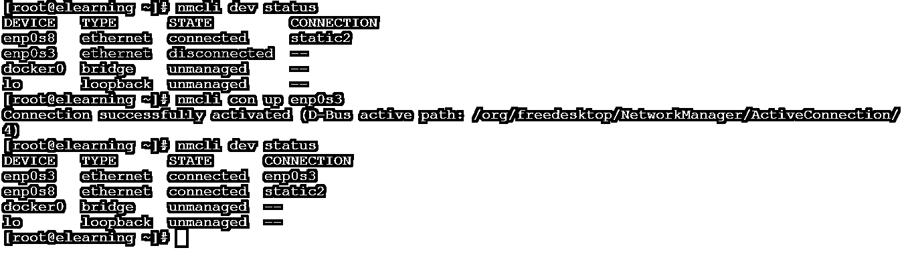
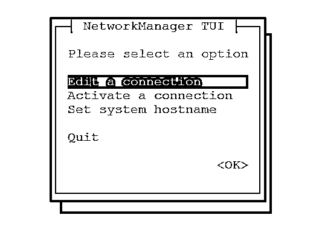

# Linux 网络管理器

> 原文：<https://www.educba.com/linux-network-manager/>

## Linux 网络管理器简介

在 Linux 生态系统中，网络管理器是一个活跃的网络控制和配置系统。它有助于保持网络相关设备的正常运行。当它们在环境中处于活动状态时，保持实时连接正常运行也起着重要的作用。在 Linux 环境中，网络管理器有自己的核心守护进程。网络管理器帮助配置不同的连接，如移动宽带(如蜂窝 3G)、以太网(eth0)、无线、移动宽带(如 2G、3G 等蜂窝网络)。)、DSL 和以太网点对点(PPPoE)、静态路由、网络别名、DNS 信息和不同的 VPN 连接。

**文本编辑器的语法**

<small>网页开发、编程语言、软件测试&其他</small>

`nmcli [OPTIONS...] {help | general | networking | radio | connection | device | agent | monitor} [COMMAND] [ARGUMENTS...] nmtui`

*   我们可以在语法或命令中使用“nmcli”关键字。它将采用不同的参数，如选项、命令和不同的参数。根据提供的参数，它将激活或停用网络连接，创建、编辑、显示、删除和帮助显示网络设备状态。
*   **选项:**我们可以提供与“nmcli 和 nmtui”命令兼容的不同标志。
*   如果我们需要通过 GUI 控制网络管理器，那么我们需要使用 nmtui 实用程序。

### Linux 网络管理器命令是如何工作的？

在 Linux 环境 6 之前，没有网络管理器的概念。网络的东西由网络管理员工具来管理。网络管理员工具将负责 Linux 旧版本中的所有网络活动。从 Linux 6 (CentOS 或 RHEL)开始，网络管理员工具将被网络管理器取代。它将提供丰富的功能，如移动宽带配置和用户特定的网络配置。它还可以提供从 Linux 环境中更改或编辑接口配置文件的功能。

在 Linux 环境下管理或控制网络管理器有两种方式，即 mncli 和 mntui。

*   nm CLI:nm CLI 是一个命令行工具，用于在 Linux 环境中控制或管理网络管理器。它还有助于报告网络状态。我们也可以使用 nmcli(命令行工具)作为图形客户端、nm-applet 或其他工具的替代品。它还用于激活或停用网络连接、创建、编辑、显示、删除以及帮助显示网络设备状态。
*   基本上，nmtui 是一个基于 curses 的 tui 应用程序。这将有助于与网络管理员的互动。在 nmtui 实用程序的帮助下，我们可以图形化地添加主机名，为特定的网络接口设置 IP 地址，等等。

### 实现 Linux 网络管理器命令的例子

下面提到了不同的例子:

#### 示例 1–检查设备

在使用 Linux 环境时，首先，我们需要检查所连接设备的当前网络状态。在 nmcli 命令中，我们能够检查当前网络设备的状态。

**命令:**

`nmcli dev status`

**说明:**

按照上面的命令，我们能够检查连接到 Linux 环境的网络设备的当前状态。连接了四个设备，但其中两个已连接，两个设备处于未被管理的状态。

**输出:**

#### 示例 2–检查连接状态

我们已经看到了网络设备的状态，但是我们还可以检查服务器的连接状态。当我们将多个网卡或不同的网络设备连接到实时系统时，进行检查是非常重要的。

**命令:**

`nmcli con show`

**说明:**

按照上面的命令，我们可以获得关于活动环境的连接状态的详细信息。有两个实时连接，为了进一步的网络调试，我们还可以使用 UUID。

**输出:**

#### 示例 3–添加新连接

在 nmcli 命令中，我们可以在环境中添加新连接。我们还可以添加新的 IP 地址和网关 IP。

**命令:**

`nmcli con add type ethernet con-name elearning ifname enp0s8 ip4 192.168.56.60/24`

**说明:**

按照上面的命令，我们能够在 Linux 环境中添加新的连接。新的连接名称为“elearning”，我们正在设置 IP 地址，即“192.168.56.60”。

**注意:**一旦新连接将添加。它不会被自动激活。我们需要手动激活新的连接(如果您不需要重启服务器的话)

**输出:**

截图 1 (a)

截图 1 (b)

#### 示例 4–连接断开

根据要求，我们可以从 Linux 环境中断开或关闭网络接口。我们只需要在 nmcli 命令中定义接口名称。

**命令:**

`nmcli con down enp0s3`

**说明:**

按照上面的命令，我们将网络接口“enp0s3”从 Linux 环境中断开。一旦它将断开连接，那么进一步的通信将不会与这个网卡发生。

**输出:**

#### 示例 5–连接正常

我们有功能来关闭界面。同样，我们也可以将设备或网络接口从断开状态启动到启动或运行状态。我们只需要在 nmcli 命令中定义接口名称。

**命令:**

`nmcli con up enp0s3`

**说明:**

按照上面的命令，我们从 Linux 环境连接网络接口“enp0s3”。一旦它连接，那么进一步的通信将发生在这个网卡上。

**输出:**

#### 示例# 6-“nm tui”命令

在网络管理器中，如果我们想通过 GUI 设置主机名或网络接口，那么我们需要使用“nmtui”功能。这将有助于通过 GUI 模式编辑或配置不同的网络相关活动。

**命令:**

`nmtui`

**说明:**

根据要求，我们可以通过 GUI 配置网络活动。

**输出:**

### 结论

我们已经看到了“Linux 网络管理器”的完整概念，以及正确的示例、解释和带有不同输出的命令。从 Linux 管理员的角度来看，Linux 网络管理器非常重要。它有助于管理和控制整个网络环境。我们可以在 Linux 环境中添加和配置新的或现有的网络设备。

### 推荐文章

这是一个 Linux 网络管理器的指南。这里我们讨论 Linux 网络管理器命令是如何工作的，以及实现网络管理器命令的例子。您也可以看看以下文章，了解更多信息–

1.  [Linux 通过名字查找文件](https://www.educba.com/linux-find-file-by-name/)
2.  [Linux Sed 替换](https://www.educba.com/linux-sed-replace/)
3.  [Linux Zcat](https://www.educba.com/linux-zcat/)
4.  [Linux 用户](https://www.educba.com/linux-users/)

